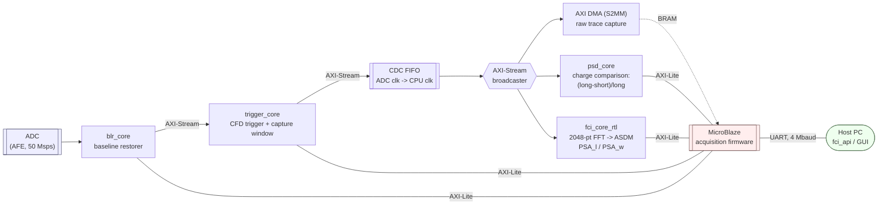
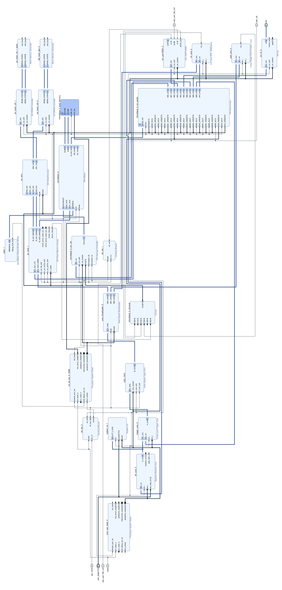
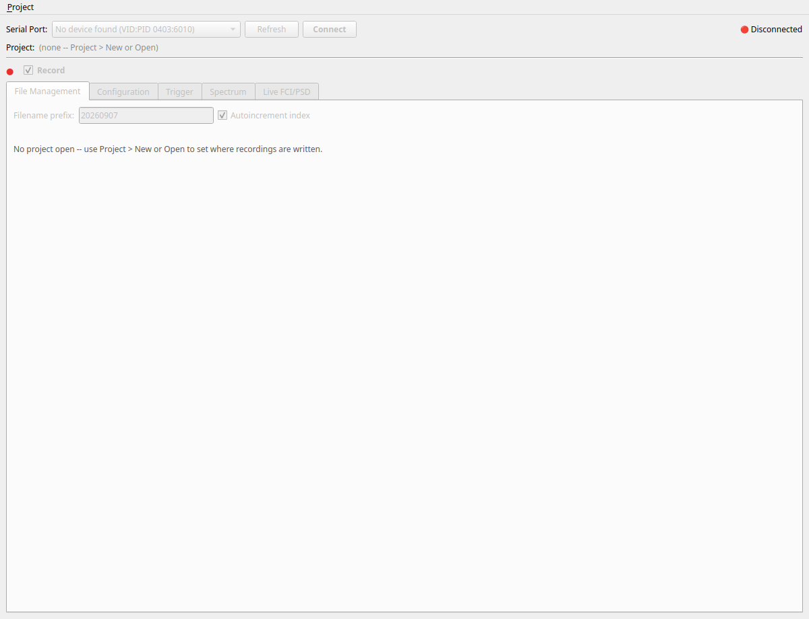

# FCI-FPGA

FPGA deployment of the gamma/neutron discrimination method based on frequency components analysis
(FCI), alongside a conventional charge-comparison PSD path, on a CMOD-A7 (Artix-7 XC7A35T) with a
SiPM-ready analog front end. A MicroBlaze soft core runs the acquisition firmware and exposes an
ASCII/binary CLI over UART; a PySide6 GUI (or any script against the Python client library) drives
it from a host PC.

The method is based on an FFT magnitude spectrum reduced to a ratio of two frequency bands, in place
of (or alongside) charge comparison, as described in Morales et al., *"Digital pulse
shape discrimination method based on frequency components analysis for CLYC detector"* (Nucl.
Instrum. Methods Phys. Res. A, 2023): this project is that method's real-time FPGA implementation
and hardware validation, run against a CLYC scintillator with a DD neutron generator, Cs-137 and
Co-60 sources.

## Block diagram



Every block above is real RTL/IP in this repository (`fpga/rtl/`) -- see [`fpga/bd/fci_bd.tcl`](fpga/bd/fci_bd.tcl) for the Vivado block design
this diagram summarizes, or the exported canvas:

[](docs/log/images/fpga_block_design.svg)

FCI and PSD run **in parallel** off the same broadcast trace, each independently paired by
timestamp on the firmware side (`fci_api`'s `AcqEvent` carries both `fci` and `psd` for every
event) -- neither is a fallback for the other; the point of this project is comparing them
directly against the same pulses.

## Repository layout

```
fpga/
  rtl/            trigger_core, blr_core, psd_core, fci_core_rtl, fci_sink -- one dir per IP core,
                  each with its own src/tb/scripts
  hls/            fci_core's HLS source (pre-RTL-migration path; see docs/log for the migration)
  bd/             the Vivado block design as a reproducible .tcl script (fci_bd.tcl)
  ublaze_sw/      MicroBlaze firmware: acquisition, CLI, per-subsystem drivers (psd.c, blr.c, ...)
  projects/       the Vivado and Vitis projects are created here by the developer upon clonning the repository. The projects are recreated from the rest of the source files: block design, constraints, IP cores, etc.
  bitstream/      built bitstreams: XSA export from Vivado and compiled bitstream with MicroBlaze firmware (download.bit)
sw/
  fci_api/        pure-Python protocol client (no Qt dependency) -- framing, retries, one typed
                  method per CLI command
  gui/            the PySide6 application described below
  analysis/       offline validation scripts against recorded raw traces
  examples/       small standalone scripts against fci_api
docs/
  sw/             GUI user interface + full CLI wire protocol
  log/            the project's running development log (design decisions, bring-up debugging,
                  experimental validation results)
  fpga/           AFE schematics and ADC datasheet
```

## The GUI


A project-based workflow modeled on similar commercial solutions: a project is a folder holding one campaign's
instrument settings *and* its recorded data together (`settings.json`, `RAW/`, `LIST/`,
`SPECTRA/`), and nothing else in the window -- not even Connect -- is usable until one is open.
Five tabs cover file naming, per-subsystem configuration, the trigger/oscilloscope view, a live
energy spectrum with SPE export, and the live FCI-vs-Energy / PSD-vs-Energy discrimination plots
shown above.



See [`docs/sw/README.md`](docs/sw/README.md) for the full tour (every tab, with screenshots) and
[`docs/sw/CLI_documentation.md`](docs/sw/CLI_documentation.md) for the wire protocol itself.

## Running

```
cd sw
uv run examples/read_batch_demo.py          # auto-detects the board by USB VID:PID
uv run gui/main.py
```

## Building the bitstream

Open [`fpga/projects/project_fci/project_fci.xpr`](fpga/projects/project_fci/project_fci.xpr) in
Vivado 2022.2 and run Generate Bitstream, or drive the same flow in batch mode. The RTL sources
under `fpga/rtl/` and the block design (`fpga/bd/fci_bd.tcl`) are both plain text and diff cleanly;
the `.xpr`/`.runs` artifacts are the reproducible-build entry point.

## Documentation

- [`docs/sw/README.md`](docs/sw/README.md) — GUI tour, tab by tab, with screenshots
- [`docs/sw/CLI_documentation.md`](docs/sw/CLI_documentation.md) — UART CLI wire protocol
- [`sw/README.md`](sw/README.md) — Python client/GUI developer quick-start
- [`docs/log/README.md`](docs/log/README.md) — running development log: design rationale, bring-up
  debugging, and experimental validation (DD/Cs-137/Co-60) against the Morales et al. method
