# FCI-FPGA — Project Log

Real-time FPGA implementation of the **FCI (Frequency Classification Index)** algorithm
(Morales et al.) for gamma/neutron discrimination with a CLYC/NaI(Tl) + SiPM detector.

| | |
|---|---|
| **Target** | Digilent Cmod A7-35T (Artix-7 35T) on the IAEA DPP4SiPM AFE carrier |
| **ADC** | LTC2248, 14-bit, 50 Msps, `MODE` pin strapped to 2/3 VDD |
| **AFE** | AD8330 VGA + AD5697 dual 12-bit DAC (I²C 0x0D) |
| **Toolchain** | Vivado / Vitis / Vitis HLS 2022.2 |
| **Soft CPU** | MicroBlaze, standalone BSP |
| **Reference design** | `NSIL-MCA-DPP4SiPM` (same board, gamma spectroscopy) |


---

## Goals

**The objective this all serves: a follow-up publication.** Morales et al. (2024) proposes the FCI
method and, in its §8, declares the hardware validation as future work — "a hardware design to
validate the proposed method using an embedded application is under development, targeting an AMD
Artix-7 XC7A35T FPGA". **This project is that design**, carried out by the paper's own author, and
this log is its working record. The results below are being assembled toward reporting it.

The goals in order of dependency. §0 gives the published background they rest on; the numbered
sections are the record of getting there.

1. **Deliver the hardware validation the paper leaves as future work.** Trigger, baseline
   restoration, 2048-point FFT, city-block ASDM and the two partial spectral areas — all
   fixed-function on a $100 Artix-7 35T, classifying per event at the detector's live rate rather
   than offline, on exactly the XC7A35T target the paper names.
   *Status: running on hardware (§8b, §8g), 48.8 k events/s trigger throughput (§8c).*

2. **Show it works at 50 Msps** -- half the rate the paper subsamples to, and a rate a cheap ADC can
   actually sustain. The claim being tested is Nakhostin's: that the n/gamma shape information
   survives well below the sampling rates conventionally assumed, so a frequency-domain index keeps
   working on hardware where charge comparison degrades. *Status: demonstrated on the DD dataset
   (§8s) -- FCI FoM 1.34 at the paper's own 475 keVee limit against their 1.88, and it leads PSD at
   every energy cut.*

3. **Reproduce the paper's own results on the hardware, same detector unit.** Same Scionix
   CLYC+SiPM detector (model and serial), same 6Li capture line at 3160 keVee, and the paper's own
   figures regenerated from FPGA-processed data: the FCI/PSD-vs-energy matrices (its Fig. 5), the
   gamma-only control against the same class line (Fig. 6), and the double-Gaussian FoM fits
   (Fig. 7). *Status: done (§8s). Zero of 2893 Cs-137 events land on the neutron side of the FCI
   line, across the full energy range -- the paper's own headline claim, now from silicon.*

4. **Quantify what FCI buys over charge-comparison PSD on this hardware.** Not as a fitted FoM alone
   but in terms that matter for a fielded instrument: class separation in sigmas, gamma
   misclassification rate at a fixed threshold, and stability of that threshold against run-to-run
   drift. *Status: FCI separates at 2.84 sigma against PSD's best-available 1.74; PSD misclassifies
   42% of Cs-137 at its own threshold, FCI 0.00% (§8s).*

5. **HYPOTHESIS -- FCI may be more resilient to pile-up than PSD.** Potential additional
   contribution, not yet established. The reasoning: an FFT magnitude is shift-invariant and a
   second pulse landing anywhere in the frame still contributes its own spectral character, so a
   **same-species** pile-up (gamma+gamma, or neutron+neutron) should keep the summed event on the
   correct side of the line. Charge comparison has no such property -- a second pulse falling
   inside one gate and outside the other corrupts the ratio directly, and where it lands depends on
   arrival time. **Mixed-species pile-up (gamma+neutron) should be ambiguous for both methods**, and
   that is a physical limit rather than a defect: the event genuinely contains both.

   This is untested ground: the original paper REMOVES pile-up before analysis (its §4.2.3), so the
   behaviour under pile-up is simply not characterised anywhere. It matters for a fielded monitor,
   where rate is not a free parameter.

   *Status: preliminary and NOT yet conclusive. On the piled-up 6Li events in this dataset FCI
   classified 92.7% correctly against PSD's 76.5%, versus 98.0%/95.3% on clean events -- FCI
   degrading about 3.5x less (§8r). But n = 41 piled-up events, roughly a 2 sigma difference. Needs
   a deliberate high-rate run with a large piled-up population, and separate accounting of
   same-species against mixed-species pile-up, before it can be claimed.*

6. **One datapath, two scintillator families.** The register-programmable PSA windows should retune
   from an inorganic (CLYC) to an organic (EJ-276/OGS) without an RTL change -- the thesis of §0.
   *Status: CLYC side established; the organic side is not yet measured on this instrument.*

7. **Keep the instrument usable.** A host client and GUI that make the above reproducible by hand:
   live FCI/PSD, oscilloscope, energy spectrum with SPE export, and on-device parameter sweeps
   (§8f, §8l, §8m). *Status: in use; it is what produced every dataset analysed here.*

---

## 0. Scope: one datapath, two scintillator families

Two published results define what this instrument is for. Neither is a hardware implementation;
this project is the hardware implementation, and the goal is to show that **a single fixed-function
FPGA datapath serves both an inorganic and an organic scintillator**.

**The method — Morales et al., *Nucl. Eng. Technol.* 56 (2024) 745–752**
([doi:10.1016/j.net.2023.11.013](https://doi.org/10.1016/j.net.2023.11.013)). CLYC(Ce) + SiPM
(Scionix V12.7B30/SIP-E3-CLYC-X on an OnSemi ArrayC-60035-4P), CAEN DT5761 at 4 GS/s subsampled to
100 MS/s. A 2048-point FFT per triggered trace, reduced to the **approximate** spectral density
magnitude by the city-block sum |Re| + |Im| — no square root, no squaring — then two partial
spectral areas, `PSA_l` over bins 1–25 and `PSA_w` over bins 1–90:

```
FCI = (PSA_w − PSA_l) / PSA_w
```

The DC bin is deliberately excluded, which is what gives the index its immunity to baseline offset.
Its two practical claims are that it needs **no preprocessing** — no baseline removal, no pulse
alignment, both of which CCM-based PSD does need — and that it classifies over the **full** energy
range, including below the ~475 keVee neutron limit where PSD requires an energy cut to stay usable.
The paper proposes FPGA/DSP deployment as future work and stops there.

**The reach — Nakhostin, *Nucl. Instrum. Methods A* 916 (2019) 66–70**
([doi:10.1016/j.nima.2018.11.021](https://doi.org/10.1016/j.nima.2018.11.021)). A BC501A **liquid
organic** scintillator on a PMT, digitized at 4 GHz. The finding that matters here: although the
pulses carry components to ~110 MHz, the *n*/γ **shape** difference lives **below ~18 MHz**, so the
useful sampling floor — the paper's "PSD Nyquist frequency" — is **32 MHz**, not the ≥250 MHz that
had been the standing recommendation. A frequency-domain index (power in 0–8 MHz over total power)
holds its FoM essentially flat from 4 GHz all the way down:

| method | 50–200 keVee | 200–1400 keVee |
|---|---|---|
| charge comparison @ 4 GHz | 0.72 ± 0.02 | 1.51 ± 0.04 |
| charge comparison @ 250 MHz | 0.62 ± 0.03 | 1.33 ± 0.02 |
| charge comparison @ 32 MHz | **lost entirely** | not quoted |
| frequency domain @ 4 GHz | 0.75 ± 0.02 | 1.34 ± 0.04 |
| **frequency domain @ 32 MHz** | **0.62 ± 0.06** | **1.31 ± 0.04** |

Charge comparison is the one that collapses under down-sampling: at one sample per 31.25 ns the
integration limits no longer land where they should, discrimination below 200 keVee is *completely*
lost, and low-output events are dislocated to the top of the plot. The frequency-domain FoM only
breaks below **27 MHz**. Note where the two methods cross: at 4 GHz charge comparison wins the high
range (1.51 vs 1.34), and at 32 MHz the frequency-domain method holds 1.31 while charge comparison
has no low-range answer at all. Frequency-domain analysis is not the better method in the abstract —
it is the one that **survives a cheap ADC**, which is the whole reason this instrument can exist on a
$100 board.

### Why this instrument sits above both floors

This design digitizes at **50 Msps** — above Nakhostin's 32 MHz organic floor, and half the 100 MS/s
the FCI paper used for CLYC. The 2048-point transform at that rate gives 24.414 kHz bins and a
25 MHz Nyquist (§8g), so the bands both papers care about are inside the same register range:

| band | source | bin at 50 Msps | within `psa_*_hi` ≤ 1024? |
|---|---|---|---|
| CLYC `PSA_l` 1.03 MHz | FCI paper, retuned | 42 | yes |
| CLYC `PSA_w` 3.52 MHz | FCI paper, retuned | 144 | yes |
| organic band edge 8 MHz | Nakhostin optimum | 328 | yes |
| organic shape limit 18 MHz | Nakhostin | 737 | yes |

The window bounds are genuine AXI4-Lite registers, so **retuning from CLYC to an organic is a
register write, not a rebuild**. That property was bought deliberately and at a price: §1 records
rejecting a free-running HLS configuration worth 2–3× the throughput precisely because it turned the
window bounds into stream ports, and the hand-written VHDL core that replaced it (§8g) kept them as
registers for the same reason. A throughput decision made for tuning convenience turns out to be
what makes one bitstream cover two detector families.

### What this does *not* yet establish

Three things are reasoned, not measured, and should be read as the open questions they are:

1. **The transform length is fixed at 2048; the *live* window is not.** An EJ-276 or BC501A pulse,
   with a delayed component of tens to a few hundred ns, occupies well under 1% of a 40.96 µs
   frame — so the obvious worry is ~2000 samples of baseline noise summed into every bin. That
   worry is mostly already answered: `sample_framer` owns the FFT's frame boundary and **zero-pads
   a short capture up to `FFT_LENGTH`** (note 3 in its header). Exact zeros contribute no noise, so
   per-bin noise scales with the square root of the *live* sample count, not the frame length —
   a `depth` of 256 is ≈2.8× better per-bin SNR than a full-length capture, and the spectral
   envelope is unchanged, merely interpolated onto finer bins. **Shortening the analysis window for
   a fast scintillator is therefore a register write today.** What is *not* runtime-tunable is the
   transform itself: `xfft_2048` is generated with `run_time_configurable_transform_length = false`
   (`C_HAS_NFFT = 0`), so the FFT still consumes 2048 beats per frame whatever the capture depth,
   pinning the event-rate ceiling at 40.96 µs/frame ≈ **24.4 kcps**. That is above the ~12 kcps
   readout limit measured in §8h, so it does not bind yet — but it is the first thing that would,
   at organic-scintillator rates. See §0a for what enabling runtime `NFFT` would cost.
2. **The analog front end has never been characterized above ~0.5 MHz.** The ~0.47 MHz figure on
   record (§8g) comes from the CLYC+SiPM pulse's 740 ns rise — it describes the *signal*, not a
   measured AFE limit. Whether the AD8330 path and whatever anti-alias filtering the carrier has
   actually pass 8–18 MHz is unverified, and it is a hard prerequisite for the organic claim.
3. **The two indices are relatives, not the same formula.** Nakhostin's is low-band power over total
   power from |X|²; the FCI is `(PSA_w − PSA_l)/PSA_w` over the city-block ASDM with DC dropped.
   Same idea — a low-frequency partial area against a total — differing in normalization, in whether
   DC is included, and in the magnitude approximation. That the CLYC form transfers to organics is
   the hypothesis under test, not a corollary of either paper.

Everything below is the record of building the CLYC half of that and getting it to work in silicon.

## 0a. Runtime-configurable FFT length: what it would cost

Not enabled, and **not the first thing to try** — reducing `depth` (above) buys the SNR benefit for
free. Recorded here because the question will come back the moment event rate becomes the binding
constraint, and because two of the steps are silent-failure traps.

`xfft` v9.1 does support it, and this instance is compatible: `C_ARCH = 1` is Pipelined Streaming
I/O, which allows run-time `NFFT`. Resources are set by the **maximum** length, so keeping the max at
2048 leaves BRAM and DSP essentially where they are — the cost is control logic, not memory.

| # | Change | Risk |
|---|---|---|
| 1 | Regenerate the IP with `run_time_configurable_transform_length = true` | low |
| 2 | `s_axis_config_tdata` widens (an `NFFT` field appears in the LSBs). Update the component declaration in `fci_core_rtl_top.vhd` — **read the width off the regenerated `.veo`, do not assume 16** | low |
| 3 | Config writes must land **between frames**. Today the core writes config once after reset and never again; runtime `NFFT` needs a small FSM to quiesce the input, let in-flight frames drain, write, resume | **deadlock** — a config write mid-frame corrupts the frame, and a halted FFT input channel stalls the lockstep broadcaster and bricks the pipeline (§4.3) |
| 4 | `sample_framer`: `FFT_LENGTH` generic → signal. `beat_count` is already sized for the max, so only the `last_beat` compare changes | low |
| 5 | `bin_accumulator`: `bit_reverse(beat_idx, NFFT)` must reverse over the **actual** log2(N), not the max. Cheap to fix (reverse the full width, then shift right by `NFFT_MAX − nfft`) | **silent** — get it wrong and every bin index is scrambled with no error flagged, producing a plausible-looking but meaningless FCI. Same failure class as §8g |
| 6 | Window bounds are bin **indices**, and bin spacing changes with N. Firmware or host must rescale — better, hold the windows in Hz on the host and convert on write | **silent** — windows silently point at the wrong band after an `NFFT` change |
| 7 | `CAPTURE_DEPTH`'s "HARD INTERFACE CONSTRAINT" comment in `bringup.c` is stricter than the RTL actually is, since the framer pads and flushes. Worth correcting either way | none |

What it buys, and only this: the FFT frame occupies N cycles, so N = 256 lifts the transform-side
ceiling from ~24.4 kcps to ~195 kcps. It does **not** improve per-bin SNR beyond what zero-padding
already gives, and it makes bin spacing *coarser* (195 kHz at N = 256 against 24.4 kHz today). It is
a throughput change, not a resolution change.

---

## 1. What was built

### `fci_core` — Vitis HLS

Computes the two partial-spectrum-area sums whose ratio is the FCI, over a 1024-sample frame.

- `N_SAMPLES = 1024`, FFT-based, `ap_ufixed<28,12>` (Q12.16) results
- Window bounds as genuine AXI4-Lite registers (`psa_l_lo/hi`, `psa_w_lo/hi`), `ap_ctrl_hs`
- Cosim verified: **Latency = Interval = 3249 cycles** → no back-to-back overlap, ceiling
  **≈ 15.4k events/s** at 50 MHz

An alternative free-running configuration (`ap_ctrl_none` + `ap_fifo` window ports) reached
1024-cycle intervals — 2–3× the throughput — but was rejected: the window bounds must remain real
AXI4-Lite registers. Accepted trade-off, recorded here so it is not rediscovered as a bug.

### `trigger_core` — hand-written VHDL

Cross-level trigger with pre-trigger lookback and triggered capture, streaming straight into
`fci_core`'s `s_axis_data` with no adapters.

```
adc_data ─┬──────────────────────────────► trigger.vhd ──► trigger pulse
          └──► delay_line.vhd ──► delayed ──► capture_engine.vhd (IDLE/CAPTURE/STREAM)
                                                  └──► circular_buffer.vhd ──► m_axis
```

Register map (AXI4-Lite):

| Offset | Register | Notes |
|---|---|---|
| 0x00 | `threshold` | 14-bit, offset-binary ADC code |
| 0x04 | `polarity`  | 1 = rising crossing, 0 = falling |
| 0x08 | `delay`     | pre-trigger samples, clamped 2..256 |
| 0x0C | `depth`     | capture length, clamped 1..4096 |

Verified by a self-checking testbench (`xvhdl`/`xelab`/`xsim`), currently **8/8 scenarios
passing**: six original functional and boundary cases, a reconfiguration-hazard case added after
§4.1, and a long-stall throughput case added for §7a.

### Block design and firmware

`clk_cpu` and `clk_adc`, both 50 MHz, from one MMCM (`NUM_OUT_CLKS = 2`; the third output,
`clk_dsp`, was dropped once nothing needed a separate DSP clock domain). `trigger_core` →
`axis_broadcaster_0` → {`fci_core` → `axi_dma_0`, `axi_dma_1` raw-trace tap}, with
`axi_dma_1` configured for 256-beat bursts (§7b). MicroBlaze firmware drives everything by
hand-poked AXI4-Lite plus two interrupt-driven DMA channels; BRAM readback goes through MM2S + FSL
because `axi_bram_ctrl_*` is mapped only into the DMA address spaces, not into `microblaze_0/Data`.

Firmware layout: `main.c` is a bare entry point; all bring-up and acquisition lives in
`bringup.c`/`bringup.h` behind `Bringup_Run()`.

---

## 2. The bring-up problem

Captured ADC traces showed a repeatable artifact on **large** pulses while **small** ones passed
through intact: a fast overshoot spike, a flat plateau lasting the pulse duration, an undershoot,
then a slow settle.

The two ILA captures below are from the same session at the same baseline (~10050 in the raw
reading). Small pulse, clean:


Large pulse, same setup — spike, flat plateau, then a cliff:


For reference, the analog pulse at the AFE output measured on a scope — negative-going, ~500 mV,
fast fall and a few-µs exponential recovery. This is the shape the digitized trace must reproduce
(possibly inverted), with **no discontinuity, delta or spike**:


---

## 3. Root cause: the 2's-complement fold

**The LTC2248's `MODE` pin is strapped to 2/3 VDD, which selects 2's-complement output. The design
was consuming that word as offset binary.**

Reading 2's complement as unsigned maps analog value `V` to

```
U = V              for V >= 0
U = V + 16384      for V < 0
```

which is monotonic *everywhere except across analog zero*, where `U` folds from **16383 straight to
0**. The baseline sits ~6300 counts below analog zero — offset-binary ≈ 1861, which read raw is
`1861 XOR 8192 = 10053`, matching the "baseline close to 10000" seen in the earliest bring-up logs:


So:

- pulse amplitude **< ~6300** → never reaches the fold → **reads cleanly**
- pulse amplitude **> ~6300** → crosses it → **cliff**, and if it also over-ranges the ADC it
  **clips flat at the rail** on the far side before cliffing back on the way down

Rise → cliff → plateau → cliff back → exponential decay. That is the artifact, item for item, and
it is amplitude-dependent for a concrete reason.

**Fix:** a single MSB inversion in `trigger_core_top.vhd`, applied after the input capture register
so the rest of the core stays format-agnostic:

```vhdl
adc_data_ob <= (not adc_data_q(ADC_WIDTH - 1)) & adc_data_q(ADC_WIDTH - 2 downto 0);
```

### Reproduced on demand

`test_encoding_fold_demo()` (in `bringup.c`, behind `ENCODING_FOLD_DEMO_ENABLE`) raises both gain
channels until a pulse crosses analog zero, then prints the capture twice — corrected, and as the
pre-fix firmware would have read it:

```
idx  corrected  as_read_before_fix
 97      6335        14527
 98      8935          743   <- crosses analog zero, folds 16383 -> 0
 99     11126         2934
101     16383         8191   <- ADC clipped at the rail
...     16383         8191      (85 samples of flat plateau)
185     15907         7715
232      8225           33   <- decayed to near zero: the "undershoot"
233      8163        16355   <- folds back
234      7584        15776      then settles slowly to baseline
```

The corrected column over the same samples is a clean pulse. Question closed.

Current state, same ILA, radix signed — clean rise and exponential decay:


---

## 4. Other real bugs found along the way

Each of these was genuine and independently verified, even though none of them caused the artifact.

### 4.1 Reconfiguration hazard in `trigger.vhd`

The `above` comparator state was compared across threshold/polarity register writes, so *any*
config write could emit a false `trigger_o`. Fixed by suppressing the trigger on the cycle config
changes while still updating `above` to the new comparison:

```vhdl
cfg_changed := (threshold_i /= threshold_q) or (polarity_i /= polarity_q);
if armed_i = '1' and not cfg_changed and (...edge...) then
  trigger_o <= '1';
```

Verified by a new testbench scenario that fails when the fix is reverted.

### 4.2 VGA fine-gain DAC pinned at code 0

The driver applied the **coarse** channel's logarithmic formula to the **fine** channel. Since
`log10(1.0) = 0`, the default fine gain of 1.0 produced DAC code **0** instead of 819 — the AD8330
parked at the bottom of its control range for a long stretch of bring-up, making every threshold
constant tuned in that period meaningless.

The two channels use genuinely different control laws (confirmed in the sibling project's
host-side Python API, which is the real source of truth — its MicroBlaze only ever receives
finished integer codes):

```
fine   (VMAG, linear)      code = gain * 2^12 / (2 * 2.5)          gain 1.0 -> 819
coarse (VDBS, logarithmic) code = 0.6 * 2^12 * log10(gain) / 2.5   gain 6.0 -> 765
```

A later controlled bisect confirmed the fine channel is linear empirically: baseline σ tracked the
DAC code proportionally (410 → 29, 819 → 58, 1638 → 102), not exponentially.

### 4.3 `axi_dma_0` armed as a one-shot — the pipeline deadlock

`axi_dma_0` was armed for a single 8-byte transfer during the end-to-end test and not re-armed
until continuous capture started at the very end. In between, `fci_core`'s result stream had
nowhere to go, so it backpressured; once its output FIFO filled it stopped accepting input; and
because `axis_broadcaster_0` is **lockstep** (no beat advances unless *both* consumers take it), a
stalled `fci_core` froze the raw-trace tap on `axi_dma_1` too.

The `raw_events` counter traced it exactly:

| point in run | `raw_events` |
|---|---|
| first calibration fails | 5 (the FIFO's worth of events) |
| after the one-shot test | 6 (drained 2 beats = 1 event) |
| entire gain bisect | 8, frozen |
| continuous capture starts | flowing again |

This is what made *every* calibration result unreproducible for several sessions — success
depended purely on how much FIFO slack happened to be left. Fixed by servicing both broadcaster
consumers continuously from before the first trigger (`start_result_pipeline()` alongside
`start_raw_trace_pipeline()`).

### 4.4 Threshold calibration by descending sweep

The original auto-calibration swept the threshold down from full scale waiting for a real pulse.
Two problems:

1. **The trigger response is not monotonic in threshold.** With RISING polarity, a threshold below
   baseline never fires (`above` is permanently 1); inside the noise band it fires at kHz; above
   the noise but below the pulse peak it fires at the event rate; above the peaks it never fires.
2. It kept reporting "first capture at probe threshold 15488" on traces that never exceed 5959 —
   physically impossible. Those were **stale captures draining**, not triggers at that level.

Replaced with a **noise-band search**: sweep *up* from 0 in small steps with a few ms dwell, and
record the first and last threshold that fire. The noise band is always present, independent of
the detector, and fires at kHz, so milliseconds are decisive. Calibration then parks at the band
center, captures immediately, and measures mean/σ from the pre-trigger region.

Two follow-on fixes were needed: the step size had to drop from 64 to 8 (the band is only ~±4σ ≈ 56
counts wide on a quiet baseline — *narrower than the original step*), and the event-counter
snapshot had to move to **after** programming the threshold, or a capture already in flight under
the previous threshold scored as a hit at the new one.

### 4.5 Startup race

`test_trigger_core()` left a live threshold (0x1234 = 4660) that real pulses cross every time,
while neither broadcaster consumer was armed yet. A trigger in that window left `capture_engine`
stuck in STREAM holding beat 0. The threshold is now parked at full scale on the way out, so
nothing can fire until the whole pipeline is up.

---

## 5. Hypotheses that were wrong

Both were pursued hard, and both are disproven by measurement. **Do not revive them.**

### ADC bus capture skew

Real and measured: the 14 input flops were scattered across `SLICE_X39Y106..SLICE_X50Y116` with
port-to-flop delays spanning 3.272–5.736 ns — **2.464 ns of bit-to-bit skew** on a bus latched
every 20 ns. Adding `attribute IOB` packed all 14 into `ILOGICE2.IFF` at 1.448–1.480 ns
(**0.032 ns** skew), with hold slack going from +0.146 to +1.992 ns.

Compelling, and wrong. `system_ila_0` samples the *same pads* through its own fabric registers that
the attribute never touched:

| capture path | pad→flop delay | skew |
|---|---|---|
| `trigger_core` `adc_data_q` (IOB-packed) | 1.448 – 1.480 ns | 0.032 ns |
| `system_ila_0` probe0 (fabric SRL) | 3.548 – 7.099 ns | **3.551 ns** |

The ILA path carries *more* skew than `trigger_core` had before the fix, and it shows clean pulses.
If 3.551 ns does not corrupt the bus, 2.464 ns was not corrupting it either.

**The IOB attribute is kept** — it is the correct way to capture a source-synchronous parallel bus
and it costs nothing — but it is documented on those merits, not as the fix.

### VGA fine gain at code 0

Overload recovery is a plausible reading of spike/plateau/undershoot, and the misconfiguration was
real (§4.2). But the controlled bisect showed that at fine code 0 the pulse amplitude is **41
counts with σ = 5** — VMAG at 0 V means the AD8330 output is essentially *zero*. It produces **no
signal**, not distorted signal, so it cannot explain traces full of large distorted pulses.

### Why the ILA reinforced both errors

The ILA was treated as ground truth, and it is not:

- it probes the **raw external port**, upstream of the MSB flip, so it saw the un-corrected word
- the radix was set to **unsigned decimal**, which renders the fold exactly as the firmware did
- it samples with its own scattered fabric flops

The instrument had the same disease as the patient. It is still useful, but for bus-integrity
questions its probe should be moved to `adc_data_q` (post capture register).

---

## 6. Process mistakes worth recording

- **A stale ELF was debugged for two full sessions.** The Vitis app's `src/` had been overwritten
  with the sibling project's firmware, *with original timestamps preserved*, so `make` saw sources
  older than the objects and silently relinked a byte-identical binary. Builds "succeeded" and
  changed nothing. Now caught by checking the ELF's string table against expected new output.
- **`mb-gcc -fsyntax-only` does not run `-Wunused-function`.** That was the standard verification
  command for most of the project, and it hid dead code. Use `-c -o /dev/null`.
- **`INPUT_DELAY` is not a queryable port property in Vivado 2022.2.** `get_property INPUT_DELAY`
  returns empty whether or not a constraint is applied. Concluding "the constraint isn't applying"
  from that emptiness sent the investigation chasing file-scoping settings across several rebuilds.
- **Auto-inferred MMCM generated clocks don't resolve while the IP is an unlinked OOC black box.**
  `set_input_delay` against an empty clock collection silently no-ops. Fixed by constraining the
  physical port with `create_clock`.
- **An event-rate estimate was wrong by 10×** (a UART dump timed as ~5 s when it is ~0.53 s), which
  produced a confident but false explanation for why calibration was failing. Background here is
  ~30 cps, and the real cause was §4.3.
- **The encoding hypothesis was raised early and dismissed on bad reasoning.** The fold point was
  placed at offset-binary midscale 8192 instead of at analog zero, where the *misread* jumps
  16383→0; and the fingerprint was described as "a cliff" without recognizing that a cliff, a
  clipped far side and a cliff back *is* spike-plateau-undershoot. That misplacement is what led to
  the skew and VGA detours.

- **Automatic error recovery was added before the error was understood**, and it was unbounded. It
  reset and re-armed the DMA on every fault, converting one diagnosable failure into 378,713 resets
  and zero clean captures — it deleted the evidence needed to diagnose it. Recovery belongs *after*
  a fault is characterized, and always with a retry bound (§7c).
- **Several things were changed in one step** — DMA parameters, ILA topology and firmware together —
  which left nothing to bisect when the system stopped acquiring. The batch had to be reverted whole,
  and the actual fix was then found in one change from the restored baseline (§7b).
- **The rollback initially went too far**, reverting the §7a `capture_engine` fix along with the
  diagnostics even though it had been in the working system and was never suspect. Reverting to a
  known-good state means reverting the *suspect* changes, not every recent one.

The general lesson: every hypothesis here was eventually settled by a **measurement that could have
come out the other way** — the ILA skew numbers, the gain bisect, the fold demo. The ones that
dragged on were the ones argued from plausibility instead.

---

## 7. Measured characteristics

At the normal operating point (fine gain 1.0 → code 819, coarse 6.0 → code 765), background only
(NORM + cosmics, ~30 cps):

| quantity | value |
|---|---|
| baseline (offset binary) | ~1861 |
| baseline noise σ | ~7 quiet; ~55 at 30 cps (pile-up inflates the pre-trigger window) |
| pulse rise | ~21 samples / 420 ns |
| pulse decay τ | ~1.4 µs (~70 samples to 1/e) |
| pulse amplitude | ~840–4100 counts, background dependent |
| headroom to analog zero | ~6300 counts |
| polarity (digitized) | **rising** — pulses go UP from baseline |

### Constants and what fixes them

Most numbers in this design are forced by something measurable. A few are not, and the difference
matters — this project lost several sessions to constants that looked derived and were not
(thresholds 1900 and 2100, tuned against a mis-encoded signal; a 64-count scan step that turned out
wider than the noise band it was searching for). Each constant is therefore classified below.

| constant | value | what fixes it |
|---|---|---|
| capture depth | 1024 | **Hard interface constraint.** Must equal `fci_core`'s `N_SAMPLES`: `trigger_core` streams exactly this many beats and `axis_to_fft` reads exactly that many, so a mismatch either hangs the pipeline or desyncs every frame after it. Not tunable. Currently written as a bare literal in three places in `bringup.c` — promoting it to a named constant is an open item (§9). |
| output FIFO depth (`capture_engine`) | 2 | **Derived** from the buffer's 1-cycle read latency: one read already in flight when TREADY drops, plus the beat already being presented. Three would be dead area; one would drop data. |
| `axi_dma_1` burst size | 256 | **Bounded by the protocol.** 256 is the AXI4 maximum burst length for an INCR transaction, so this is the floor on per-beat address-phase overhead rather than a tuned value (§7b). |
| `axi_dma_1` `c_sg_length_width` | 18 | **Chosen, with headroom.** 12 bits would carry today's 2048-byte trace and 13 the 4096-byte maximum; 18 leaves room to grow the trace without another block-design change. |
| `BASELINE_SAMPLES` | 64 | **Derived.** Must lie entirely inside the `TRIGGER_DELAY` pre-trigger region, so anything below 100 works; 64 leaves margin while still averaging enough samples for a usable σ. |
| noise-scan `STEP` | 8 | **Derived.** Must be well under the noise band width. On a quiet baseline σ ≈ 7, so the band is only ~±4σ ≈ 56 counts — a step of 64 stepped straight over it (§4.4). |
| AD5697 fine / coarse codes | 819 / 765 | **Derived** from the two control-law formulas (§4.2), cross-checked against the sibling project's host-side API and confirmed on hardware by the gain bisect. |
| FFT bin spacing | 48.83 kHz | **Derived**: 50 Msps / 1024. |
| `TRIGGER_DELAY` | 100 | **Chosen.** Sets the pre/post-trigger split; any value above `BASELINE_SAMPLES` and within the delay line's 2..256 range is valid. Adjust to taste. |
| `THRESHOLD_SIGMA_MULT` | 8 | **Tuning knob — not derived.** The paper's 4σ is for offline analysis of recorded traces; on a live comparator at 50 Msps it would fire ~1500 false triggers/s against a ~30 cps real rate. 8 was picked to sit clear of the noise, and is the intended thing to adjust: raise it if noise triggers persist, lower it if genuine small events are missed. |
| `psa_l_hi` / `psa_w_hi` | 25 / 90 | **Inherited, not derived for this detector.** These came from `fci_core_tb.cpp` and were never re-derived against the measured pulse. They are mismatched — see below. |

### Known issue: FCI windows are mismatched to this pulse

τ ≈ 1.4 µs puts the spectral corner at 1/(2πτ) ≈ 114 kHz. With 1024 samples at 50 Msps the FFT bin
spacing is 48.83 kHz, so the corner sits at **bin ~2.3** and essentially all pulse energy lands in
the first few bins. The current windows are `psa_l` = bins 1–25 (to 1.22 MHz) and `psa_w` = bins
1–90 (to 4.39 MHz) — both capture nearly the same energy, pinning FCI near 1.

Measured: **0.84 ± 0.03** over 60 background events, unimodal. Little shape information survives
into the ratio. Narrowing `psa_l` toward the first 2–3 bins is the direction that restores
sensitivity to decay-constant differences, and it is an AXI4-Lite parameter change — no rebuild.

---

## 7a. Issue #10 — trigger_core output rate halved (fixed)

`trigger_core`'s AXI4-Stream output ran at 25 Msps against a 50 Msps capture: TVALID toggled
1/0/1/0 continuously instead of staying high.

The issue text suspected the lockstep `axis_broadcaster` or the DMAs, but the ILA capture rules
that out — **TREADY was steady high while TVALID toggled**. A consumer applying backpressure would
show the opposite. The stall was inside `capture_engine.vhd`.

`circular_buffer` has a 1-cycle registered read latency. The FSM used a *single* `addr` register as
both the buffer read address and the current-beat pointer, so after every accepted beat it had to
spend a dead cycle waiting for `buf_rd_data_i` to catch up to the new address:

```vhdl
elsif m_axis_tready_i = '1' then      -- beat accepted
  addr       <= addr + 1;
  data_valid <= '0';                  -- forced low for the next full cycle
```

A hard 50% duty cycle, independent of anything downstream.

**Fix:** stop serializing "advance address" and "present data"; pipeline them. `issue_addr` now runs
ahead, presenting a new address every cycle it is allowed to, and returning words land in a 2-entry
FIFO feeding the stream output. Two entries is exactly right: when TREADY deasserts, one read is
already in flight and must be absorbed, on top of the beat already being presented. Issue is gated
on the occupancy the FIFO will have *next* cycle (`count + push - pop`), which makes overflow
structurally impossible rather than merely unlikely.

**Verification.** The testbench now counts idle cycles between the first accepted beat and TLAST
whenever TREADY is held high, and fails on any. Reverting the RTL makes it fail with exactly
`depth - 1` bubbles per capture — 4095 for a 4096-beat trace — which is the 50% duty cycle
quantified:

```
with the fix:      PASS (beats=4096, mid-stream idle cycles=0)
fix reverted:      FAIL: 4095 idle cycle(s) mid-stream with tready held high
```

All 8 scenarios pass, and the IP was repackaged and byte-compared against the RTL.

## 7b. Raw-trace backpressure — the DMA burst size

Fixing §7a moved the bottleneck rather than removing it. With `capture_engine` finally offering one
beat per cycle, `trigger_core` presents a sustained 50 Msps stream, and the ILA then showed genuine
backpressure for the first time: TREADY *low* on the raw-trace tap, which is the opposite of the
§7a signature and therefore a different problem with the same symptom.

Two extra ILA probes — `fci_core_0/s_axis_data_TREADY` and `axi_dma_1/s_axis_s2mm_tready` —
identified the slow consumer directly, with no inference needed. (These were part of the diagnostic
build that had to be reverted for unrelated reasons, §7c, so they are not in the design today; the
capture below is from that build.)


`s_axis_data_TREADY` (`fci_core`) is **steady high**. `s_axis_s2mm_tready` (`axi_dma_1`) is **low**,
pulsing only in short bursts. `trigger_core`'s `m_axis` therefore sits at TVALID = 1, TREADY = 0.

Because `axis_broadcaster_0` is lockstep, this is not a local problem. No beat advances unless
*both* masters accept it, so `axi_dma_1` alone was rate-limiting `fci_core` as well.

`axi_dma_1` was configured with `c_s2mm_burst_size = 2`. Every two beats of data
therefore paid for a full AXI address phase plus a SmartConnect arbitration round. At 50 Msps the
memory side could not retire transactions fast enough, S2MM's internal buffer filled, and TREADY
dropped — the stream was rate-limited by transaction overhead, not by bandwidth.

**Fix** (`59422f3`):

| parameter | was | now | what fixes it |
|---|---|---|---|
| `axi_dma_1` `c_mm2s_burst_size` / `c_s2mm_burst_size` | 2 | **256** | 256 is the AXI4 maximum burst length for an INCR transaction — the largest value the protocol allows, so this is the floor on address-phase overhead, not a tuned midpoint. It cuts transactions per trace by 128×. |
| `axi_dma_1` `c_sg_length_width` | unset (default 14) | **18** | Sizes the LENGTH register: 18 bits holds 262143 bytes against a present maximum of 4096 (`RAW_TRACE_MAX_SAMPLES` 2048 × 2 bytes). Headroom, chosen — 13 bits would carry the 4096-byte maximum. |
| `axi_dma_0` burst sizes | 2 | **8** | `axi_dma_0` carries one 8-byte FCI result per event at ~30 events/s, so it has no throughput problem to solve. Raised off the minimum for margin rather than for throughput; going to 256 would buy nothing here and would cost buffer BRAM. |
| `axi_dma_0` `c_sg_length_width` | 8 | **14** | 8 bits caps a transfer at 255 bytes. That was sufficient for the 8-byte result and is why it never failed, but it left no room for batching several results per transfer later. |

**Result.** The same ILA view after the change — `trigger_core`'s `m_axis` is `Active` with
TVALID = 1 and TREADY = 1 held continuously across the whole 2048-sample window, streaming beats
without a gap:


**The fix is not free, and the cost lands in the scarcest resource.** `axi_dma_1` now occupies
5 BRAM tiles (4 ×RAMB36 + 2 ×RAMB18) against 2 before the change, and the design total moved from
37.5 to 40.5 of 50 tiles — the +3 accounts for the whole difference. Deeper bursts need deeper
buffers. See §8 for why that matters for what comes next.

---

## 7c. A rollback, and why

Between §7a and §7b there is a detour worth recording, because the mistake in it is a process
mistake rather than a technical one.

After the backpressure appeared, several things were changed at once (`c8dda35`): DMA burst and
length-width parameters on both channels, the two TREADY probes from §7b plus two extra monitor
slots with the existing slots renumbered, and a batch of firmware diagnostics including automatic
DMA error recovery. The system then stopped acquiring entirely — `DMAIntErr`, one clean transfer after a
fresh bitstream and a permanent halt after it.

Two compounding errors followed:

1. **The recovery loop was unbounded.** It reset and re-armed the DMA on every error, which turned
   one diagnosable failure into 378,713 resets and zero clean captures. It destroyed the only
   evidence that could have identified the failure — the state of the core at the moment it first
   went wrong. Bounding it to 8 consecutive attempts restored observability immediately; the
   counter then read `recoveries=8 (consec=8, GAVE UP)` instead of a six-digit number. The frozen
   state it was masking looks like this — `trigger_core` stuck at TVALID = 1, TLAST = 1, TREADY = 0
   with `axi_dma_1`'s MM2S stream inactive and `s_axis_s2mm_tready` flat:

   

2. **Nothing could be bisected**, because BD parameters, ILA topology and firmware had all moved
   together. There was no single-variable experiment available.

The resolution was to revert the whole batch (`de5b230`) back to the last configuration known to
acquire, keeping only the §7a `capture_engine` fix, which had been in the working system and was
never in question. From that restored baseline the burst size was the single next change, and it
worked (§7b).

The `DMAIntErr` sequence itself was never isolated to a specific change and is not claimed to be
explained here. What is established is that it did not survive the revert, and that neither
`c_sg_length_width` value was capable of causing it: `axi_dma_0` at 8 bits caps at 255 bytes
against an 8-byte payload, and `axi_dma_1`'s default 14 bits caps at 16383 against 2048.

One part of the batch did earn its keep and should be re-applied first: the two TREADY probes.
They are what turned "there is backpressure somewhere" into "`axi_dma_1` is the slow consumer and
`fci_core` is not," which is the measurement §7b rests on. The rest of the diagnostics are preserved
in `c8dda35` and are worth re-applying **one at a time, with a hardware test between each** — see
the open items in §9.

---

## 8. Resource budget and headroom

Measured from the routed checkpoint of the current build (`report_utilization -hierarchical`),
not estimated:

| resource | used | available | % |
|---|---|---|---|
| Slice LUTs | 16970 | 20800 | **81.59** |
| Slice registers | 24110 | 41600 | 57.96 |
| Slices | 6870 | 8150 | 84.29 |
| BRAM tiles | 40.5 | 50 | **81.00** |
| DSP48E1 | 16 | 90 | 17.78 |

Fully routed, no routing errors, WNS **+1.811 ns**, WHS **+0.019 ns**.

Per block, largest first:

| block | LUTs | FFs | BRAM tiles | DSP |
|---|---|---|---|---|
| `fci_core_0` | 3919 | 5767 | 2 (4 ×RAMB18) | 13 |
| `axi_smc` | 3496 | 3996 | 0 | 0 |
| **`system_ila_0`** | **2054** | 2995 | **9.5** | 0 |
| `microblaze_0` | 1570 | 1304 | 0 | 3 |
| `axi_dma_1` | 1309 | 1926 | 5 | 0 |
| `axi_dma_0` | 1209 | 1809 | 2 | 0 |
| `trigger_core_0` | 1166 | 3846 | 2 | 0 |
| **`dbg_hub`** | **450** | 741 | 0 | 0 |
| `axis_broadcaster_0` | 4 | 2 | 0 | 0 |

### What removing the debug logic frees

`system_ila_0` + `dbg_hub` together are **2504 LUTs (12.0% of the device)** and **9.5 of 50 BRAM
tiles (19%)**. Removing both:

| | now | debug removed | free afterward |
|---|---|---|---|
| LUTs | 81.6% | **69.5%** | 6334 |
| BRAM tiles | 81.0% | **62.0%** | 19 |
| FFs | 58.0% | 49.0% | 21226 |
| DSP | 17.8% | 17.8% | 74 |

Partial reduction is also available: ILA storage scales with total probe width × depth, so dropping
from 4 monitor slots to 1–2 recovers most of the BRAM, and halving `C_DATA_DEPTH` from 2048 to 1024
halves it again. `C_SLOT_n_AXI_DATA_SEL = 0` captures control signals only (~4 bits instead of ~26
per AXIS slot). The 2048 depth is itself derived, and should not be cut without
re-deriving it: `trigger_core` captures a full 1024-sample trace before it streams any of it, so
the raw ADC bus and the triggered output are offset by 1024 cycles and a window has to hold both
to be readable.

### What the planned blocks need

Two observations shape the plan. **LUTs and BRAM are the binding constraints; flip-flops and DSPs
are abundant** (58% and 18%). And **the histogram dominates BRAM while everything else is logic.**

On Artix-7 a RAMB36E1 in 1K×36 mode is 1024 deep at up to 36 bits, so a histogram's tile count is
set by channel count alone — counter width up to 36 bits is free:

| histogram | RAMB36 tiles |
|---|---|
| 4K channels × 32-bit | 4 |
| 8K × 32-bit | 8 |
| 16K × 32-bit | 16 |

The 19 tiles freed by removing debug cover **16K channels with 3 to spare**, or 8K comfortably.

#### Sizing the trapezoidal filter

The trapezoidal filter is the one block whose cost swings hard on a design choice: its two delay
lines are *k* and *k+m* samples deep, so at 50 Msps the storage is set entirely by the peaking and
flat-top times, and a long shaping time gets expensive fast.

| peaking + flat top | *k*+*m* at 50 Msps | delay-line storage (14-bit) | as SRL32 |
|---|---|---|---|
| 2 µs + 1 µs | 150 | ~250 samples | ~120 LUTs |
| 5 µs + 1 µs | 300 | ~550 samples | ~250 LUTs |
| 10 µs + 2 µs | 600 | ~1100 samples | ~500 LUTs, or 1 ×RAMB18 |

**The shaping times for this detector have not been fixed yet, so this block cannot be costed
further than the table above.** Anything up to a few µs of peaking time stays comfortably in SRL
territory and needs no BRAM; past roughly 10 µs the BRAM-versus-logic trade becomes live. Settle
the shaping time against the measured pulse (τ ≈ 1.4 µs, §7) before treating any row here as the
budget.

Logic estimates for the four blocks — estimates, not measurements, and to be replaced with
synthesis numbers as each block is built:

| block | LUTs | BRAM | DSP |
|---|---|---|---|
| baseline restorer (gated moving average or IIR) | ~300 | 0 | 0–1 |
| trapezoidal filter (few-µs shaping) | ~350–500 | 0 | 1–2 |
| histogram read-modify-write control | ~200 | (see table above) | 0 |
| PSD: `ENERGY` / `ENERGY_SHORT` | ~300 | 0 | 0 |
| **total** | **~1150–1500** | **0 beyond the histogram** | **~2–3** |

Against 6334 free LUTs and 74 free DSPs after the ILA is removed, the logic is not the constraint.
The histogram's channel count is.

The CAEN-style PSD block is the cheapest of the four by a wide margin: two gated accumulators over
two integration windows on the baseline-restored stream, plus window counters and comparators. It
needs no memory of its own, since the pre-gate history it integrates over is already held by
`trigger_core`'s pre-trigger delay line.

`axi_smc` at 3496 LUTs is the largest block never examined for reduction. Its cost scales with
slave-port count, and it currently carries four (MM2S and S2MM for both DMA channels).

---

## 8a. Spectroscopy chain: blr_core and psd_core

Two new hand-written VHDL cores, built to the requirement in issue #12 (configurable BLR feeding a
configurable CAEN-style PSD).

### Revised datapath

The BLR runs **continuously on the raw ADC stream, ahead of the trigger**, rather than as another
broadcaster consumer. That places baseline restoration before the threshold comparison, so the
trigger works against a restored baseline — which also sets up the planned CFD trigger — and it
means every downstream consumer sees restored data:

```
adc pins -> blr_core -> trigger_core -> axis_broadcaster -> M00 fci_core -> fci_sink
              (continuous) (+timestamp)                     M01 psd_core
                                                            M02 axi_dma_1 (raw restored trace)
```

As built, the broadcaster has three masters; the planned shaper becomes a fourth. §8b has the
as-built version of this diagram with the clock-domain boundary marked.

Every link is AXI4-Stream, so the block design connects these as interfaces rather than as
hand-wired net bundles. On the two links carrying the continuous converter stream —
`blr_core -> trigger_core` — **TREADY is deliberately ignored**: `blr_core`'s master never examines
it and `trigger_core`'s slave ties it high. There is no buffer between those blocks and the ADC
pins, so a beat not taken is a sample destroyed; honoring backpressure there would corrupt the
time base rather than politely delay it. The interface is AXI4-Stream for connectivity, not for
flow control. `blr_core`'s testbench holds TREADY low for its entire run to prove the core does
not depend on it.

Three things moved out of `trigger_core_top` into `blr_core_top`, because that core is now the
first to touch the pins: the external ADC port itself, the IOB-packed capture register, and the
ADC word-format handling. `trigger_core`'s input is now an AXI4-Stream slave (16-bit TDATA, sample
in the low bits) rather than a plain vector wired to pads.

**The datapath is signed and zero-centered end to end, and offset binary is gone from it entirely.**
The LTC2248 is strapped for 2's complement, and 2's complement *is* signed — so in a signed
datapath there is no conversion to perform at all, only sign extension. That is worth stating as a
design property rather than a detail: the double-conversion hazard that would have re-created the
bring-up fold of section 3 is now **designed out rather than guarded against**, because there is no
MSB flip anywhere in the normal chain to apply twice. Both cores keep an `ADC_IS_2C` generic
(default **false** in `trigger_core`, since `blr_core` upstream already emits signed) purely to
cover a board strapped the other way.

### blr_core

Gated exponential moving average. `acc <- acc + sample - baseline` while the gate is open, with
`baseline = acc >> k`, so the time constant is exactly `2^k` samples — at 50 Msps, k=12 is 82 µs,
comfortably slower than the ~1.4 µs pulse decay it must not track.

| offset | register | what fixes it |
|---|---|---|
| 0x00 | `shift` (k) | **Tuning knob.** Must be slow against the pulse decay and fast against real DC drift. Default 12 = 82 µs. |
| 0x04 | `gate_thr` | **Set from the measured noise.** A few σ above baseline noise (σ ≈ 7 quiet, ≈ 55 at 30 cps, §7). Default 256. |
| 0x08 | `ctrl` | bit0 bypass (for A/B against unrestored data), bit1 hold |
| 0x0C | `baseline`/status | RO, live estimate + gate state |
| 0x10 | `holdoff` | **Derived from the pulse duration** — see below. Default 384 samples = 7.7 µs, past 5 decay constants. |

Output is **signed, restored to zero** — not offset binary re-centered on mid-scale, which is what
the first version emitted. Zero is the natural origin for a bipolar pulse: `psd_core` integrates a
zero-mean input with no pedestal to subtract, and `trigger_core` compares against a signed
threshold. Nothing downstream carries a mid-scale constant, so nothing downstream can disagree
about what the constant was.

Three failure modes are handled in the RTL rather than left to firmware, and each was caught by the
testbench rather than reasoned about in advance:

- **Cold start.** `acc = 0` means the first real sample is thousands of counts from the estimate,
  so a naive gated EMA shuts its gate on sample one and never reopens. Fixed by seeding `acc` from
  the first sample. The first implementation seeded one cycle too early, from the capture register's
  reset value, and recorded 8192 (all-zero pins, MSB-inverted) as the baseline — every other check
  in the testbench failed downstream of that single wrong value.
- **Pulse tails reopening the gate.** A threshold-only gate shuts on the peak but reopens part-way
  down the decay while the signal is still tens of counts high, so every event drags the estimate
  upward. Measured before the fix: **718 counts of drift across six 3000-count pulses.** Fixed with
  a hold-off that keeps the gate shut for `holdoff` further samples after the signal returns in
  range. After the fix: **0 counts of drift.**
- **Genuine DC drift locking the gate out.** If the baseline walks further than `gate_thr`, the gate
  shuts around a stale estimate forever. A watchdog forces one update after `2^(k+3)` closed cycles,
  floored at 4× the hold-off so ordinary pulses can never trip it.

**Overflow is structurally impossible, so there is no saturation logic.** The concern was real — a
wrap at the top of range would fold a large pulse straight back to zero, the exact
spike-plateau-undershoot signature of section 3 from a new cause. But `sample - baseline` on two
14-bit signed quantities spans ±16383 and needs 15 bits; the output is 16-bit signed, so the result
cannot overflow it. Widening the port was cheaper and stronger than the two comparators it
replaced: it removes the failure mode instead of clamping it.

**12/12 testbench scenarios pass.**

### psd_core

Dual-gate charge integrator producing the CAEN pair. Both gates open at
`pre_trigger - pre_gate`; the short gate captures the prompt component, the long gate prompt plus
delayed, and their ratio is the discrimination parameter — computed on MicroBlaze, the same
division-on-the-host split `fci_core` already uses.

| offset | register |
|---|---|
| 0x00–0x0C | `pre_trigger`, `pre_gate`, `short_gate`, `long_gate` |
| 0x10 | `baseline_ref` — **signed** residual-pedestal trim, default **0** (`blr_core` already restores to zero) |
| 0x14 | `ctrl` — bit0 pop, bit1 clear; self-clearing strobes |
| 0x18 | `status` — empty, full, sticky overflow, FIFO level |
| 0x1C–0x28 | `energy_short`, `energy_long`, `timestamp_lo/hi` |
| 0x2C | `event_count` |
| 0x30 | `watermark` — IRQ threshold, 0 disables |

**`s_axis_tready` is tied high permanently.** `axis_broadcaster_0` is lockstep, so a core that
stalled would take `fci_core` and the raw-trace DMA down with it — which is exactly how the
pipeline deadlock of section 4.3 happened. The only place a result can be lost is a full FIFO, and
that is counted and flagged rather than absorbed silently. The testbench asserts on TREADY for the
whole run.

**16/16 testbench scenarios pass**, including 36 undrained events to prove the overflow path.

### fci_sink — a buffered AXI4-Lite result window for fci_core

`fci_core`'s results used to reach MicroBlaze through `axi_dma_0`, which spends ~1200 LUTs and
2 BRAM tiles to move 8 bytes per event. `fci_sink` replaces that path: it pairs `fci_core`'s
two-beat AXI4-Stream result with its timestamp into the same 32-deep FIFO `psd_core` uses, and
presents the head over AXI4-Lite. The design then keeps exactly one DMA channel — the raw restored
trace.

| offset | register |
|---|---|
| 0x00 | `ctrl` — bit0 pop, bit1 clear |
| 0x04 | `status` — empty, full, sticky overflow, sticky framing error, level |
| 0x08–0x14 | `psa_l`, `psa_w`, `timestamp_lo/hi` |
| 0x18 | `event_count` |
| 0x1C | `watermark` |

**The buffering has to be RTL.** Vitis HLS can expose scalar outputs on an `s_axilite` bundle, but
those are single registers valid at `ap_done` with no queue behind them — at 15 kcps that is a hard
66.7 µs deadline per event, and one late interrupt loses a result silently. So `fci_core` keeps its
stream output internally and this block is what makes it present as a buffered register interface.
It is a separate IP only so that `fci_core`'s HLS output does not have to be unpacked and
re-instantiated; the pair can be packaged as a single block-design cell later without changing any
RTL.

Framing is anchored on TLAST rather than a beat counter. `fci_core` emits PSA_l with TLAST low then
PSA_w with TLAST high; a counter that ever slipped by one would swap the two for every subsequent
event and invert the FCI ratio with nothing to indicate it. Anchoring on TLAST re-synchronizes at
every event boundary, so a disturbance can corrupt at most one result — and a beat arriving where
the other kind was expected sets a sticky framing-error bit instead of passing quietly.

**11/11 testbench scenarios pass.** One real bug surfaced there: `clear` reached the FIFO and the
event counter but not the pairing logic, so the framing-error flag latched for the lifetime of the
bitstream and the status register would have gone on accusing after the fault was long gone.

### Why a result FIFO instead of a DMA channel

The design target is 15 kcps, not the 30 cps seen today. At 15 kcps the budget is 66.7 µs per event
(3333 cycles at 50 MHz); a six-word read plus MicroBlaze ISR entry and exit is roughly 400 cycles,
so the CPU keeps up **on average** — what it cannot guarantee is servicing every event before the
next one lands. A bare register pair loses an event on any late interrupt, with nothing to show.

| | LUTs | BRAM | slack at 15 kcps |
|---|---|---|---|
| bare result registers | ~100 | 0 | 66 µs (one event) |
| **32-deep result FIFO** | **~250** | **0–0.5 tile** | **2.1 ms** |
| AXI DMA channel | ~1200 | 2 tiles | buffer-sized |

The FIFO buys DMA-class jitter tolerance for a fifth of the fabric, on a device already at 81.6%
LUT (§8), and lets firmware drain in batches on the watermark instead of taking 15,000 interrupts
a second. Two limits worth recording alongside it: `fci_core`'s own ceiling is **15.4 kevents/s**
(Latency = Interval = 3249 cycles), so 15 kcps lands on the FCI core's maximum rather than the
result path's; and list-mode output at that rate is ~360 kB/s against UART's ~11.5 kB/s, so
sustained high rates require on-chip histogramming rather than streaming events off-board.

### Event timestamp on TUSER

`trigger_core` now carries a free-running 64-bit cycle counter, latched the moment the trigger
fires and held on **TUSER** for every beat of the resulting frame. `psd_core`, `fci_core` and the
future shaper each tag their own result with it, so results from the same pulse can be paired on
MicroBlaze.

This has to be in-band rather than a counter register the CPU reads. With a lockstep broadcaster
and no buffering, position in the output sequence would itself imply a common event — but once each
consumer has its own result FIFO they drain independently, and only a tag carried with the data
still pairs them. The counter is never gated: it is the time reference, so a stall would distort
every interval derived from it. At 50 MHz, 64 bits wraps in ~11,700 years, so firmware carries no
wrap handling.

`trigger_core`'s TUSER widened from 1 bit to 64; its testbench still passes **8/8**.

---

## 8b. The chain on hardware: two clock domains and the CDC

The spectroscopy chain of §8a is now wired in the block design, synthesized, and running on the
board. The stream path is:

```
       |------------- 50 MHz (converter rate) -------------|  |------- 75 MHz (CPU) -------|
adc -> blr_core -------------> trigger_core -> CDC_FIFO ------> axis_broadcaster -> M00 fci_core -> fci_sink
       (continuous)            (+timestamp)    (depth 32)                           M01 psd_core
                                                                                    M02 axi_dma_1 (raw trace)
```

The design now runs **two clock domains**: 50 MHz for the sample-rate front end and **75 MHz** for
MicroBlaze and every event-rate consumer. The AXI4-Lite side follows the CPU at 75 MHz;
`microblaze_0_axi_periph` inserts an `axi_clock_converter` automatically for any MI port on a
different clock (`auto_cc` in `axi_resolve.tcl`), so the 50 MHz slaves needed no manual bridge.

### Why 75 MHz, and why the UART chose it

The CPU clock was not picked for throughput — it was picked by the UART. `axi_uartlite` enumerates
baud rates up to **921600 and no further**, and the IP enforces **|error| ≤ 3%**, filtering the
dropdown to the rates a given `C_S_AXI_ACLK_FREQ_HZ` can actually hit. This is a documented Xilinx
constraint on the core, not the general ~2–3% tolerance of an asynchronous UART receiver; the IP
will simply refuse the combination.

An exact 921600 needs a clock that is an integer multiple of 14.7456 MHz. 75 MHz is not, but lands
at **−1.73%**, inside the ±3% window — so 75 MHz is the lowest convenient clock that both keeps the
error legal and leaves headroom on a device already at 81.6% LUT. Raising the CPU clock was
worthwhile independently: at 921600 baud the list-mode output is no longer the thing limiting how
fast events can be reported.

### Where the CDC goes, and why it is after the trigger

The crossing is an `axis_data_fifo` (depth 32) on **`trigger_core`'s output**, so `blr_core` and
`trigger_core` both stay at 50 MHz and the broadcaster and its consumers all run at 75 MHz.

The tempting placement is earlier — right after `blr_core`, so the trigger benefits from the faster
clock too. That does not work, for two reasons:

- **`trigger_core` is a sample-rate block, not an event-rate one.** Its pre-trigger delay line and
  its capture counter advance every cycle and are **not TVALID-gated**. Feeding it from a FIFO in a
  faster domain would advance those counters on cycles where no new sample arrived, stretching the
  pre-trigger window and the capture length by whatever the clock ratio happened to be.
- **Capture is bound by the sample rate anyway.** Writing `depth` samples takes `depth` sample
  periods no matter how fast the fabric runs, so a faster clock buys the capture engine nothing.
  What the 75 MHz domain does buy is faster *consumers* — and those are all downstream of the
  crossing.

So the boundary belongs exactly where the work stops being per-sample and starts being per-event,
which is the trigger's output. The depth of 32 absorbs bursts across the crossing rather than
buffering the stream: a 50 Msps feed into a faster domain drains faster than it fills and never
approaches full in steady state.

**A note that costs an afternoon if you don't know it:** `axis_data_fifo_v2_0` declares only
`s_axis_aresetn`. There is no `m_axis_aresetn` port to connect, on either side of the crossing —
the core derives the master-side reset internally. Looking for that port and concluding the BD is
incomplete is a dead end.

### Bugs found bringing this up

- **`package_ip.tcl` associated only `s_axi` with the clock**, so `blr_core_0/m_axis` came into the
  BD with no clock association and Vivado raised `[BD 41-967]`. The fix was in the packaging
  script, not the RTL: `foreach axi_if {s_axi m_axis}` (and `{s_axi s_axis m_axis}` where a slave
  stream exists). Worth recording because the RTL was correct throughout and the error message
  points at the block design.
- **A 14-bit truncation between `blr_core` and `trigger_core`.** `blr_core`'s restored output spans
  ±16383 and needs 15 bits (§8a); `trigger_core` was still taking 14. Widening the datapath to
  16-bit signed fixed it.
- **`ADC_WIDTH = 15` in the exported XSA.** With an odd width, `trigger_core`'s zero-padding
  generate would have driven `m_axis_tdata_o(15) <= '0'` — destroying the sign bit of every
  negative sample, i.e. of every pulse. Caught before it reached hardware; the generic is 16.
- **`[BD 41-237]` FREQ_HZ mismatch**, from AXI4-Lite interfaces that must follow the 75 MHz CPU
  while the stream interfaces follow the 50 MHz ADC clock.

### Later: raised again, to 150 MHz — a new UART floor, and pipeline throughput

**Everything above describes the 75 MHz era and is preserved as the reasoning that was actually
true at the time — the live design has since moved on.** The CPU/consumer clock (`clk_cpu_dpp`) was
raised a second time, 75 -> **150 MHz**, in the same commit (`7c7ca2c`, issue #20) that added the
first hand-written VHDL `fci_core_rtl` (§8g) with its 2048-point FFT. That is no coincidence, though
this log never recorded it at the time: the entire "why 75 MHz" argument above was about the UART,
not throughput headroom for compute. By this point `axi_uartlite` (baud enumerated straight from
`C_S_AXI_ACLK_FREQ_HZ`, the exact constraint pinning this domain at 75 MHz) had already been replaced
by `axi_uart16550` (§8f, §8l), whose baud comes from a runtime divisor over its own independent
`xin` clock (`clk_wiz_1`, 64 MHz) rather than from `clk_cpu_dpp` directly -- but that did not fully
decouple the two clocks, it changed WHICH constraint the UART imposes. `axi_uart16550`
(PG143) requires its AXI clock to run at **at least 2x its `xin` reference** for the core to
function correctly -- a hard floor, not the old ±3% baud-error band. At `xin` = 64 MHz that floor is
128 MHz, which 75 MHz (and the original 50 MHz) both sit well under; 150 MHz clears it with margin.
So the UART still constrained this clock after the peripheral swap, just via a different, looser
relationship than the one that originally pinned it at 75 MHz.

**More importantly than satisfying that floor, though:** the higher clock gives `psd_core`'s and
`fci_core_rtl`'s own processing pipelines lower per-event latency and higher sustained event
throughput -- the actual reason 150 MHz was chosen over some smaller value (e.g. 128 or 130 MHz)
that would have cleared the floor just as legally.

The diagram and the derived numbers above (75 MHz, the −1.73% baud error, "81.6% LUT" as the
then-current headroom figure) are historical, not current. Wherever this domain is referenced
elsewhere in this log -- §9's current-state summary, §8t/§8u's pulse shaper work, any open item
about firmware timing constants -- **it is 150 MHz (6.667 ns/cycle)**, confirmed directly from
`fci_bd.tcl`'s `clk_wiz_0` (`CLKOUT2_REQUESTED_OUT_FREQ {150}`). UART is also no longer at 921600:
`axi_uart16550` runs at **4 Mbaud** (`UART_XIN_HZ / (16 * UART_BAUD_DIVISOR)` = 64 MHz / 16 = exactly
4,000,000, divisor 1 -- see `uart.h`), which is what made the higher `$RB`/`$RQ` batch readout rates
in later sections (§8l onward) possible in the first place.

---

## 8c. Double-buffered capture (issue #13)

`trigger_core` was deliberately **single**-buffered, and §"Architecture" of the original plan
argued that at some length: `fci_core`'s interval equals its latency (3249 cycles, no overlap), so
its ceiling is ~15.4k events/s, while a single-buffered `trigger_core` sustains
`50e6/(2*depth)` = **24.4k events/s** at depth 1024. Capturing faster than the consumer could drain
would have bought nothing, and the reasoning was correct *for that configuration*.

It stopped being correct. With `fci_core` moving to a pipelined VHDL implementation and the fabric
clock raised, `trigger_core` became the binding constraint instead. Overlapping capture with
streaming removes the factor of two — the core is busy for `depth` cycles rather than for
`capture + stream` — giving `50e6/depth` = **48.8k events/s**.

**Dead time is what this actually buys**, and that is the better way to state it than a rate
ceiling. Single-buffered, *every* event arriving during the stream phase was lost: half the live
time at full rate. Two buffers mean an event is lost only if both are occupied — a third event
arriving before the first has drained.

Two independent state machines share one dual-port RAM, with the top address bit as buffer select,
so no second memory instance is needed:

```
capture FSM:  wait for trigger while buf_free  ->  write depth samples  ->  set full(wr_sel)
stream  FSM:  wait for full(rd_sel)            ->  stream it out        ->  clear full(rd_sel)
```

**Each buffer latches its own depth.** `depth_i` is a live register that firmware may change
between two captures in flight at once; latching per buffer rather than once globally is what keeps
a depth change from corrupting a trace already being streamed.

The claim was verified by a **negative control**, not just by a passing test: with double-buffering
disabled the same stimulus reports `expected 2 traces, got 1`. A test that passes both before and
after a change proves nothing about the change.

**BRAM cost is the one open detail.** The address space doubles: at `MAX_DEPTH = 4096` and 16-bit
samples that is 4 RAMB36 rather than 2. Setting `MAX_DEPTH` to **2048** — still twice the 1024
actually used — makes double-buffering BRAM-neutral. The block design still instantiates the core
at 4096, so this saving has not been taken yet (§9).

---

## 8d. First on-hardware comparison: FCI vs PSD

Both discriminators now run on the same events, paired by the in-band timestamp of §8a, with
firmware printing `El,FCI,PSD` as CSV so a run drops straight into a spreadsheet.

### Configuring the long gate against the AFE, not against theory

The first runs showed **14% of events with `El < Es`** — an impossible result, since the long gate
contains the short one. The cause was the long gate extending into the AFE's undershoot: the tail
goes *negative*, so integrating further subtracts charge. A `[SCAN]` diagnostic that integrates a
captured trace at increasing gate lengths made this visible directly, and the long gate came down
from **400 to 250 samples**. The gate is now sized from the measured pulse rather than from the
nominal decay constant.

### Results, with the caveat that matters more than the numbers

With a low-level discriminator at `El >= 18000`:

| | FWHM of the separation | as % of usable span | residual energy dependence above the cut |
|---|---|---|---|
| **FCI** | **0.0814** | **11.3%** | **2%** of variance |
| PSD | 0.2627 | 26.3% | 22% of variance |

**This is FCI against a mis-configured PSD, and should not be read as FCI beating PSD.** What is
wrong with the PSD is now better understood than when those numbers were taken — and it is not what
was recorded here previously.

### The low-energy PSD pathology is not a baseline offset

An earlier revision of this section attributed it to a residual pedestal of about **−12 counts** and
named `psd_core`'s `baseline_ref` as the fix, calling that the highest-value outstanding experiment.
**That was wrong, and the arithmetic refutes it without needing any new data.**

With a constant pedestal `p`, a long gate `L_l` and short gate `L_s`, and a true ratio `c`:

```
PSD_meas = (c*El_true + (L_l - L_s)*p) / (El_true + L_l*p)
```

As `El_true -> 0` this tends to `(L_l - L_s)/L_l` = 170/250 = **+0.68**, *for any value of p at all*,
sign included. A constant offset simply cannot drive PSD negative at low energy. The measured
low-energy median is **−1.28**.

Checked against 1111 events of real hardware output (`Energy,FCI,PSD`), the charge collected in the
gate region between samples 80 and 250 behaves like this:

| `El` bin | fraction with `Es > El` | tail charge per sample |
|---|---|---|
| 243 – 6,013 | 100.0% | **−27.0** |
| 6,013 – 8,971 | 99.1% | −14.0 |
| 8,971 – 12,187 | 94.6% | −6.7 |
| 12,187 – 20,224 | 28.8% | +12.1 |
| 20,224 – 28,090 | 0.0% | +48.0 |
| 200,953 – 3,161,186 | 0.0% | **+1354.1** |

A fixed offset would put the *same* number in every row of that last column. It swings by two orders
of magnitude and changes sign. Whatever is happening scales with pulse amplitude.

### The leading hypothesis: the BLR gate never closes for small pulses

`blr_core` shuts its gate when the input deviates from the estimate by more than `gate_thr`, which
firmware sets to **4σ** (`Blr_GateThresholdForSigma`, floored at 32, capped at 1024) — roughly
**168–256 counts** on this detector. A pulse whose peak never reaches that threshold never closes the
gate, so the BLR treats it as baseline drift and subtracts it: the pulse is partially cancelled and
its tail is driven **negative**. That produces exactly the observed signature — negative tail charge
for small pulses, clean integration for large ones.

The crossover supports it numerically. Median PSD changes sign at `El` ≈ 12,000–14,000; the captured
raw trace gives `El`/peak ≈ 137, so that crossover is a peak amplitude of **~95 counts**, the same
order as `gate_thr`. Same order, not the same number — so this is a hypothesis with quantitative
support, not a settled cause.

**Two tests, both already built in and neither needing new RTL:**

1. **`blr_core` bypass** (`ctrl` bit 0, §8a — it exists for exactly this A/B). If the low-energy
   pathology survives with the BLR bypassed, the BLR is not the cause and the hypothesis dies in one
   run.
2. **Sweep `gate_thr`.** If the crossover energy moves with it, the mechanism is confirmed and the
   threshold can be set from the pulse population rather than from noise alone.

### The undershoot is the detector's, and it does not reach the PSD gates

The undershoot is **intrinsic to the detector's built-in preamplifier** — observed directly on an
oscilloscope with the detector plugged straight in, no AFE, no FPGA, nothing of ours in the loop.
That is worth recording as a property of the signal rather than a suspicion about our own chain.

Measured on the captured trace (peak 710 counts at sample 133):

| | |
|---|---|
| zero crossing after the peak | sample 857 — **14.5 µs** after the peak |
| undershoot minimum | sample 1004, −90 counts = **−12.7% of peak** |
| still negative at | the end of the 1024-sample record |

**It cannot be the cause of the low-energy PSD pathology.** The long gate closes ~3.7 µs after the
peak; the undershoot begins ~14.5 µs after it, four times later. A linear preamplifier scales its
shape with amplitude, so that separation holds for small pulses as much as large ones — the gate
never sees the undershoot at any energy. The amplitude-dependent *sign reversal* of §8d therefore
still requires a non-linear element, and the gated BLR remains the only one in the chain. The
bypass test is unaffected and still discriminates.

The earlier 400 → 250 gate reduction did its job and should stay.

### But it does reach the BLR gate — a rate-dependent risk

```
signal falls back inside +/- gate_thr   sample 411
hold-off 384 samples -> gate reopens    sample 795
undershoot spans                        sample 857 onward
```

The gate reopens **before** the undershoot arrives, so `blr_core` tracks a genuinely negative
excursion and pulls its estimate down — which biases every subsequent restored sample *up*.

Whether that matters is purely a question of event rate, against the BLR's `2^12` = 4096-sample
(82 µs) time constant:

- **~30 cps today:** 33 ms between events, 1.65 M samples. Fully recovered, no effect. This is why
  it has never shown up.
- **15 kcps design target:** 66.7 µs between events, 3333 samples — *shorter* than the time
  constant. Each event would begin on a baseline still biased by its predecessor.

So this is an error that no bench measurement at present rates can reveal, and that appears only as
the rate rises. Two candidate fixes, neither tested: extend `holdoff` past the undershoot (~1200
samples rather than 384), or gate on signed deviation so the undershoot closes the gate the same way
the pulse does. The second is the more principled — the undershoot is signal, and the gate exists to
keep signal out of the estimate.

### A pairing bug, and why it was invisible

Firmware drained one PSD result per printed FCI result, but advanced its FCI position by
`count - last_printed_count`, which can jump by more than one when the drain loop falls behind. The
two streams then slid apart permanently. The symptom was not corrupted data — it was
**missing event numbers** in the log (4700, 4827, 4845, 4912), which is easy to read as dropped
events rather than as misalignment. Fixed by advancing the PSD side by the same `advanced` count.

A second, cosmetic-looking bug in the same output was worse than it appeared: fixed-point printing
computed `scaled/10000` and `scaled%10000` separately, and C truncation toward zero means
`-5000/10000` is `0` — so **−0.5 printed as `0.5000`**, silently flipping the sign of every
fractional-only PSD value. Now handled by taking the magnitude and emitting the sign separately.

---

## 8e. The reference dataset, and what the digitizer was actually sampling at

`data/prepare_dataset.py` builds the committable verification set for the HLS testbench. It now
handles **two sources in one identical schema**: the labeled Zenodo set published with the paper
(the verification reference, carrying the paper's own FCI), and **CoMPASS ROOT files** measured on
this setup (unlabeled, for characterizing the real detector through the same datapath). ROOT is
read with `uproot` — pure Python, no ROOT installation, and the TTree is self-describing, unlike
the `.BIN` format where the byte layout has to be assumed.

The CLI **refuses to overwrite the tagged reference set**, because measured data carries no
reference FCI: writing it to `fci_verification_set.csv` would not fail, it would quietly disable
the testbench's figure of merit.

### Every sample was duplicated — in every format and on both operating systems

Across four acquisitions and all three CoMPASS formats, every sample appeared exactly twice:

| check | result |
|---|---|
| aligned grid `s[2k] == s[2k+1]` | **100.00%**, every event, every file |
| offset grid `s[2k+1] == s[2k+2]` | 20–43%, **no** event at 100% |
| run lengths of identical consecutive samples | **all even** — 0 odd out of 1,573,672 |

The run-length test is the sharpest of the three: a genuinely slow or oversampled signal produces
odd run lengths constantly, so a strictly even distribution is very hard to get any other way.
Worth stating as evidence rather than proof, though — it constrains the *pattern*, not the
mechanism, and says nothing about whether the doubling originates in the firmware, in CoMPASS, or
in the acquisition settings requested. Decimating by 2 is provably lossless either way. Recording the same setup **on a Windows machine
changed nothing**, which — together with its appearance in CSV, BIN and ROOT — rules out the host,
the OS and CoMPASS's file writers.

### Confirmed on a second family — each board at exactly half its nominal rate

The same tests were run on the earlier organic-scintillator campaign (`FFT-organic`, archived on
the external drive), recorded with a **DT5725SB s/n 30364** — a different family, 250 Msps, 14-bit,
ROC 4.31 / AMC 136.140, also DPP-PSD. It behaves identically: **100.00% aligned identity in all
2400 events tested across four runs and both channels, and 0 odd runs out of 600,298.**

| board | declared `sampleTime` | samples/record | distinct | `RECLEN` | implied interval | true rate |
|---|---|---|---|---|---|---|
| DT5751 | 1000 ps | 39,996 | 19,998 | 39,996 ns | **2.0 ns** | 500 Msps |
| DT5725SB | 4000 ps | 560 | 280 | 2,240 ns | **8.0 ns** | 125 Msps |

Two different families, each storing waveforms at **exactly half** the nominal ADC rate, both
running DPP-PSD firmware — and with **different detectors** on each (CLYC + SiPM on the DT5751,
organic scintillators on the DT5725SB), so the effect is not a property of the signal either. That points at the DPP firmware rather than at one product — which is
what makes it worth asking CAEN about rather than working around silently.

Worth keeping the epistemics straight: the duplication is *measured* on both boards; the 2.0 ns
figure for the DT5751 is *independently confirmed* by the pulser; the 8.0 ns figure for the
DT5725SB is *inferred* from the same record-length arithmetic the pulser validated, since no
pulser run exists for that unit.

### A 100 kHz pulser settled it: the ADC runs at 500 MS/s

A waveform generator at 100 kHz, 80% duty cycle, gives an absolute time reference. Three
independent measurements agree:

| measurement | result | implies |
|---|---|---|
| Pulse period, 50% crossings, 2000 records | 5000.249 ± 0.004 distinct samples per 10.000 µs (sd 0.18) | **1.99990 ns** per distinct sample |
| Duty cycle: HIGH 1003 + LOW 3997 samples | 2.006 µs / 7.994 µs = 20.1% / **79.9%** | **2.000 ns** per distinct sample |
| Board `Timestamp` (an independent clock) | dominant inter-event multiple 5×, implied period 10.0015 µs | pulser is **99.985 kHz** — genuinely 100 kHz |

The duty cycle lands on 79.9% against the generator's 80%, measured purely in sample counts, so the
2 ns figure does not rest on a single estimator. And it closes exactly against the settings file:
`SRV_PARAM_RECLEN = 39996.0` ns, with 19,998 distinct samples in the record — 19,998 × 2.000 ns =
**39,996 ns**. CoMPASS states record length in nanoseconds, and it only reconciles at 2 ns per
distinct sample.

**So the duplication was never a defect: it is CoMPASS upsampling ×2 to present the advertised
1 GS/s.** The digitizer records 500 MS/s. That explains every observation at once — two digitizers,
three formats, two operating systems, strictly even run lengths, and decimation by 2 being exactly
lossless. There was never any information to recover.

### The detector's own pulse confirms it, independently of the pulser

The decay-time puzzle is now closed, and it closed by measuring rather than by assuming. The Zenodo
dataset published with the paper was recorded with **the same CLYC + SiPM detector**, at a *known*
100 Msps — so it is an absolute time reference that needs no pulser at all.

Fitting its scintillation decay gives **τ = 462 samples = 4.62 µs for gamma events** by log fit
(5.01 µs neutron), or **4.89 µs** taking the 1/e crossing directly — the definition matters at the
5% level here, and is worth stating whenever this number is quoted. Matching the averaged DT5751 pulse against that reference with the
time scale as the only free parameter gives:

```
best match = 4.84 DT5751 distinct samples per reference sample
             10 ns / 4.84 = 2.07 ns per distinct sample
```

That agrees with the pulser's 2.000 ns to **3%**, and it excludes the declared 1 ns outright — 1 ns
would require a factor of 10, not 4.84.

**Two methods, two precisions — worth keeping distinct.** Matching the whole pulse *shape* is the
more precise of the two (2.07 ns) because it compares like with like: both averages are processed
identically, so the window sensitivity cancels. Comparing a single fitted **τ** instead — fitting
the DT5751 decay independently and asking what interval reproduces 4.62 µs — gives τ = 1900–2160
distinct samples and a looser **2.1–2.4 ns**, because a single-exponential fit to a low-amplitude,
multi-component decay moves with the fit window. Both exclude 1 ns by more than a factor of two.
The CAEN support email uses only the τ comparison, since that needs nothing from the reference
dataset but a single scalar. The factor is stable across gamma-only, neutron-only and
combined averages and across every fit window tried. The recent DT5751 runs were **background
measurements**, so they are gamma-dominated and the gamma subset is the right reference; it happens
not to matter, since all three subsets give the same factor.

**The detector's decay constant, from three references.** The detector is a Scionix
**V12.7B30/SIP-E3-CLYC-X** (CLYC:Ce, SiPM readout, built-in preamplifier). Its data sheet specifies,
for gammas, **rise time 1.5 µs and fall time 5 µs** — and gammas is the right column, since the
recent runs are background.

| source | fall time (max → 1/e) |
|---|---|
| Scionix data sheet, gammas | **5 µs** |
| Zenodo recording, same detector, known 100 Msps | **4.89 µs** |
| Direct oscilloscope measurement | **~6 µs** |
| DT5751 read at the pulser-verified 2.000 ns | **4.13 µs** (2064 distinct samples) |

The data sheet and the Zenodo recording agree to **2%**, which settles the reference: ~5 µs. The
oscilloscope's ~6 µs is the outlier, about 20% high, and the DT5751's 4.13 µs is about 17% low.
The latter is expected from the data itself — these background pulses are only **6–16 ADC codes**
tall on a 10-bit board, so the baseline estimate, not the sampling, limits where the 1/e point
lands.

An earlier revision of this section claimed the ~6 µs figure was simply wrong, then later gave it
equal weight to Zenodo. Neither was right: with the data sheet in hand the correct reading is that
~5 µs is the reference value, the oscilloscope sits ~20% above it, and the discrepancy is worth
a second look but changes nothing here.

**The rise time does not corroborate, and is not used.** The same data sheet specifies 1.5 µs, but
the Zenodo recording of this detector gives a 10–90% rise of **0.13 µs** — a factor of ten away,
at a known sample rate, so the disagreement is real and not a sampling artifact. Separately, the
rise measured on the DT5751 average is dominated by alignment jitter: aligning 6-count pulses on
their minimum smears a sub-µs edge far more than it smears a 4 µs tail. Two independent reasons to
leave the rise-time check out rather than let it muddy the fall-time one.

The sampling conclusion is insensitive to all of this: at 2 ns the DT5751 gives 4.13 µs, within 20%
of every reference; at the declared 1 ns it gives 2.06 µs, less than half of all of them.

(This is unrelated to the ~1.4 µs figure in §8a: that is the AFE-shaped pulse on the Cmod board,
a different signal chain from the CAEN measurement of the raw SiPM + preamp output.)

### The consequence: the ROOT path is currently 5× too fast

`prepare_dataset.py` decimates ROOT data by the duplication factor only, so it emits **500 Msps**
traces. The Zenodo reference is **100 Msps**. The same 2048-sample window therefore spans 4.10 µs
for measured data and 20.48 µs for the reference — the two sources land in entirely different FFT
bins, and an FCI comparison between them would be meaningless **while looking perfectly
well-formed**. This is exactly the class of error the shared schema was supposed to prevent and
does not.

The fix is a further ÷5 on the ROOT path (÷10 from raw), landing measured data at 100 Msps so the
testbench's existing ÷2 takes both to the board's 50 Msps. One judgment call goes with it:
**10.6% of trace power sits above 50 MHz and is flat with frequency** — broadband noise, not
signal. Plain subsampling folds all of it into the FCI band, biasing precisely the band-energy
ratio the FCI is built from, so each group of 5 samples should be averaged rather than picked.
**Not yet applied** (§9).

---

## 8f. The `sw/` client, and three real hangs found by driving the device for real

Everything before this section was driven by one-off diagnostic scripts. `sw/` adds the real
client: `fci_api` (pure Python, no Qt — a synchronous, thread-safe `transact()` primitive plus a
typed method per command) and a PySide6 GUI on top (live FCI/PSD view, raw-trace oscilloscope,
per-subsystem config panels, a threshold calibration wizard, FoM grid-search optimization). Driving
the device continuously, from a GUI, the way an actual user would — rather than a script that runs
once and exits — surfaced three genuine firmware hangs that no amount of scripted one-shot testing
had hit.

### The FSL hang guard, finally applied

`getfslx(..., FSL_DEFAULT)` in `read_raw_trace()`'s retrieval loop (MM2S → FSL stream 1 → CPU) is a
single blocking MicroBlaze instruction: a missing beat hangs the whole CPU with no diagnostic, no
timeout, and no recovery — exactly the item left open since §9's original list. Fixed with a bounded
`tget`/carry-flag poll (`RAW_TRACE_FSL_TIMEOUT_ITERS = 2,000,000`, `tget` and the carry-flag read
combined into **one** `asm volatile` block — two separate statements have no compiler-enforced
adjacency and let other code land between them, corrupting the carry read) and a recovery path,
`recover_raw_trace_pipeline()`, that resets and re-arms `axi_dma_1` under
`microblaze_disable_interrupts()` if the poll times out. Verified by disassembly (`tget`/`addic`
directly adjacent) and by 100+ consecutive continuous captures with no stall.

### A wrong hypothesis: torn reads of `g_raw_ready_buf`/`g_raw_ready_depth`

Before the real cause below was found, the oscilloscope (continuous `$RT` at `depth=1024`) hung
completely. `g_raw_ready_buf`/`g_raw_ready_depth` are two separate `volatile u32`s, written together
by `service_dma1_event()` (the ISR) but read as two separate statements by `Bringup_CaptureTrace()`
— a textbook torn read. Guarding the read with `microblaze_disable_interrupts()`/`enable()` was
tried. It did **not** fix the hang it was aimed at, and it introduced a **new** regression: the same
oscilloscope scenario that used to run cleanly started hanging with the guard in place. Reverted.
Kept as a precedent, the same spirit as §5: a plausible, real-looking race that measurably was not
the bug.

### The real cause: `axi_dma_1`'s S2MM channel armed at a depth that no longer matches `capture_engine`

`capture_engine.vhd` (§8c) is already correct here: since double-buffering, each half latches its
*own* `depth_i` snapshot (`depth_latch`) at the instant its trigger fires, specifically so a live
depth change can never corrupt a capture already in flight. The bug was entirely on the software
side of that boundary. `service_dma1_event()` re-arms `axi_dma_1`'s S2MM channel for the *next*
capture by reading `TRIGGER_CORE_DEPTH_OFFSET` fresh, at ISR time — correct for deciding what the
next arm should use, but the same read was also used to *label* the transfer that had just
completed, which may have been armed under a different, now-superseded depth value. Worse: if
`depth` is written again (any `$ST` index 3, e.g. the calibration wizard's widen-then-restore, or
the oscilloscope's own depth field) after that arm but before the next real trigger fires,
`capture_engine` latches the *new*, larger depth for that capture and streams more samples than
`axi_dma_1` was armed to accept. The DMA completes at its own, shorter, stale length and stops
asserting `tready`; `capture_engine`'s stream FSM is left waiting for a `tready` that never returns
— permanently wedged, with no bound on this side of the pipe (unlike the FSL side above).

Two escalating hardware repros nailed it down: an isolated widen→(20×`$RT`)→restore sequence with
no threshold touched at all reproduced a total, unrecoverable hang (every command, not just `$RT`)
on the very next capture after the restore; the full calibration wizard flow (real ~4 s collection
loop, real `apply_to_device()`) reproduced it identically. Neither an isolated `$ST`
threshold+polarity write nor sustained polling at a *fixed* depth (the FSL fix's own 100+-call
verification, above) reproduced anything — it is specifically depth changing underneath an armed
transfer.

Fixed by tracking what depth is actually armed (`g_raw_armed_depth`, updated at every arm site —
`start_raw_trace_pipeline()`, `service_dma1_event()`, `recover_raw_trace_pipeline()` — instead of
re-derived from a live register read) and by a new `Bringup_ReconfigureRawTraceDepth()`, called from
the CLI's `$ST` depth handler immediately after the register write, that resets and re-arms
`axi_dma_1` to the new depth right away rather than leaving the old arm in place for the next ISR to
opportunistically catch up on. Both repro scripts, re-run against the fix, completed 41/41 calls
each with no hang and byte-for-byte config restoration.

### Calibration wizard: same lesson as §4.4, on the client side

The wizard's own threshold math went through the same kind of wrong turn firmware's original
`calibrate_threshold()` did (§4.4). First it parked the trigger at `blr_core`'s live baseline —
found to be an entirely different numeric domain from what `trigger_core`'s comparator actually
compares against, so it never fired at all. Then it parked at `threshold=0` directly, in the right
domain, confirmed to fire at kHz — and hung the entire device, reproduced repeatedly, independent of
the two firmware fixes above. The working theory is an interrupt livelock (the capture-complete ISR
firing faster than the main loop can ever be scheduled), matching §4.4's own "inside the noise band
it fires at kHz" observation, but this was never proven at the firmware level — the client sidesteps
it instead. The wizard now never touches the threshold register at all: it collects the pre-trigger
region of real, sparse, background-radiation-triggered captures at whatever threshold is *already*
configured, pools several for statistics (widening `delay`/`depth` for a bigger pre-trigger window,
always restored afterward), and proposes `mean + Nσ` — the same formula as §4.4's firmware
calibration, just computed over the CLI instead of raw MMIO.

### Left open

- **The `threshold=0` interrupt livelock is still unconfirmed at the firmware level** — nothing here
  proves or fixes it, the client just never creates the condition. If any future feature is tempted
  to force a high trigger rate, this needs solving first, not rediscovering.
- ~~A transient framing glitch — two leading NUL bytes on the first transaction right after a
  fresh serial connection.~~ **Fixed:** `FciTransport.transact()` now strips leading NUL bytes
  from each reply line before parsing it — the existing `reset_input_buffer()` calls only clear
  what's *already* in the OS buffer, not bytes still in flight over USB at that instant, so the
  race could still land 1-2 stray NULs at the front of a reply. NUL is never valid content in this
  ASCII protocol, so stripping it is safe.
- The oscilloscope's "Calibrate Threshold…" button is now disabled while continuous (`Start`) mode
  is running, purely to avoid the calibration wizard's own `$ST` delay/depth writes contending with
  the oscilloscope's concurrent `$RT` polling. This is a UI-level precaution, not a confirmed
  firmware bug in its own right — unlike the depth-arm race above, this specific interaction was
  never isolated as a reproducible hang on its own.

---

## 8g. FCI had no discrimination power at all — a fixed-point precision floor in the HLS core

With a DD neutron generator running (plenty of thermal neutrons, the ideal condition for measuring
real separation), FCI produced **no gamma/neutron separation whatsoever**, at any window setting:
the paper's own `psa_l` 1–25 / `psa_w` 1–90, half those, and several narrower pairs all gave one
broad unimodal blob. PSD, computed from the *same events on the same hardware*, worked fine.

### What the data actually said

The GUI shows it before any analysis does. Same events, same energy axis, one panel above the
other — PSD resolves the Li-6 thermal-capture peak near `energy_long` ≈ 3e6 into a tight
horizontal ellipse, while FCI smears the identical events over most of its vertical range:

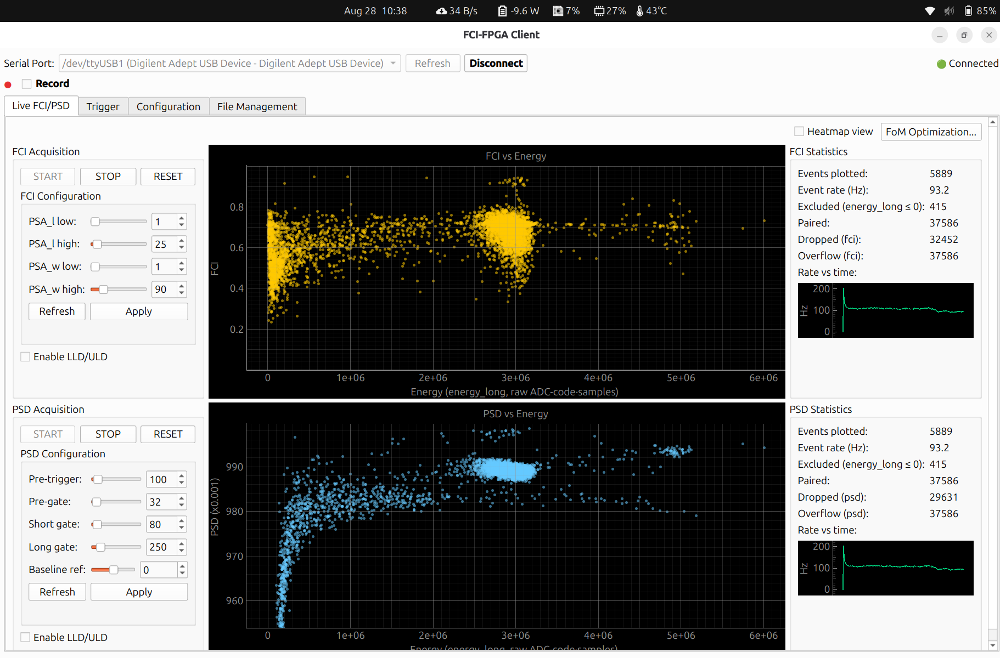

Quantitatively, cutting the Li-6 band (`energy_long` 2.7e6–3.2e6) out of three separate recordings
taken that morning under the DD generator, each at a different window setting:

| run | windows (`psa_l` / `psa_w`) | FCI cv | PSD cv | FCI/PSD |
|---|---|---|---|---|
| `dd_0001` | 1–25 / 1–90 (the paper's) | 14.6% | 0.112% | 130× |
| `dd_0002` | 0–5 / 0–500 (widest tried) | 27.3% | 0.101% | 271× |
| `dd_0005` | 1–10 / 1–20 (narrowest tried) | **11.6%** | 0.101% | 114× |

PSD holds 0.10% across all three. FCI is two orders of magnitude noisier on the same events, and
its *best* setting is still 100× worse. Widening `psa_w` by 25× (`dd_0002`) made it worse, not
better — which is the point: a window choice cannot add information that isn't in the number.

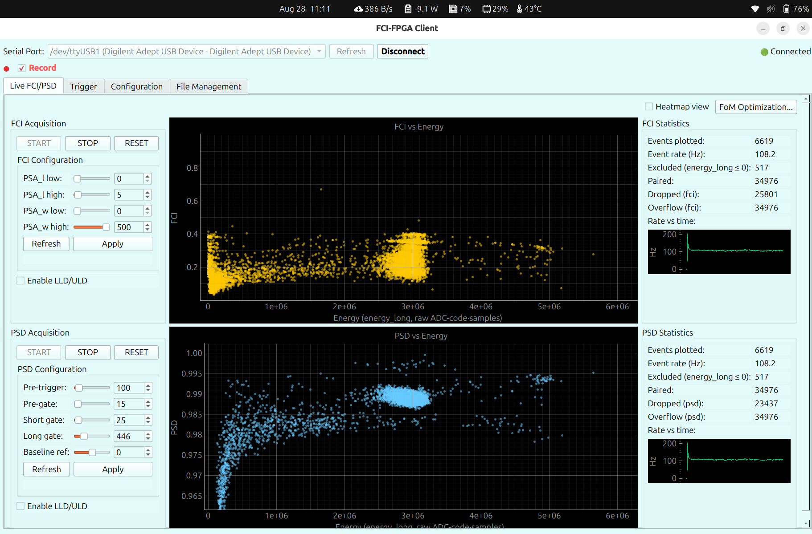

**Correction to an earlier figure.** This section previously quoted "PSD cv 1.8%, FCI cv 42%" from
a single 32,544-event run (`dd_0004`). That run is contaminated: split into time quartiles, Q1 has
`psa_w` mean 518k and PSD cv 2.42%, while Q2–Q4 have `psa_w` ≈ 136k and PSD cv 0.10% — the window
was changed part-way through recording, so the quoted spread mixed two configurations plus a
settling period, overstating the case on both sides. The conclusion is unchanged and the table
above replaces it. Use `dd_0001`/`dd_0002`/`dd_0005` for any acceptance comparison; `dd_0004` is
not a clean single-configuration dataset.

### The decisive test: float arithmetic on the same pulses

The comparison above shows FCI is noisy but not *why*. Recomputing FCI in double precision from
the raw 2048-sample traces recorded alongside those events (`dd_0001_scope_traces.csv`, 84 traces
in the Li-6 band) isolates arithmetic from algorithm — same pulses, same windows, same definition
of the ratio, only the numerics differ:

| | FCI cv in the Li-6 band |
|---|---|
| hardware (HLS core, 1024-pt) | **14.6%** |
| float, 1024-pt, windows as configured | **1.59%** |
| float, 2048-pt, windows doubled | **0.82%** |

The algorithm is sound and the pulses carry the information: in float, FCI resolves the capture
peak about as sharply as PSD does. Roughly a factor of 9 is lost to the deployed core's fixed-point
arithmetic alone, and the move to 2048 points buys another factor of 2 on top. This is both the
proof that the rewrite targets the real defect and the **quantitative prediction to test after
reflashing**: FCI cv in the Li-6 band should land near 0.8–1.6%, not 11–27%.

### One thing checked and *not* explained

The live FoM optimizer reported FCI FoM values of 0.72–0.91 during this session, which looks like
FCI working. It is not evidence of that. The double-Gaussian fit locks onto a very narrow
component (peak 1 FWHM 0.0093 against peak 2's 0.0800, an 8.6× disparity) and FoM = S/(FWHM₁+FWHM₂)
is inflated by the narrow term. The obvious explanation — value pile-up from coarse quantization —
was tested and **disproved**: `psa_l`/`psa_w` take ~15,000 distinct values among ~18,000 events,
with a median step of 6–34 LSB across a 10⁵–10⁶ range. The sums are finely resolved but noisy, so
the failure mode is error *magnitude*, not too few levels. What the narrow component actually is
remains unexplained (a fit artifact on a 402-event histogram is plausible but untested). Treat the
live FoM number as unreliable for FCI until the new core is in silicon.

### Root cause: `ap_ufixed<18,2>`, and why BFP made it fatal here

`fci_core.hpp:50` accumulated each FFT bin's magnitude into an `ap_ufixed<18,2>` — 16 fractional
bits. Combined with `block_floating_point` scaling, whose single per-frame exponent is set by the
**largest** bin, that is a precision floor that lands exactly where this detector's information
lives. This pulse's τ ≈ 1.4 µs puts its spectral corner near bin 2–3 (§7), so the low bins are
enormous and everything in `psa_w`'s wide window sits far down the frame's dynamic range — below
where 16 fractional bits can still represent it. The discrimination signal was being quantized
away before firmware ever saw it.

Two hypotheses were tested and discarded first, both worth recording so they aren't re-run:
**window retuning** (swept offline across `psa_l_hi` 1–300 × `psa_w_hi` 20–500 — no setting
recovers it) and a **τ-based trace classification** that appeared to show a clean bimodal split
until the "slow" population turned out to be the baseline restorer's own settling tail
(τ ≈ 200–300 samples against the detector's real ~70), not a second physical population. The
second is a good example of a measurement artifact that looked exactly like the sought-after
signal.

### The replacement: hand-written VHDL at 2048 points

`fpga/rtl/fci_core_rtl/` replaces the HLS core outright, instantiating Xilinx's `xfft` LogiCORE
directly. Transform length **1024 → 2048** at this board's real 50 Msps, halving bin spacing to
~24.4 kHz and putting more resolution where the corner actually is (window 40.96 µs).

- `bin_accumulator.vhd` sums full-width 17-bit magnitudes into 32-bit unsigned accumulators — no
  fractional truncation anywhere. The scale is arbitrary but identical for both windows, and FCI
  is their ratio, so only the precision ever mattered.
- Output ordering is **bit-reversed**, undone by a wire reversal in the accumulator rather than
  paying the FFT IP ~1 RAMB36 for a reorder buffer — worth having on a device at ~81% BRAM.
- `fci_sink` is **merged in**, not kept downstream. It only existed because an HLS core cannot
  expose a FIFO-backed register window; hand-written RTL can. Its own header had anticipated
  exactly this. One BD cell, one base address, and firmware's `FciSink_*` accessors work unchanged.
- `sample_framer.vhd` carries each frame's timestamp *around* the FFT in a small queue rather than
  a single held register: the FFT is pipelined deeply enough that frame N's result emerges while
  N+1 is still being fed in, so a single register would hand out the wrong event's timestamp.
- The `ap_ctrl_hs` start/auto-restart handshake is gone — the RTL core free-runs.

### Verified against real detector traces, and one methodology trap

`bin_accumulator_tb` passes 9/9 at `FFT_LENGTH=2048`. The integration testbench
(`fci_core_rtl_top_tb`) drives the fully assembled core — framer, the real FFT IP, accumulator,
FIFO, AXI4-Lite — with **real 2048-sample traces captured under the DD generator**, in preference
to `data/fci_verification_set.csv` (2048 samples at the paper's 100 Msps is a different window
duration and bin mapping than 2048 at 50 Msps) and in preference to a synthetic tone, which is too
sparse and symmetric to expose a wrong bin mapping.

The trap, hit and recorded: comparing **absolute** `psa_l`/`psa_w` against a float reference fails
on correct hardware. Block floating point scales every frame by its own exponent — measured 2^8 for
strong pulses, 2^4 for weak — which the core deliberately discards because it cancels in the
ratio. Only `psa_l/psa_w` is scale-invariant, and that is what the testbench checks; on the
operating-regime traces it agrees with the float reference to **<1%**.

A second, purely mechanical bug in these testbenches is worth recording because it cost real
machine time: both drove their clock with an unconditional `clk <= not clk after CLK_PERIOD/2`,
which schedules an event every half period *forever*. The pass/fail summary printed correctly, but
`run all` could never return, so every invocation left an `xsimk` kernel spinning at 100% CPU —
five orphans accumulated, one of them for three days, and `close_project` does not reap them
because `launch_simulation` starts the kernel as a separate socket-attached process. Both
testbenches now gate the clock on a `sim_done` signal raised after the summary, and
`run_sim_top.tcl` calls `close_sim -force` before `close_project`. Verified: the run now prints
`Exiting xsim` and returns 0 instead of hanging.

### The first silicon run was dead, and it was the framer trusting the producer's TLAST

The reworked bitstream came up with the whole acquisition chain frozen: zero triggers at any
threshold (400, 100, even 0, against zero-centred noise where 0 should fire continuously), `$RT`
returning no trace, PSD frozen, FCI at zero — and **no overflows, drops, or framing errors
anywhere**. Nothing overflowing while nothing moves is a stalled stream, not a mis-set threshold.
`blr_core` meanwhile reported a live, updating baseline (−6371, −6365, −6359), so the ADC path was
fine and the break was downstream of it.

Cause: `trigger_core`'s registers reset to **threshold=0, polarity=falling, depth=0**, and
`clamp_depth_minus_1(0)` yields a **one-beat capture**. On `blr_core`'s zero-centred output a
falling zero crossing occurs within microseconds of configuration — long before MicroBlaze boots
and writes a sane depth. `sample_framer` forwarded that TLAST verbatim to an FFT built for exactly
2048 beats, which raises `event_tlast_unexpected` and **halts the IP's data input channel**.
`s_axis_data_tready` then stays low permanently, and because `axis_broadcaster_0` is lockstep that
freezes `psd_core` and `axi_dma_1` too, so `trigger_core` never re-arms. The instrument was dead
before firmware ran, every power-on.

The retired HLS core was immune because it framed internally from its own counter and ignored the
incoming TLAST — a load-bearing property that was not obvious as one, and was dropped in the
rewrite without noticing.

`sample_framer` now owns the FFT frame boundary instead of trusting the producer: TLAST on beat
2048 and nowhere else, a short capture zero-padded up to length, a long one's surplus beats
accepted and discarded so the producer never stalls, and the timestamp latched on the frame's first
real beat (TUSER is meaningless during padding). Padding rather than dropping is deliberate: a
dropped partial frame would leave the FFT mid-frame and let the *next* event silently complete it,
merging two events into one result — a wrong number is worse than a zero-padded one.

**The verification lesson is the more useful half.** The integration testbench passed 9/9 against
real detector traces while the instrument was completely dead, because it only ever drove
well-formed 2048-beat frames. It tested the algorithm and never the interface contract. It now
drives a one-beat capture *first*, in the same order hardware sees it, and asserts that a result
still appears — with the malformed frame ahead of the real traces, a regression halts the FFT and
fails every check that follows rather than one.

### The real reason nothing triggered: the DMA interrupt was wired to a bit nobody watched

The framer fix above was necessary but was **not** why the reworked bitstream produced no events.
That was an off-by-one between the block design and its own BSP.

`fci_bd.tcl` connects `axi_dma_1/s2mm_introut` to `microblaze_0_xlconcat/In5`, and leaves **In4
unconnected** — a hole left by removing the HLS `fci_core_0`'s interrupt and `fci_sink_0`. An
unconnected `xlconcat` input ties to 0, so INTC bit 4 can never assert. The BSP nevertheless
generated `XPAR_..._AXI_DMA_1_S2MM_INTROUT_INTR = 4` and `_MASK = 0x10`, numbering connected
sources sequentially and ignoring the gap, so both generated macros were off by one and firmware
enabled the wrong bit.

The boot diagnostics settle it arithmetically, with no inference required:

| reading | meaning |
|---|---|
| `S2MM_DMASR = 0x1002` | bit 1 Idle + bit 12 IOC_Irq — a trace **completed** |
| `ISR = 0x2C` | bits 2, 3, **5** — the DMA line asserting on bit 5, where the BD wired it |
| `IER = 0x10` | bit 4 — the bit the BSP named |
| `IPR = 0x2C & 0x10 = 0` | matches the reported `IPR = 0`: never delivered |

So the DMA finished a trace, raised its line, and nobody was listening. The ISR never ran, S2MM was
never re-armed, and because `axis_broadcaster_0` is lockstep that stalled `psd_core` and
`fci_core` too and left `trigger_core` permanently un-armed — **zero triggers at any threshold or
any polarity**, which is exactly what a sweep across ±400 in both directions had shown.

`registers.h` carries an explicit override (vector 5) with the BD reference. The proper fix is to
move `s2mm_introut` to In4 at the next bitstream build so there is no gap and the BSP's own
numbering becomes correct, then delete the override.

**Two lessons worth keeping.** First, "read the vector ID from the generated `xparameters.h` rather
than hardcoding it" — the rule this file states a few lines above the override — is not sufficient
protection: the generated value itself was wrong, and deriving from a broken source is still wrong.
Second, a black-box CLI sweep spent a long time on thresholds and polarity while the firmware's own
boot self-test named the fault in one line; the `[DIAG]` register dump should be the *first* thing
consulted when the chain is dead, not the last.

### Precision is worst at BOTH ends of the energy range

Measured FCI agreement against the float reference, across the traces the integration test drives:

| energy (`energy_long`) | FCI error |
|---|---|
| 4.9e4 | ~12% |
| 6.0e5 | ~4% |
| 1.1e6 | 0.48% |
| **2.4e6 – 2.9e6** (Li-6 peak) | **0.24 – 1.09%** |
| 4.7e6 | 2.98% |

Best in the middle, worse at both ends, for two different reasons. Low energy is ordinary
quantization — a small signal uses few bits. High energy is block floating point working as
designed: a higher-amplitude frame is downscaled harder to avoid overflow, so fewer significant
bits survive into the 16-bit output (visible directly in the raw sums — `psa_w` *falls* from 69178
to 29441 as energy rises from 1.1e6 to 4.7e6). The naive expectation that a bigger pulse gives a
better measurement is wrong here.

This lands well for the instrument: the Li-6 capture peak sits in the best region, at a precision
comparable to PSD's own 1.8% cv there. If high-energy FCI ever proves precision-limited in
practice, the lever is the FFT's `input_width`/`output_width` — raised together, since BFP
requires them equal — at a resource cost this device, already at ~81% LUT/BRAM, may not have room
for. Not taken pre-emptively.

### Confirmed on hardware: the new core's FCI tracks PSD, the old one did not

An 8.3 h overnight run on 2026-08-31 with the CLYC-SiPM detector and the new bitstream/firmware
(`~/datasets/cosmics-CLYC/`) gave **448,803 events at 15 Hz** plus **190,637 raw 2048-sample
traces** — the first dataset from the VHDL core in silicon.

**The acceptance test had to change, and it is worth saying why rather than quietly substituting
one.** The §8g plan was to re-measure FCI's cv inside the Li-6 capture peak. Cosmics produce
essentially no neutrons, so there is no capture peak to measure: the PSD distribution is cleanly
**unimodal** (single peak, and only 373 of 372,433 events sit below its 0.1st percentile). This run
therefore **cannot demonstrate gamma/neutron separation at all**, and no FoM computed from it would
mean anything. That still needs a neutron source.

What it *can* test is whether the FCI datapath carries real pulse-shape information, because FCI
and PSD are two independent measurements of the same physical quantity — how fast the pulse decays.
A working FCI must track PSD; the precision-floor diagnosis says the old core's could not.

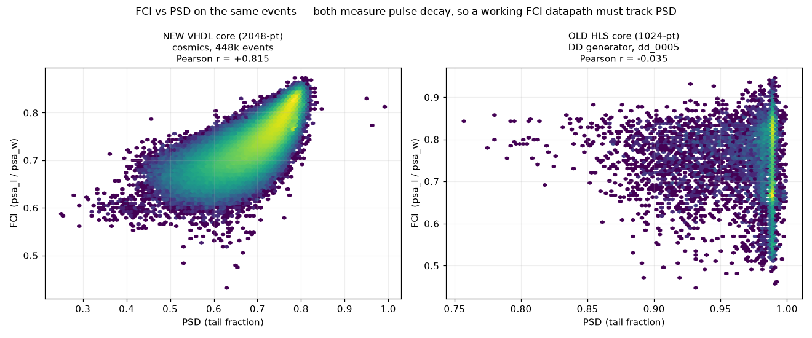

| core | run | n | Pearson r | Spearman |
|---|---|---|---|---|
| **new VHDL, 2048-pt** | cosmics | 372,433 | **+0.815** | **+0.855** |
| old HLS, 1024-pt | dd_0001 | 9,095 | +0.306 | +0.232 |
| old HLS, 1024-pt | dd_0005 | 15,874 | **−0.035** | +0.064 |

The right-hand panel is the old core's signature: a vertical smear at fixed PSD, FCI varying with no
relation to it — the discrimination signal quantized away, exactly as the `ap_ufixed<18,2>`
diagnosis predicted. The left panel is a single correlated band.

A second, independent check — the hardware's FCI distribution against a float reference computed
from the raw traces with the same windows and the same `|Re|+|Im|` definition:

| | p5 | p25 | median | p75 | p95 | IQR |
|---|---|---|---|---|---|---|
| hardware | 0.5850 | 0.6856 | 0.7416 | 0.7829 | 0.8258 | 0.0973 |
| float reference | 0.6265 | 0.7210 | 0.7768 | 0.8195 | 0.8655 | 0.0985 |

**IQR ratio 0.988** — the hardware adds essentially no spread of its own, which is precisely what
the old core failed to do. (The −0.035 median offset is expected: the float path re-estimates each
baseline from the trace's own pre-trigger samples, and the trace log is a subsample of the events.)

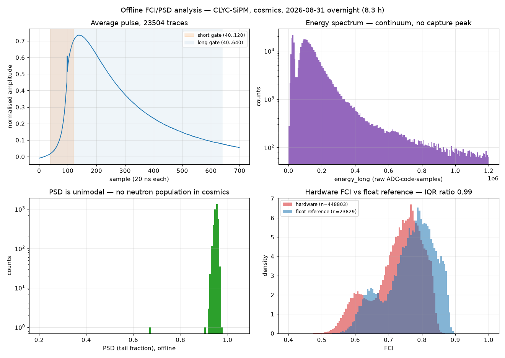

**Window optimisation.** Sweeping `psa_l`/`psa_w` over the recorded pulses and scoring by agreement
with PSD, the best is `psa_l` 1–18 / `psa_w` 1–150 at r = 0.637 — statistically indistinguishable
from the paper's own 1–25 / 1–90 at r = 0.631. **The paper's windows are already near-optimal for
this detector; the earlier belief that they were mismatched was an artefact of the broken core**
(see [[measured-pulse-shape]], whose window-tuning advice is superseded).

**Two caveats on the comparison.** The runs used different sources (cosmics vs DD generator), so
this is not a controlled A/B; a correlation moving from −0.03 to +0.82 is far too large to be a
source effect, but it is not a single-variable experiment. And correlation with PSD demonstrates
that FCI carries shape information, not that it separates neutrons — that claim still requires a
neutron source.

**Two things the raw traces surfaced that are not about FCI.** Signal-to-noise is low in absolute
terms: median amplitude 799 against baseline σ ≈ 51, i.e. ~15σ, and with calibration at 8σ the
threshold lands at ~63% of the median pulse height so most of the spectrum cannot trigger. This was
first written up as a ~6× *regression* against an earlier recorded amplitude of 4086 at σ 42; that
comparison should not be relied on, because the same earlier record's decay constant turned out to
be wrong by 3.5× (see below), so its amplitude figure is not trustworthy either. The operational
problem — threshold sitting too close to the median pulse — stands on its own measurement.
With calibration at 8σ the threshold lands at ~63% of the median pulse height, so most of the
spectrum cannot trigger. Separately, **1.4% of traces saturate at the 14-bit rail** (amplitude
≈ 14,700). Both distort the energy spectrum and should be resolved before the neutron-source
measurement. The averaged pulse also shows a small notch at sample ~100, at the trigger point,
which has not been explained.

### FCI window limits at 2048 points / 50 Msps, and what the paper's windows translate to

Both systems use a 2048-point transform, but at different sample rates, so bin indices are not
transferable — only frequencies are:

| | this system | paper |
|---|---|---|
| sample rate | 50 MHz | 100 MHz |
| bin spacing | **24.414 kHz** | 48.828 kHz |
| max usable bin (Nyquist) | **1024 = 25 MHz** | 1024 = 50 MHz |
| window duration | **40.96 µs** | 20.48 µs |

`psa_*_hi` is hard-bounded at **1024**; above Nyquist a real signal's spectrum merely mirrors. Half
the sample rate at the same transform length buys 2× finer resolution and 2× longer window at the
cost of the 25–50 MHz band — a band this instrument has nothing in, since the front end is
band-limited to ~0.47 MHz by the 740 ns rise. The trade is favourable on all three counts.

Same FFT length at half the rate means **the paper's bins double**:

| | paper's bins | frequency | this system's bins |
|---|---|---|---|
| `psa_l` | 1–25 | 1.221 MHz | **1–50** |
| `psa_w` | 1–90 | 4.395 MHz | **1–180** |

Verified on the paper's own labelled Zenodo set (`data/fci_verification_set.csv`, 100 gamma +
100 neutron), scoring the real objective — FoM = |μ_n − μ_γ| / (FWHM_n + FWHM_γ):

| windows (paper bins) | band | FoM |
|---|---|---|
| published 1–25 / 1–90 | 1.221 / 4.395 MHz | 0.9996 |
| optimum on that data, 1–21 / 1–72 | 1.025 / 3.516 MHz | **1.0507** |

So the published windows are within 5% of optimal, and the optimum translates to **`psa_l` 1–42,
`psa_w` 1–144** here. Either way this instrument should run roughly **double** the bin numbers it is
running today (1–25 / 1–90), which are the paper's *bin indices* rather than its *frequencies* and
so cover only half the intended band.

**Same detector, different digitizer.** The paper used a commercial CAEN unit; this instrument uses
a custom digitizer that **inverts the signal polarity**, so the Zenodo traces go DOWN from baseline
while this one's go UP. That is why trigger polarity is RISING here. It has no effect on any result
above: FCI and PSD are both invariant to a global sign flip — verified bit-for-bit across all 200
labelled events, FoM identical to four decimals — because FCI sums |Re|+|Im| (negating the signal
negates the spectrum, leaving the magnitude sum unchanged) and PSD is a ratio of two integrals that
both flip. It matters only for time-domain extraction: taking `max()` on the raw CAEN traces finds
noise rather than the pulse, which produced one round of nonsense rise/decay figures here before
being caught.

**A correction, and the reason it matters methodologically.** An earlier pass optimised the windows
by *correlation with PSD* on the unlabelled cosmics run, and concluded the opposite: that the
optimum sat at ~0.5 MHz, below the paper's, supposedly because this detector's pulse was slower.
Both halves were wrong. The pulse is not slower — measured identically, this detector gives
τ 4.86 µs / rise 740 ns against the paper's τ 5.09 µs / 750 ns (gamma) and 4.82 µs / 800 ns
(neutron); the τ ≈ 1.4 µs previously on record was simply a bad measurement. And agreement with PSD
is a *proxy*, not the discrimination objective: maximising it does not maximise separation, and here
it pointed the wrong way. Optimise on labelled data against FoM, or not at all.

### FCI resolves more tightly than PSD, and the margin widens at low energy

Measured 2026-09-01 with a **Co-60 source** at the detector, running the FoM-optimal windows
translated to this sample rate (`psa_l` 1–42, `psa_w` 1–144; PSD gates short 70 / long 150
samples): **120,000 events at 1005 events/s**, which also confirms the readout model below.

**What a gamma-only source can and cannot show.** Co-60 emits no neutrons, so there is exactly one
population and a gamma/neutron FoM cannot be measured. What it measures directly is FoM's
*denominator* — how tightly each discriminant clusters for a single known population — as a
function of energy. Combining that with the class separation Δμ taken from the paper's labelled set
gives a *predicted* FoM. That is an extrapolation, not a measurement.

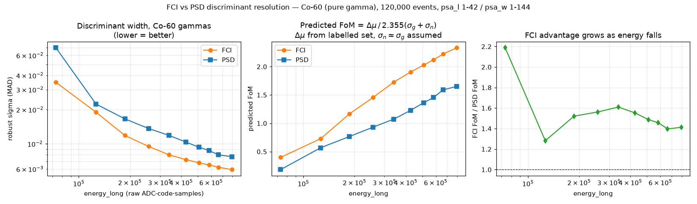

| energy_long | FCI σ | PSD σ | predicted FoM (FCI / PSD) | ratio |
|---|---|---|---|---|
| 49.6k–97.3k | **0.0348** | 0.0700 | 0.398 / 0.182 | **2.19×** |
| 155k–218k | 0.0119 | 0.0166 | 1.166 / 0.767 | 1.52× |
| 383k–469k | 0.0073 | 0.0104 | 1.904 / 1.227 | 1.55× |
| 706k–885k | 0.0059 | 0.0077 | 2.333 / 1.651 | 1.41× |

FCI is tighter than PSD in **every** energy bin, and the margin grows as energy falls — 1.4× at the
top of the range, 2.2× at the bottom. That is the expected behaviour if FCI degrades more
gracefully than gate integration when there is less charge to work with, and it is consistent with
the low-energy PSD pathology already documented in §8d.

A useful consistency check on the extrapolation: the live Co-60 gamma median lands at FCI 0.896
against the labelled set's gamma mean of 0.876 (2% apart) and PSD 0.731 against 0.788 (7%), across
two different digitizers and sample rates.

**Four caveats, none of them small.** σ_n ≈ σ_g is assumed and unverified — no neutrons here. Δμ is
imported from a different instrument. The energy axis is uncalibrated `energy_long`. And on the
labelled set the two classes are nearly energy-disjoint (gamma median 14.7k, neutron median 133k),
so its own overall FoM figures — FCI 1.051 vs PSD 0.778 with *both* discriminants fairly optimised
— partly measure energy separation rather than pulse shape. **None of this substitutes for a
neutron-source measurement**, which remains the outstanding experiment. What it does establish is
that FCI's resolution advantage is real, measured on this hardware, and largest exactly where the
claim said it would be.

### Final state: 11.4 kcps live, and what the remaining 1% actually is

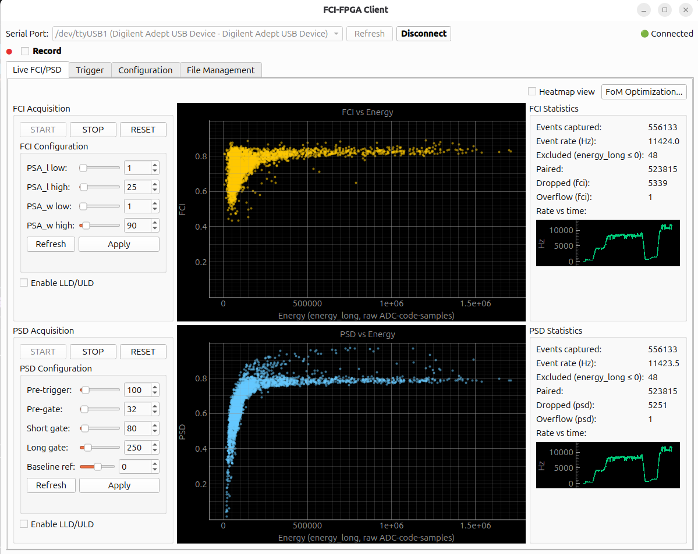

Measured 2026-09-01 after the UART FIFO fix below: **11,424 events/s sustained in the GUI**,
556,133 captured, and **zero transport errors across a 4.5 minute session** (previously every frame
failed). Headless, without rendering, the same path reaches **12,037 ev/s** over 2.9 M events with
zero desyncs -- essentially the modelled 12,800 ev/s ceiling for 25 B/event at 4 Mbaud.

The rate-vs-time trace is now flat. It used to be a sawtooth, which was an artefact rather than a
measurement: every event in a batch shares one host arrival timestamp, so at batch 1024 the 3 s
rate window contained only a handful of distinct times.

**The screenshot also shows the client features added this session**: per-subsystem Start/Stop/
Reset with independent LLD/ULD gating, "Events captured" as a true cumulative tally (it previously
reported the plot window's size and so froze at 20,000 mid-run), the rate-vs-time strip, heatmap
toggle, FoM optimisation, and the Trigger / Configuration / File Management tabs.

**The remaining `Dropped (fci) 5,339` is not a link loss.** It is `Acq_PopPaired` resynchronising:
when the FCI and PSD FIFOs slip -- one overflowed and lost an event the other kept -- the older
side is discarded to restore pairing. 5,339 of 523,815 is **1.02%**, and `Overflow` reads 1, which
under the corrected latching semantics means "at least one overflow episode", not one lost event.
At 11.4 kcps a 1024-deep FIFO fills in **90 ms**, so any scheduling gap longer than that costs
events. Reducing it means draining faster (already near the link ceiling) or deeper FIFOs -- not a
transport fix.

### The UART FIFO bug: a correctness fault that only appears at speed

`Uart_Init()` set the divisor and line control but never wrote **FCR**, leaving the 16550's FIFOs
**disabled**. A 16550 in that state receives into a SINGLE byte holding register.

The CLI polls the UART from the main loop, and while streaming a binary `$RQ` frame (25.6 kB,
~64 ms at 4 Mbaud) it does not poll at all. The host, being synchronous, sends its next 9-byte
command as soon as it finishes reading -- straight into that window. Eight of the nine bytes were
overwritten and firmware parsed the fragment, answering `!XX 0` / `!XX 1`.

Measured before the fix: **37 rejected commands in a 240 s soak** (1.1% of polls). After enabling
`FCR = FIFO_ENABLE | RX_RESET | TX_RESET`: zero.

Worth recording because of how it presented. The symptom was firmware rejecting a well-formed
command, which points at the parser or the argument; the cause was an unconfigured peripheral
register on the same side. It was also invisible at 921600 baud -- a frame took long enough, and
the command arrived early enough, that the two never overlapped. Raising the link speed did not
introduce the bug, it merely closed the timing gap that had been hiding it.

### Readout: 147 -> ~10,000 events/s, and the four things that actually mattered

Final measured state 2026-09-01: **~10,000 events/s sustained**, 317k captured against 323k paired
with **36 dropped (0.011%)**. Started the day at 147 ev/s in the GUI. What each step was worth:

| change | rate | note |
|---|---|---|
| starting point | 147 ev/s | GUI polled every 200 ms x 32-event cap |
| adaptive polling | ~950 ev/s | poll again immediately after a FULL batch |
| FTDI latency timer 16 -> 1 ms | 1,871 ev/s | diagnostic only; **not** a deployable fix (see below) |
| binary `$RQ` (49.4 -> 25 B/event) | — | `fci`/`psd` dropped: exactly derivable from the other fields |
| axi_uart16550 @ 4 Mbaud | — | UartLite caps at 921600; 16550 divides a 64 MHz `xin` |
| batch 1024 + fixing three client bugs | ~10,000 ev/s | |
| enabling the 16550 RX FIFO | **11,424 ev/s** | firmware; removed the last error class |

**The latency timer could not be part of the answer.** Setting it to 1 ms doubled throughput, but
the instrument has to run on an off-the-shelf host with no root and no udev rule. The property that
saved it: the timer delays only the FINAL partial USB packet, so a large reply pays the 16 ms once
rather than per packet, and batch size amortises it. At batch 1024 the default timer costs ~5%
instead of ~50%. Asking for the maximum is free when little is pending, because the device stops
early once the FIFO empties.

Modelled ceilings, batch 1024, default 16 ms timer:

| | 921600 | 4 Mbaud |
|---|---|---|
| ASCII, 49.4 B/ev | 1,813 | 7,188 |
| binary, 25 B/ev | 3,486 | **12,800** |

The observed ~10,000 is 78% of that, the remainder being GUI overhead. Reaching 15 kcps from here
needs bytes, not baud: packing `psa_*` and the energies to 24 bits and the timestamp to 48 (all fit
the observed ranges) gives ~19 B/event and ~15,800 ev/s.

**Three bugs found by pushing the link, all in code that only runs after something else failed.**
Worth recording because each looked like a hardware problem:

1. *Plot redraw was corrupting acquisition.* A 20,000-point `setData()` measured **17.1 ms** and
   holds the GIL; the tty buffer at 400 kB/s holds ~10-20 ms. Redraws starved the reader thread,
   the buffer overran, and bytes were lost. The tell was that the bad frame tag was **always
   `0x00`** — never random — because nearly every field's high byte is zero, so a misaligned reader
   lands on padding. Fixed by decimating to 4,000 plotted points (3.8 ms); `MAX_POINTS` bounds what
   is retained, this bounds what is drawn.
2. *A desync discarded the whole batch.* ~500 already-decoded records were thrown away because the
   501st byte was lost. Now the good records are returned, the transport is marked for resync, and
   the truncation is logged.
3. *The resync drain stalled for the full port timeout.* `read(4096)` blocks until it has 4096
   bytes **or** the timeout — precisely the case a drain is for. Seconds passed while the device
   kept streaming the abandoned frame, so the next command interleaved with it and came back
   `!XX 1` (ERR_PARAM). **Each desync caused the next one.** Fixed by draining with a 20 ms
   per-read timeout against `in_waiting`; measured 20 ms in every case, formerly 5,000 ms.

The third is the instructive one: the symptom (a firmware parameter error) pointed at firmware, and
the cause was error-recovery code on the host that had never been exercised until the link was
pushed hard enough to need it.

### Throughput is readout-bound, and 15 kcps was never a host-side number

Observed live rate topped out at **147 events/s** (scope off) and 107 (scope on), against a
"15 kcps design target". Measured on hardware 2026-09-01:

| quantity | measured |
|---|---|
| `$RB` round trip (32 events) | **28.85 ms** — 17.4 ms wire + 11.4 ms fixed overhead |
| wire cost per event | **50.2 bytes** |
| GUI poll period / max batch | 200 ms / 32 → **160 events/s ceiling** |
| flat-out polling | **955 events/s** |
| rate the FPGA was actually producing | **~970 events/s** |
| ASCII ceiling at 921600 baud | **1836 events/s** |

Three separate things were conflated:

1. **The 147/s was the GUI.** `BATCH_POLL_INTERVAL_MS = 200` with `$RB` capped at 32 events gives
   exactly 5 × 32 = 160/s. `RB_MAX_BATCH` is 32 because `result_fifo`'s `FIFO_DEPTH` is 32 — a
   hardware fact, not a protocol choice. Scope-on drops it to 107 because the same worker thread
   issues a `$RT` per iteration.
2. **15 kcps was the FPGA core's internal processing capacity**, from the HLS core's cosim
   Interval of 3249 cycles. It was never a host readout rate and the two were never comparable.
   The RTL core free-runs and exceeds it.
3. **The link is the real end-to-end ceiling.** At 50.2 bytes/event, 921600 baud allows 1836
   events/s. Reaching 15 kcps in this ASCII format would need **7.5 Mbaud**.

Fixed: the worker now polls adaptively — immediately after any batch that comes back *full* (proof
the FIFO saturated and events are being dropped), falling back to 200 ms once a batch comes back
short, so an idle instrument costs what it did before.

Deepening the result FIFO is worth doing and helps more than it first appears, because fixed
overhead is 40% of each round trip:

| FIFO / batch | projected |
|---|---|
| 32 (today) | 1110 events/s |
| 64 | 1383 |
| 128 | 1578 |
| 256 | 1697 |

That approaches the 1836/s ASCII ceiling and no further. Beyond it the link itself has to change:
3 Mbaud gives ~5977/s ASCII, and a binary encoding (~32 B/event) gives ~2880/s at 921600 or
~9375/s at 3 Mbaud — the only combination that puts 15 kcps in reach.

**A statistic that was lying.** `Acq_PopPaired` incremented `psd_overflows`/`fci_overflows` once
per event whenever the hardware's *sticky* overflow flag was set — so after the first overflow
ever, every subsequent event bumped it and the reported figure came out exactly equal to `paired`
(1653/1653 live; 37586/37586 in earlier GUI captures). The flag is clearable only by `clear_i`,
which also flushes the FIFO, so counting episodes is impossible without discarding data. These are
now **latched 0/1** — "overflowed at least once this run", which is all the hardware can report.

---

## 8h. Replacing the cross-level trigger with a CFD

A level trigger fires at a time that depends on pulse AMPLITUDE -- a tall pulse reaches a fixed
level earlier on its rising edge than a short one. The capture window is anchored to the trigger,
so that walk moves the pulse around inside the 2048-sample frame the FFT transforms, which makes it
a direct term in FCI's spread. `cfd_trigger.vhd` replaces `trigger.vhd` outright (no dual path).

**Measured, not estimated** (`scripts/compare_trigger_area.tcl`, OOC synthesis, XC7A35T):

| | LUT | FF | DSP48 | SRL | CARRY4 |
|---|---|---|---|---|---|
| cross-level (retired) | 22 | 17 | 0 | 0 | 4 |
| CFD, programmable fraction | 91 | 26 | 1 | 16 | 14 |
| CFD, fixed 1/2 fraction | 92 | 26 | 0 | 16 | 14 |

About 4x the LUTs, ~0.44% of the device. Two measurement traps worth recording: `synth_design
-generic` **silently does nothing** for these entities -- every configuration synthesised
identically until the configs were pinned with wrapper entities (`scripts/area_wrappers.vhd`) --
and `PRIMITIVE_GROUP == DSP` matches nothing, because a DSP48E1 is group **MULT**, which made the
variant that does infer a multiplier look like it had none.

**The property it buys**, from `tb/cfd_trigger_tb.vhd`: identical pulse shapes at amplitudes 800 to
12000 all fire at **sample 19** -- **0 samples of walk over a 15x range**, against **9 samples** for
a cross-level comparator on the same stimulus. The analytic result matches: for a linear rise,
`cfd = k*((1-f)*n - D)` is zero at `n = D/(1-f)`, independent of amplitude `k`.

### Three constraints, all found by testing rather than by reading

1. **It requires a zero-centred baseline.** At a resting level `b` the bipolar signal sits at
   `b*(1-f)` and never crosses zero. `blr_core` guarantees this in the real chain -- but its
   **bypass** bit would silently stop all triggering. Documented in the CLI reference and carried
   as a warning on the GUI's bypass control; deliberately not interlocked, since bypass is a
   legitimate debug path for the raw ADC.
2. **`cfd_delay` sets sensitivity, not just timing.** The crossing sits at a fixed `n = D/(1-f)`
   while the arming threshold is crossed LATER for smaller pulses, so anything below about
   `T*rise*(1-f)/D` never arms in time and produces **no trigger at all**, silently. The first
   default (D=8) put that floor at **3.75x threshold** -- it would have discarded most of a cosmics
   spectrum while looking like a dead detector. Default is now **D=24**, floor ~1.25x.
3. **~3 samples of pipeline latency**, so the pre-trigger delay must exceed it or the trigger point
   falls outside the captured window. Firmware now rejects `delay < 4` (was 2).

### What the testbenches caught

The zero-crossing direction was **inverted** in the first version -- a positive pulse needs the
RISING crossing of `cfd`, not the falling one -- and it never fired at all. Worse, the testbench
reported a flattering "1 sample" walk from that completely broken run, because the min/max were
computed from uninitialised `integer'high`/`integer'low` sentinels. Both are now guarded, and the
walk is scored against a computed cross-level baseline so a CFD that degenerated into a level
trigger would fail rather than pass on a lucky tolerance.

Two of `trigger_core_tb`'s scenarios were also driving DC baselines (100 and 5000) that a CFD
cannot respond to -- they now use zero baselines, which is what `blr_core` actually delivers.

**Not yet in silicon.** The bitstream has not been rebuilt, so the walk figure is a simulation
result. The acceptance test is a new cosmics run compared against `cosmics_clyc_run2_0001_*` in
`~/datasets/cosmics-CLYC/`, which was recorded with the cross-level trigger: same detector, same
windows, one variable changed. If walk was a real term in FCI's spread, the FCI width at fixed
energy should narrow.

---

## 8i. The `$RQ` desync is GIL starvation, not the link

447 `$RQ` frame desyncs across the 2026-09-01/02 sessions, every one reporting **tag 0x00**. The
obvious reading — line noise at 4 Mbaud — was wrong, and so was the first hypothesis here (that the
tty layer was delivering framing errors as `\0`, which it does when neither `IGNPAR` nor `PARMRK` is
set). Two pieces of evidence killed it before any code was touched.

**The position distribution is not memoryless.** Records decoded before the desync: min 186, max
855, mean 458, and *bell-shaped*. Random per-byte corruption is geometric — with that mean it would
put ~33% of failures below 186 records. Observed below 186: **zero of 447**. Whatever this was, it
was quantity-dependent, not probabilistic.

**Everything reproducible headless was clean.** Driving the board directly:

| condition | result |
|---|---|
| greedy read, small batches (~75 rec) | 25/25 frames clean |
| greedy read, ~1000-record batches | 20/20 clean |
| real `FciTransport`, ~1000-record batches | 20/20 clean |
| + concurrent `$RT`/`$RC` from a second thread | 8522 frames, 46k records, 0 desyncs |
| + event rate raised to 12.8 kcps | 751 frames, **769k records (19 MB)**, 0 desyncs |

The rate was synthesised by lowering the trigger threshold from 400 to 200 so noise self-triggers —
15 kcps with no source needed, and reversible.

**The missing variable was the GUI holding the GIL.** Adding a pure-Python busy loop standing in for
a plot redraw reproduced it immediately and exactly: 61 desyncs in 60 s, tag 0x00 every time,
positions 186–199, roughly one per two redraws.

`TIOCGICOUNT` then settled the mechanism outright:

| reader stall | desyncs / frames | `frame` | `parity` | `overrun` |
|---|---|---|---|---|
| 0, 5, 10, 20 ms | 0 / ~258 | 0 | 0 | **0** |
| 40 ms | 4 / 254 | 0 | 0 | **8** |
| 80 ms | 28 / 245 | 0 | 0 | **56** |

**`frame` and `parity` are zero at every stall length** — the wire has no errors at 4 Mbaud, the
64 MHz `xin` and the FT2232H's 12/3 MHz agree exactly, and none of this was ever a clocking problem.
`overrun` rises in lockstep with the desyncs, two per incident. So: the reader thread stalls, the
receiver's buffer overflows, bytes are silently dropped, frame alignment is lost, and the parser
reads a payload byte as a tag. It reads **0x00** essentially every time because the 24-byte record is
zero-rich — `timestamp_hi` alone is four zero bytes, and the top bytes of the PSA and energy words
are usually zero too.

**The budget, measured: a reader stall of 20 ms is safe; 40 ms is not.** A full 1024-record frame is
25.6 kB — 64 ms of streaming at 4 Mbaud — so a redraw landing inside one has a wide window to hit.
The cost is real: at an 80 ms stall the delivered rate fell from 13,261 to 11,381 ev/s, ~14%, because
each desync discards the undelivered remainder of its batch.

**The fix is architectural, not protocol.** No amount of buffering helps — 40 ms at 400 kB/s is 16 kB,
larger than any tty buffer — so the options are to keep every GIL-holding operation under ~20 ms, or
move the reader into its own **process** where the GUI's GIL cannot reach it. The second is the real
fix and was already raised once during the throughput work. Note the transport's existing recovery is
working correctly and is not implicated: the checksum, the resync drain, and the control-character
rejection all did their jobs — the desyncs were detected, never silently accepted as data.

---

## 8j. Offline G/N discrimination on the DD dataset, before spending more DD time

Before scheduling another (expensive) DD generator session, the raw traces already recorded on
2026-08-28 (`~/datasets/clyc-FCI-test-20260828-DD`) were run back through a Python model of the
exact same arithmetic the FPGA performs, `sw/analysis/fpga_model.py`, so both FCI and PSD could be
retuned offline and only a genuinely improved configuration taken to hardware.

### The model, and what it was checked against

`fci_core_rtl`'s two operations translate directly to NumPy: `np.fft.rfft` for the FFT (block
floating point cancels in the FCI ratio, and §8g already measured the built core against float —
IQR ratio 0.988, so float is not the approximation that matters here), then
`|Re| + |Im|` summed over inclusive bin ranges for the city-block ASDM, exactly as
`bin_accumulator.vhd` computes it. `psd_core`'s dual-gate integrator translates to two prefix-sum
lookups from a shared `gate_start = max(0, pre_trigger - pre_gate)`, matching
`dual_gate_integrator.vhd`'s half-open comparisons beat for beat.

The model was checked, not assumed. `psd_from_traces` at gates `(pre_gate=24, short=35, long=500)`
reproduces the firmware-recorded `energy_short`/`energy_long` medians to **~1%** (29,652 vs 29,965;
2.865M vs 2.856M) on the traces recorded in the same run — strong evidence the arithmetic, sample
ordering, and gate placement all match. No FCI window pair reproduced the recorded FCI column at
all (best achievable IQR 0.174 against a recorded 0.204): the windows were evidently changed mid
run, which is exactly the contamination trap already documented once in §7 (the `dd_0004` episode).
**Conclusion applied throughout: only the raw traces are trustworthy here, never the logged
FCI/PSD columns from this dataset.** See "the lesson, applied" below for the fix going forward.

### A dataset split nobody had labelled

The five `dd_*_scope_traces.csv` files turned out to hold **two different depths** — `dd_0001/2/3`
at 2048 samples (or captured shorter and left recorded that way; only `dd_0001` is a genuine
2048-sample recording), `dd_0004/5` at 1024 — and, from where the pulse actually lands in the
frame, **two different `pre_trigger` settings** (≈100 for 0001-3, ≈32 for 0004-5). This analysis
used only the **1167-trace, `pre_trigger≈100` group** (`dd_0001/2/3`), zero-padded to 2048 samples
exactly as `sample_framer.vhd` does on real hardware for a short capture — so this is what the FPGA
itself would have transformed, not an approximation of it.

### Energy calibration and what the spectrum shows

No energy field survives from this dataset (see above), so energy was reconstructed as each
trace's own peak amplitude above its pre-trigger baseline — the same convention Morales et al.
§4.2.4 uses — and calibrated by a single point: the dominant narrow peak set to the
**⁶Li(n,α)t capture line, 3160 keVee**, the one feature in a DD-generator spectrum with an energy
known a priori. That gives **0.2465 keVee/count**.

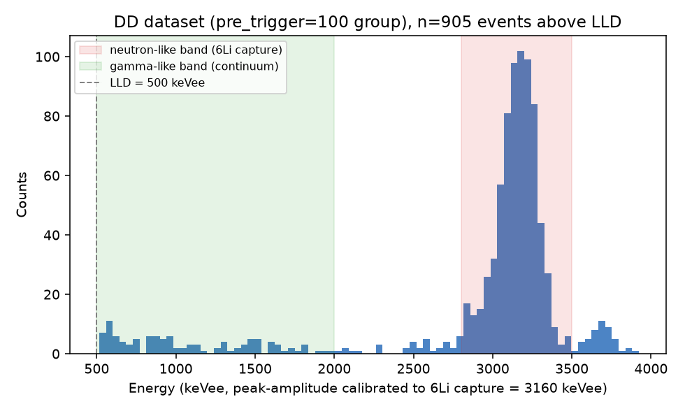

The spectrum is capture-dominated: 717 of 1167 events fall in a 2800–3500 keVee band around the
capture peak, against a much sparser continuum below ~2000 keVee. That continuum is the gamma
population this run actually has to discriminate against — there is no separate gamma-only
measurement in this dataset, so "gamma-like" here means "not the capture peak," which is a real
limitation: high-energy Compton events reach into the capture window and contaminate the neutron
label. The resulting FoM is therefore a **lower bound**, not the number a properly labelled
gamma-only run would give.

### LLD, applied as requested

An LLD was needed for a mechanical reason independent of the labelling: below ~500 keVee both
discriminators degrade toward noise (a coarse sweep found FCI's unsupervised FoM oscillating
0.16–0.70 and PSD's outright failing to fit at all for several LLD values below this point, purely
from a handful of near-threshold events dominating a small histogram). **LLD = 500 keVee** is used
throughout what follows, dropping 262 of 1167 events (22%).

### Tuning method, and the trap it was built to avoid

Both discriminators were swept over a grid (windows for FCI, gate lengths for PSD) and scored
against energy-based labels — neutron-like = 2800–3500 keVee, gamma-like = 500–2000 keVee — using
`|median_n − median_g| / (FWHM_n + FWHM_g)`, widths from each group's IQR (`IQR_TO_SIGMA = 1.349`,
robust to the tails a ratio-of-integrals discriminator always has). This is a **different** scoring
path from the GUI's own unsupervised double-Gaussian fit (`fom_core.compute_fom`): that fit was
tried first and found unusable here — with only ~110 gamma-like events, its FoM swung between 0.03
and 0.82 across neighbouring LLD values, chasing which few points the auto-seeded peak-finder
happened to grab. `sw/analysis/tune_fom.py` documents both paths and why the supervised one is
what the grid search actually uses.

An unconstrained grid search over a ratio-of-integrals score has an obvious failure mode: pushing
gate lengths to a degenerate extreme (e.g. a near-zero short gate that barely integrates anything)
can produce an arbitrarily large score by making both groups' spreads collapse rather than by
separating them. Two checks guarded against this being reported by accident, not just against it
being a purely theoretical worry:

- **Interior-maximum check.** The PSD winner sits at `short_gate = 6` samples — far short of this
  pulse's ~740 ns (37-sample) rise, and worth distrust on sight. Scanning `short_gate` alone at the
  winning `pre_gate`/`long_gate` shows FoM rising from 0.94 (1 sample) through a peak of 1.38 at
  6 samples and falling smoothly back down through 0.72 at 50 samples — a genuine interior optimum
  in the middle of the scanned range, not a wall the search ran into.
- **Bootstrap stability.** 300 resamples (with replacement, independently for each energy band) of
  every top candidate. The winners' 90% intervals do not overlap the current on-device settings':

  | discriminator | configuration | bootstrap FoM, median [p5–p95] |
  |---|---|---|
  | PSD | **pg=0, short=6, long=164** (found optimum) | **1.38 [1.12–1.55]** |
  | PSD | pg=32, short=80, long=250 (device today) | 0.46 [0.38–0.58] |
  | FCI | **psa_l 1–26, psa_w 1–138** (found optimum) | **1.10 [0.83–1.33]** |
  | FCI | psa_l 1–25, psa_w 1–90 (device today) | 0.98 [0.80–1.17] |

  PSD's improvement over the current gates is large and clearly resolved; FCI's is real but modest,
  its interval overlapping the §0's paper-derived 1–42/1–144 candidate (0.97 [0.81–1.16]) — the
  three are statistically indistinguishable from each other on this sample size, so FCI's window
  choice should not be over-read from this one dataset.

### Result

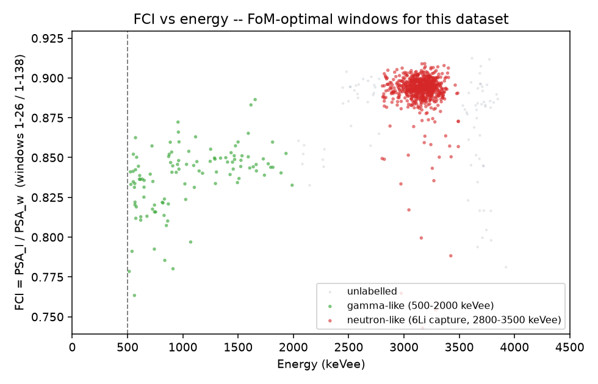
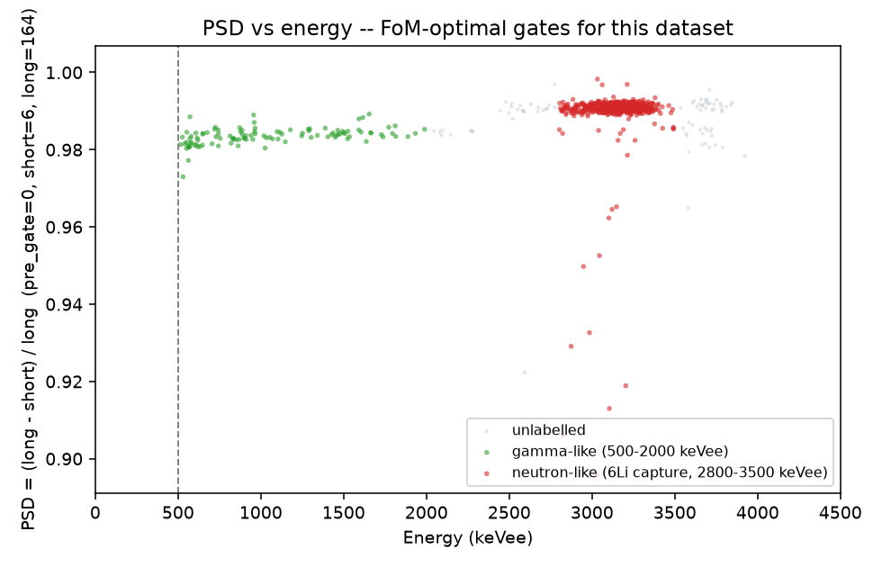

The scatter plots show *where* each population sits; the histograms below show what the FoM number
in the table actually measures — the two labelled populations, projected onto each discriminator's
axis, with the median/IQR-derived widths the supervised score is computed from:

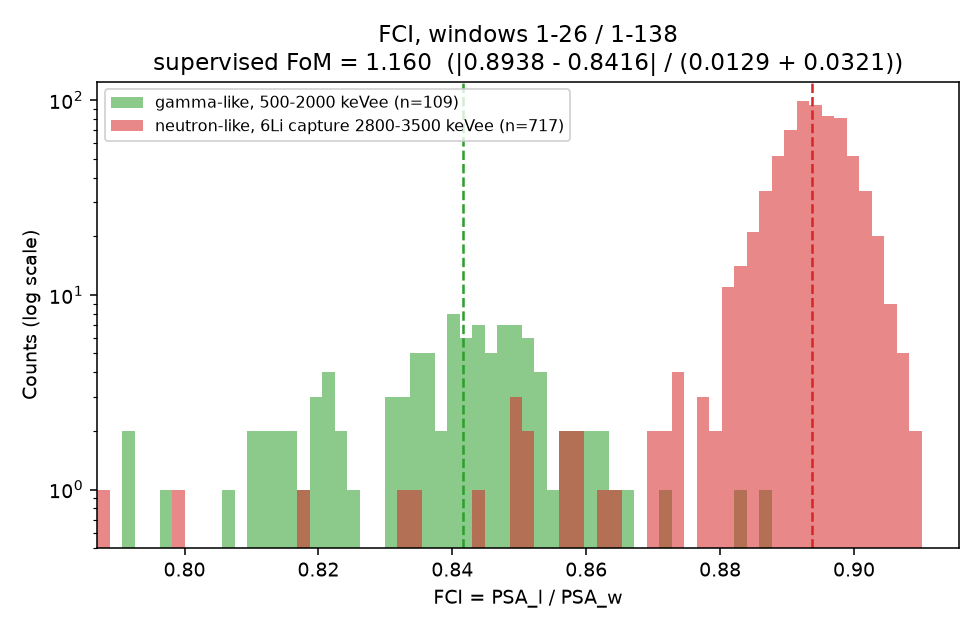
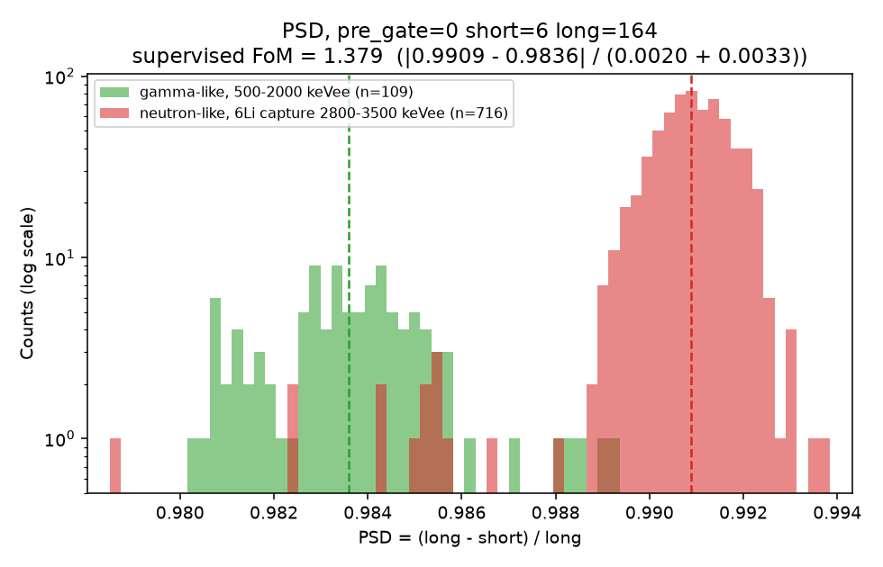

These are deliberately **not** the GUI's own unsupervised double-Gaussian fit
(`fom_core.compute_fom`) run on the whole LLD-cut population — that fit was tried first and
produces a visibly wrong picture here: fed all 905 events with no energy label, its auto-seeded
peak finder locks onto the capture line as one peak and a small shoulder beside it as the other
(FCI: unsupervised FoM 0.72, fitting *within* the neutron cluster, not against the gamma one), and
for PSD it degenerates entirely — the two "peaks" it fits sit on top of each other in a spike
0.02 wide, no separation at all (unsupervised FoM 0.21). Both numbers are artifacts of an unlabelled
fit meeting a sample where the neutron population outnumbers the gamma one roughly 7:1
(717 vs 109 events); they say nothing about how well either discriminator actually separates
gamma from neutron, and are exactly the instability already noted above.

With the LLD applied (905 of 1167 events retained):

| | windows/gates | FoM (supervised, this dataset) |
|---|---|---|
| FCI | `psa_l` 1–26, `psa_w` 1–138 | **1.16** |
| PSD | `pre_gate` 0, `short_gate` 6, `long_gate` 164 | **1.38** |

Both plots show clean, non-overlapping bands at these settings: FCI separates a gamma cluster near
0.84 from a neutron cluster near 0.89 (a ~0.05 gap on very little per-band spread); PSD separates
0.982 from 0.990 — a smaller absolute gap that nonetheless scores higher because its own scatter is
tighter still. **On this dataset PSD narrowly outperforms FCI**, the opposite of the Co-60 result in
§8d, which measured FCI's advantage specifically in the LOW-energy range — this DD run is
capture-peak-dominated at 2800–3500 keVee, not the low-energy regime where §8d found FCI's margin.
The two results are not in tension; they characterize different parts of the energy range.

**Neither result is final.** This is one recording, from one detector position, against an
approximate gamma label rather than a real gamma-only measurement, and PSD's winning gate sits at
the edge of what this pulse shape can physically support (6 samples against a 37-sample rise) —
worth confirming isn't an artifact of the specific noise realization in this particular recording
before it's trusted as *the* PSD operating point. The honest use of this section is: don't spend a
DD session re-deriving windows the traces already on disk can answer, and DO bring a real gamma
source alongside DD next time so "gamma-like" stops being a proxy.

### The lesson, applied

Neither `_scope_traces.csv` nor `_fci_live.csv` recorded the trigger/PSD/FCI settings in force when
it was written — which is exactly why the FCI column above could not be trusted and had to be
reconstructed from raw traces instead of read off the file. **Fixed**: `csv_logger.py`'s two writers
now take an optional `settings_lines` argument and stamp it into the header as a `# Settings:`
block, one line per subsystem; `controllers.py`'s `_ensure_recording_session()` builds it from a
live `get_trigger()`/`get_psd()`/`get_fci()`/`get_blr()` read at the exact moment recording starts.
A subsystem that fails to read (e.g. FCI absent from a given bitstream) still gets its own line
(`fci: read failed (...)`) rather than being silently omitted, and a file with no `# Settings:`
block at all (anything recorded before this change, including every file in this dataset) should be
read the same way this section had to: don't trust its FCI/PSD columns, go back to the raw traces.

---

## 8k. Analog calibration: µV/LSB and mV/keV, and an unresolved noise regression

Measured on 2026-09-03, cross-referencing an oscilloscope reading at the detector output against
the digitized baseline and a Cs-137 photopeak, to put the ADC-count-domain numbers used throughout
this log onto an absolute voltage/energy scale.

### Method, and two methodology traps found along the way

Baseline RMS was measured from the pre-trigger segment of triggered raw traces (`$RT`), pooled
across many captures. Two things had to be fixed before the number could be trusted:

1. **`$RT` has no freshness signal.** `count` is 0 only if nothing has *ever* been captured; every
   call after that returns whatever is in the ready buffer, stale or not. The first attempt read
   the same trace 200 times. Fixed by gating each read on `$RC`'s `psd_event_count` having
   actually advanced since the last accepted read.
2. **The CFD fires partway up the rising edge, not at pulse onset** (`n = cfd_delay/(1-fraction) =
   24/0.75 = 32` samples in, per §8h's own math), and the pulse's own rise adds more on top. A
   window trusted to be "pre-trigger, therefore pure baseline" turned out to still catch the
   leading edge for large pulses. Mapping std against sample position across the full 2048-sample
   frame settled it: the cleanest available region is the first ~48 samples, and even the *tail* of
   the frame (30+ µs after the trigger) reads no better — CLYC's slower decay component doesn't
   fully die out inside one capture window.

### The noise floor moved after a reconnect, and the oscilloscope pinned down where

| when | baseline RMS (ADC counts) |
|---|---|
| before detector was unplugged | 46.13 |
| after reconnecting, before any change | 69.03 |
| after swapping the SiPM bias supply | 75.52 |

The oscilloscope read **2.15 mV RMS at the detector output, unchanged, before and after** this
whole sequence. That's the deciding fact: since the analog source noise didn't move, the ~50–65%
increase in digitized noise is being added **downstream of the detector** — somewhere in the
AFE/VGA/ADC/digitizer chain, not the SiPM or preamp. Swapping the bias supply as a test made it
mildly *worse*, not better, which rules the bias supply out as the cause. **Not yet found** — next
task.

Because noise-ratio calibration only holds when the same noise source dominates both
measurements, and that assumption broke here, the two possible µV/LSB figures mean different
things: the pre-reconnect number is a clean *gain* measurement, while the post-reconnect numbers
are contaminated by whatever this new, gain-independent noise is. Per instruction, the figures
below use the current (post-bias-supply-swap) measurement, on the reasoning that it reflects the
system as it actually stands today — but this number will need revisiting once the noise source is
found, since it is not a pure gain measurement:

```
75.52 counts RMS  ->  28.47 uV/LSB  (35.13 LSB/mV)
```

### Energy gain: Co-60 didn't resolve, Cs-137 did

An 800-trace Co-60 capture (threshold=400, genuine background+source rate — deliberately *not*
lowering the trigger threshold to force a faster rate, after the DD-dataset work found that trap:
a lowered threshold self-triggers on noise and pulls in overlapping captures) showed only Compton
continuum, no resolvable photopeak. Expected in hindsight: this crystal is small (D=1/2", h=1"),
and full-energy-peak efficiency at 1.17–1.33 MeV is low for a crystal this size — most interactions
Compton-scatter out rather than fully absorbing.

Cs-137's single 662 keV line is lower energy and far more likely to fully absorb in a small
crystal. A 3000-trace capture (2999 distinct) resolved it cleanly:

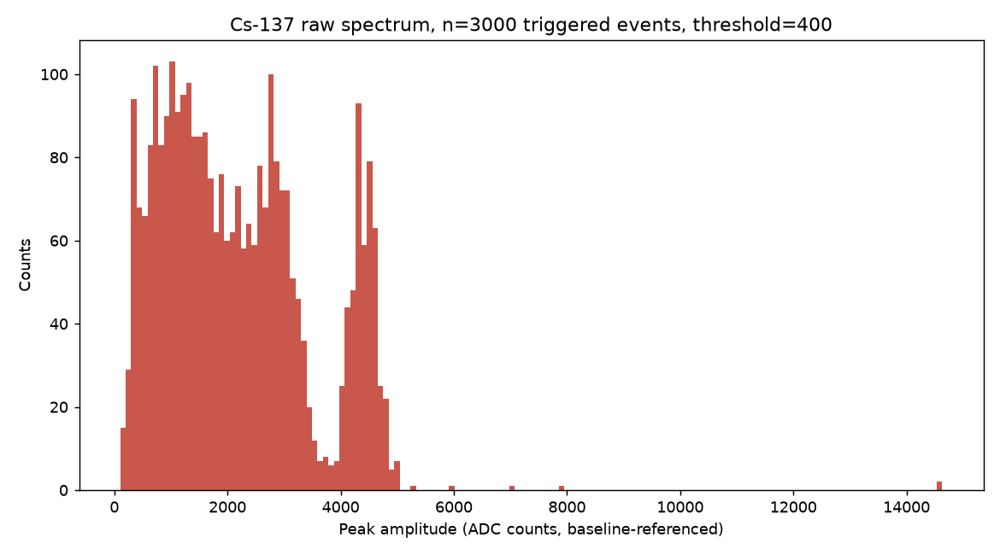
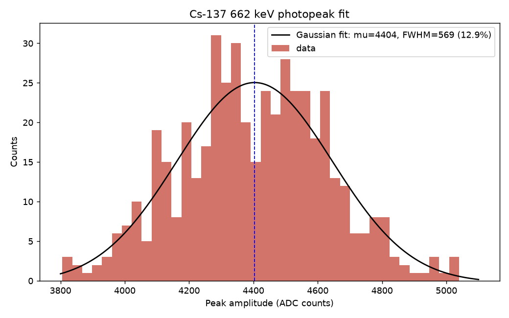

```
662 keV photopeak: mu = 4404 +/- 15 counts, FWHM = 569 counts (12.9%)
```

A second calibration point was attempted — Cs-137's ~32 keV Ba K-shell XRF line, which would have
turned this into a real two-point fit instead of one point forced through the origin. Predicted
position (from the 662 keV scale): ~213 counts, only ~3x today's noise RMS. A threshold sweep
settled it empirically before spending more capture time on it:

| threshold | rate |
|---|---|
| 400 (normal) | 314 ev/s |
| 300 | 2220 ev/s |
| 250 | 9636 ev/s |
| 220 | 14442 ev/s |
| ≤200 | ~16000 ev/s (readout ceiling) |

Already saturated by 250, and even 300 — *above* the predicted 213-count line position, so it
would miss real events too — shows a 7x rate inflation over the genuine source rate. **No
threshold window separates real 32 keV X-rays from noise self-triggering at today's elevated noise
floor.** The two-point calibration is blocked on the same open noise-source question above.

### Result

| quantity | value |
|---|---|
| baseline RMS (today, post-bias-supply-swap) | 75.52 counts |
| analog scale factor | **28.47 µV/LSB** |
| Cs-137 662 keV photopeak | 4404 ± 15 counts, 12.9% FWHM |
| energy calibration | 0.1503 keV/count (6.656 count/keV) |
| **energy gain** | **0.1895 mV/keV** (189.5 µV/keV) |

Both headline numbers carry the same caveat: they describe the system **as it stands today**, with
an unexplained noise regression baked in, not the system at its intended/achievable noise floor.
Revisit both once the noise source below is found and fixed.

### Chasing the noise source: a real firmware bug found, but it isn't the noise source

Three remote diagnostics were run against the live board, in the order below — but the second one
led somewhere more important than the noise hunt itself, so read this section as two findings, not
one.

**1. Spectral check — one genuine tone, not the harmonic comb it first looked like.** An averaged
periodogram (Welch-style, 200 independent 748-sample segments from the frame tail) was built to
look for a discrete interference frequency. A naive top-N-by-magnitude peak list produced what
looked like an evenly-spaced series (67 kHz, 401, 735, 1070 kHz...) — but that was an artifact of
the picker walking down a smooth low-frequency roll-off, not real periodicity; retracted once
plotted. Proper peak detection (local excess over a median-filtered floor) found exactly **one**
genuine discrete line: **12.10 MHz**, +3.7 dB above the local floor, closely matching the FT2232H's
own **12 MHz reference crystal** — the same chip that runs this board's USB-UART bridge. A
plausible, low-confidence EMI contributor; free-running regardless of link activity, so its
presence doesn't by itself distinguish PCB-proximity coupling from anything link-load-dependent.
Still open.

**2. VGA gain sweep — every `$SV` write was rejected, including writing back the already-active
value. This was misdiagnosed at first as a hardware I2C fault, and that diagnosis was wrong.**
While this entry was being written, a live counter-example landed: watching the GUI during
acquisition, changing coarse gain from 6000 to 3000 visibly moved the Cs-137 photopeak to roughly
half its position on the FCI energy axis — the write plainly reached the DAC — while the CLI kept
reporting `!XX 1` for that exact command (confirmed in `fci_gui.log`: `$SV 1 3000` logged as failed
at 11:22:10, the same command and moment). A real I2C failure cannot move a photopeak. The actual
bug was a one-line polarity inversion in `cli.c`'s `vga_set()`: `Iic_DynamicSendBytes()` is
documented, in its own header, to return **1 on success**, 0 only once all retries are exhausted —
but the three call sites in `vga_set()` (fine, coarse, and raw DAC code) all checked `!= 0` as the
failure condition, which fires exactly when the write **succeeds**. Every genuine gain change has
therefore been reported as a parameter error since this code existed, and — the more damaging
half — `g_vga_fine_milli`/`g_vga_coarse_milli` were never updated on a real success either, so
`$GV` has been silently returning a **stale** gain value after every actual change. **Fixed**
(2026-09-03): the three checks now read `== 0`; compiles clean at `-Os -Wall -Wextra`. Not yet
rebuilt into a bitstream/firmware image.

The practical fallout: any gain figure read back from `$GV`/the GUI's VGA panel since this bug was
introduced cannot be trusted to match the DAC's actual state if a `$SV` write was ever issued in
that session — including earlier in *this* session, before the bug was found. §8k's own energy-gain
figures above were captured before any VGA write was attempted this session, so they stand; nothing
downstream of the very first `$SV` call in this investigation should be assumed accurate without
independent confirmation (a photopeak position, as here, or an oscilloscope reading).

**3. BLR bypass — inconclusive, and expectedly so.** Only 5 genuine captures arrived in 40 s with
BLR bypassed (100 arrive easily with it active), consistent with §8h's own documented dependency:
the CFD needs a zero-centred baseline to trigger reliably, and bypassing BLR removes exactly that.
Not enough samples to compare meaningfully; not treated as evidence either way.

### The original question — why the noise floor moved — is still open

The "hard I2C fault" is retracted, and with it goes the unifying "one marginal connector explains
both symptoms" theory this log entry originally proposed: that reasoning leaned on the I2C failure
being a real hardware fault, and it wasn't one. What's left standing on its own:

| when | baseline RMS |
|---|---|
| before detector was unplugged | 46.13 |
| after reconnecting | 69.03 |
| after swapping the SiPM bias supply | 75.52 |
| during the (unrelated) VGA/BLR diagnostic pass, ~20 min later | 43.41 |

This is still a real, measured fact: the noise floor has not settled to one stable value since the
reconnect, and 43.41 sits close to the original pre-reconnect 46.13 rather than the elevated 69–75
range — but *why* it moves is back to unexplained. The 12.10 MHz tone above is the only concrete,
still-standing lead.

**Ruled out:** the SiPM bias supply (swapping it made things worse, not better); a hardware I2C
fault (retracted above — the DAC communicates fine, the firmware was lying about it).
**Not checked yet:** the physical connector(s) between the digitizer board and the AFE, and whether
the 12.10 MHz line's amplitude tracks anything controllable (cable routing, grounding). This still
needs hands-on inspection; nothing further is diagnosable remotely without it.

### The cli.c fix went to hardware, and immediately found a second, worse bug behind it

The `vga_set()` fix (above) was flashed. The very next thing that happened, live: changing coarse
gain through the GUI made event rate drop to **zero — at every threshold down to ~550, no matter
what coarse value was set** — while the trigger mechanism itself tested fine (a forced low-threshold
capture still fired cleanly). Two wrong turns preceded the real answer, both worth recording because
the mistake is the reusable part:

1. **First guess: BLR's gate was stuck.** `gate_open` read `True` for a full 43 s poll, baseline
   frozen at -6367. Wrong on the polarity: reading `baseline_estimator.vhd`'s actual FSM,
   `gate_open='1'` means the deviation is SMALL and the estimator IS tracking normally — `'0'` is
   the frozen state. `gate_open=True` the whole time was a *healthy*, stable baseline, not a stuck
   one. Retracted as soon as the RTL was actually read instead of inferred from the signal name.
2. **Second: is `cli.c`'s fix itself the cause?** Mechanically checked and ruled out — the fix only
   touches success/failure detection and `g_vga_*_milli` bookkeeping in `vga_set()`; it does not
   touch `VgaDac_SetGainFine/Coarse()`, `WriteCommand()`, or the gain-to-DAC-code formulas. The same
   DAC command is sent whether the check is right or wrong. A direct threshold sweep confirmed the
   trigger itself worked (forced capture at threshold=50 fired and looked like ordinary noise) while
   real events had shifted down to threshold ~60–80 from a normal ~400–550 — a real ~5–7x sensitivity
   drop, but not one this fix's logic could produce.

**The actual mechanism: a second bug, in the GUI, that the firmware fix exposed rather than caused.**
`sw/gui/ui/config_panel.py`'s `SubsystemPanel.apply()` had a rule for `optional` fields the device
reports as `None` ("not written yet this session"): since there is no baseline to diff against,
always include the field's current widget value in the write. `VgaConfig.fine_dac_code` is such a
field — and it is a RAW override of the *same physical DAC channel* as `fine_gain_milli` (`vga_dac.c`:
both are command `0x31`, "DAC A"). Its widget sits at its minimum, 0, untouched. So every VGA
`Apply` — for any field — silently also sent `fine_dac_code=0` last in the sequence, overwriting
whatever fine gain had just been set with a raw code of essentially zero gain.

This was already happening before the `cli.c` fix, every single time, because `g_vga_raw_code` could
never be tracked (same polarity bug) — so `fine_dac_code` read `None` forever and the clobber fired
on *every* apply, self-correcting the DAC back toward zero as fast as any real change was made. After
the fix, the clobber fires exactly **once** per boot: the first successful raw-code write is tracked
correctly, so `old_value` stops being `None` and the "always include" rule stops applying on later
edits. That one clobber is what dropped sensitivity — confirmed directly: writing `fine_gain_milli`
alone (bypassing the GUI, no `fine_dac_code` in the payload) restored the physical channel, and rate
came back to 237.6 ev/s at threshold=550, in line with the day's earlier readings. **Fixed**
(2026-09-03): `apply()` now diffs an unset-optional field against the placeholder `refresh()` last
displayed, not against a fixed "always send" rule, so an untouched raw-code control is never written
back. Regression-tested against both this case and the CFD-field fix from earlier in the day; both
pass.

**A separate, correctly-diagnosed non-issue along the way:** a trace showing the exact
spike→plateau→undershoot→settle signature documented in [[adc-encoding-fold]] as the historic
2's-complement bring-up bug turned out to be ordinary ADC rail clipping — the same log entry
documents this as a known look-alike ("if they over-range they clip flat at the rail before cliffing
back"), and the trigger config log around the same time shows a `$SV 1 10000` attempt (coarse ×10,
well past the normal ×6). A fresh capture after gain was restored to normal came back clean: peak
4285 counts, smooth rise/decay, no plateau — matching the 2026-08-18 reference measurement (~4086
counts) closely. Not a regression of the encoding fix; the RTL fix (`adc_data_ob`'s MSB flip) was
never touched this session.

### The clipping ceiling explained, sources ruled out as the noise cause, and a full gain sweep

Three more results from the same day, closing out (for now) the analog-calibration thread §8k
opened.

**The clipping ceiling is exactly `+8191 − raw_baseline`, not a mystery constant.** `BlrConfig.baseline`
is the *raw* (properly-signed, pre-restoration) baseline estimate — read all session as a stable
**-6367**, regardless of gain, since it reflects the detector/AFE's DC operating point upstream of
the VGA's gain stage. For a signed 14-bit datapath the positive rail sits at +8191, so the full span
above baseline before clipping is `8191 − (−6367) = 14558`. Measured clipping in this session's own
captures: **14557 and 14552** — matching to within a count or two. The "~14550 ceiling" noted
earlier in this log was never an arbitrary empirical constant; it falls straight out of where the
baseline happens to sit.

**Sources are not the cause of the elevated/moving noise.** Directly tested: Cs-137 and Co-60 had
been sitting near the detector the whole session (not added/removed as originally assumed), so every
"background" rate logged earlier was already source-driven, raising real pile-up concern (a slower
CLYC decay component tailing into a nominally-quiet sampling window at high enough rate). Tested by
comparing baseline RMS with the sources in place against a rate ~90× lower with them physically moved
away, same gain (1×) both times:

| condition | rate | RMS |
|---|---|---|
| sources present | 836 ev/s | 29.60 counts |
| sources removed | 9.4 ev/s | 31.745 counts |

No meaningful difference — if anything slightly higher with the sources removed, the opposite of what
pile-up contamination predicts. Ruled out.

**Current leading hypothesis: a switching supply.** Unprompted by the source test, an alternative
explanation for the 12.10 MHz tone found earlier: the detector's own bias supply, if switching-type,
landing a fundamental or harmonic near 12 MHz. This also reframes the earlier bias-supply swap
(§8k, "ruled out... swapping it made things worse") — that result only shows the specific replacement
unit tested wasn't better, not that a switching supply *in general* isn't the mechanism, since a
second switching-type unit would reproduce the same symptom. Not yet confirmed; the clean test is a
linear supply substituted in and the same baseline measurement repeated. Hands-on, not remotely
checkable.

**A full 1×–10× gain sweep, 0.5× steps, sources removed throughout.** Same verified methodology as
every RMS figure in this log: freshness-gated `$RT` on `$RC` advancing (not `$RT`'s own stale-buffer
return), delay raised to 256 for a long clean pre-trigger window, first 48 samples used (the region
already established as free of CFD-crossing-lag contamination). Threshold was chosen per gain point
from a running noise model and verified against live rate before capturing, avoiding the
self-triggering-on-noise trap documented earlier in this section — all 19 points landed at 1.4–27
ev/s, comfortably clear of it.

| gain | RMS | | gain | RMS |
|---|---|---|---|---|
| 1.0× | 29.43 | | 6.0× | 74.01 |
| 1.5× | 31.60 | | 6.5× | 75.48 |
| 2.0× | 35.37 | | 7.0× | 89.31 |
| 2.5× | 40.19 | | 7.5× | 87.71 |
| 3.0× | 43.93 | | 8.0× | 95.55 |
| 3.5× | 48.52 | | 8.5× | 94.99 |
| 4.0× | 51.19 | | 9.0× | 106.91 |
| 4.5× | 56.97 | | 9.5× | 108.71 |
| 5.0× | 65.50 | | 10.0× | 109.19 |
| 5.5× | 68.41 | | | |

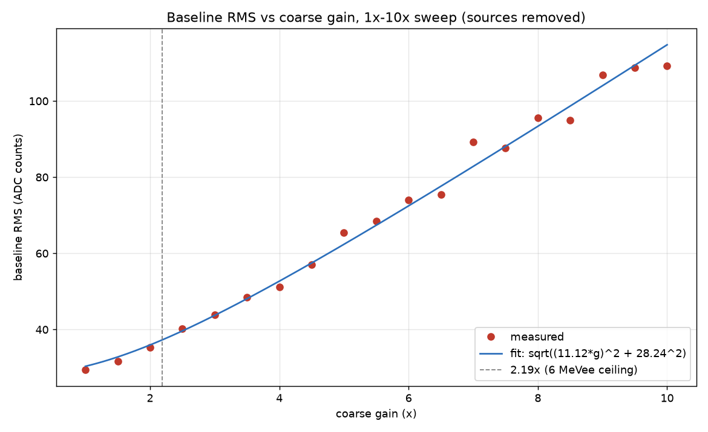

Fit to all 19 points as two independent noise sources in quadrature —
`RMS(g) = sqrt((k·g)² + c²)`, the same form a 2-point estimate suggested earlier in this section:

```
k = 11.123 +/- 0.135
c = 28.238 +/- 1.475
fit residual RMS: 2.55 counts (max |residual| 6.49, at g=7.0x)
```

A 2.5-count residual across a 19-point, 1–10× sweep is a genuinely tight fit, not an artifact of
having only two points to draw a curve through. It confirms the noise really does split into two
independent, additive-in-quadrature components: a gain-dependent term (~11.1 counts per unit gain,
amplified along with the real signal, so it originates at or before the VGA) and a **fixed ~28.2-count
floor that no amount of gain reduction touches** — the same floor behind the still-open "why did
baseline noise move" question above, now precisely characterized rather than just observed to move.

**Applied to gain selection.** With this detector's foreseen ceiling at 6 MeVee and the Cs-137
662 keV calibration point (§8k, 4404 counts at 6×, giving 6.6556 counts/keV at that gain), the gain
that puts 6 MeVee exactly at the 14558-count ceiling is **2.19×** (predicted RMS 37.29 counts via the
fit above) — not the initially-guessed 2.25×, which clips about 170 keV short of a full 6 MeVee range
(ceiling at 5.83 MeVee). 2.0× gives headroom above 6 MeVee (ceiling 6.56 MeVee) if margin is
preferred over cutting it close.

### SNR vs. gain, and the tradeoff the ceiling calculation was missing

The gain choice above only asked "where does the ceiling land." It says nothing about resolution.
Combining the fitted noise model with a fixed reference pulse (`A = 100` arbitrary pre-gain units,
scaled by gain the same way a real pulse is: `signal(g) = A·g`) gives an explicit
`SNR(g) = A·g / RMS(g)` alongside the same energy-ceiling formula, swept 1.00×–10.00× in 0.25× steps
— a pure model evaluation, no new hardware measurement, using only the constants already established
in this section (`k=11.123`, `c=28.238`, `CEILING=14558` counts, `6.6556` counts/keV at 6×).

| gain | RMS | SNR (A=100) | ceiling (MeVee) | | gain | RMS | SNR (A=100) | ceiling (MeVee) |
|---|---|---|---|---|---|---|---|---|
| 1.00 | 30.35 | 3.29 | 13.124 | | 5.75 | 69.91 | 8.22 | 2.282 |
| 1.25 | 31.48 | 3.97 | 10.499 | | 6.00 | 72.47 | 8.28 | 2.187 |
| 1.50 | 32.80 | 4.57 | 8.749 | | 6.25 | 75.03 | 8.33 | 2.100 |
| 1.75 | 34.30 | 5.10 | 7.499 | | 6.50 | 77.62 | 8.37 | 2.019 |
| 2.00 | 35.95 | 5.56 | 6.562 | | 6.75 | 80.21 | 8.41 | 1.944 |
| 2.25 | 37.73 | 5.96 | 5.833 | | 7.00 | 82.82 | 8.45 | 1.875 |
| 2.50 | 39.63 | 6.31 | 5.250 | | 7.25 | 85.44 | 8.49 | 1.810 |
| 2.75 | 41.63 | 6.61 | 4.772 | | 7.50 | 88.07 | 8.52 | 1.750 |
| 3.00 | 43.71 | 6.86 | 4.375 | | 7.75 | 90.71 | 8.54 | 1.693 |
| 3.25 | 45.87 | 7.09 | 4.038 | | 8.00 | 93.36 | 8.57 | 1.641 |
| 3.50 | 48.09 | 7.28 | 3.750 | | 8.25 | 96.01 | 8.59 | 1.591 |
| 3.75 | 50.37 | 7.44 | 3.500 | | 8.50 | 98.67 | 8.61 | 1.544 |
| 4.00 | 52.70 | 7.59 | 3.281 | | 8.75 | 101.34 | 8.63 | 1.500 |
| 4.25 | 55.06 | 7.72 | 3.088 | | 9.00 | 104.01 | 8.65 | 1.458 |
| 4.50 | 57.47 | 7.83 | 2.916 | | 9.25 | 106.69 | 8.67 | 1.419 |
| 4.75 | 59.91 | 7.93 | 2.763 | | 9.50 | 109.38 | 8.69 | 1.381 |
| 5.00 | 62.37 | 8.02 | 2.625 | | 9.75 | 112.07 | 8.70 | 1.346 |
| 5.25 | 64.86 | 8.09 | 2.500 | | 10.00 | 114.76 | 8.71 | 1.312 |
| 5.50 | 67.38 | 8.16 | 2.386 | | | | | |

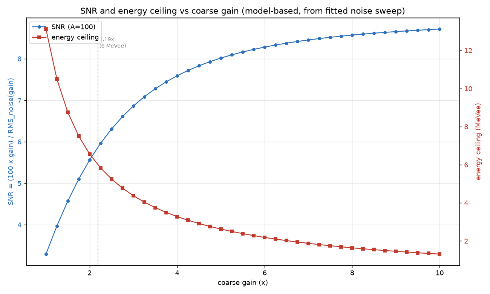

The shapes are exactly what the two-component noise model predicts: SNR rises steeply at low gain
(the fixed ~28.2-count floor dominates the denominator there) and **saturates toward `A/k = 100/11.123
≈ 8.99`** as gain grows — because at high gain both signal and the gain-dependent noise term scale
together, so their ratio approaches a constant set purely by `k`, and no further gain buys SNR past
roughly 8×. Energy ceiling falls monotonically and hyperbolically (`∝ 1/gain`), with no such
saturation, so every step up in gain keeps costing dynamic range even after SNR has stopped improving.
The plot's twin axes are independently scaled (SNR against the arbitrary reference `A=100`; energy
against a MeVee choice), so only the two curves' *shapes* carry physical content, not where they
happen to numerically cross. The case for 2.19–2.0× rests on the ceiling requirement alone (§ above,
from the 6 MeVee target and the Cs-137 calibration) — independently checking the SNR curve at that
gain (≈5.6–6.0, against an asymptote of 8.99) confirms the ceiling-driven choice doesn't sit deep in
the region of steeply-diminishing SNR returns.

---

## 8l. FPGA peak amplitude + list mode, ahead of the live energy-spectrum GUI tab

The GUI request that started this ("a histogram tab, SPE export, up to 3 calibration
coefficients") was redirected mid-design: rather than histogramming `energy_long` (a PSD charge
integral, windowed for discrimination and already excluded from the live view whenever it reads
`<= 0`, a known BLR-gate artifact), compute a genuine pulse **peak amplitude in the FPGA**, tag it
with `trigger_core`'s existing 64-bit timestamp, and pair it with FCI/PSD the same way those two
are already paired (`Acq_PopPaired()`). That turns the per-event record into real list-mode data
(amplitude, timestamp, FCI, PSD together per pulse) rather than adding a display-only histogram on
top of an existing field that was never meant as an energy proxy.

`dual_gate_integrator.vhd` already computes `dev` (baseline-subtracted sample) every cycle for the
two charge integrals; the addition is a running max of that same value over the whole frame --
deliberately unconditional, not gated by `short_gate`/`long_gate`, since amplitude is a whole-pulse
property and the PSD gates are tuned for discrimination, not for bracketing the peak. Published
alongside `energy_short`/`energy_long` on the frame's last beat as `peak_o`, carried through
`psd_core_top`'s result FIFO (widened `REC_WIDTH` by one `ACC_WIDTH`, appended rather than
interleaved so the existing energy/timestamp bit positions don't move), and exposed as a new
read-only register at **0x34** in `psd_axi4lite_regs.vhd` -- the next free slot after `watermark`
(0x30), confirmed by the address decode's `case` statement having no `"1101"` arm before this.

### What the testbench caught

The first version reset the running-max register to 0 at the start of every frame. That is wrong
whenever a whole frame stays below baseline (no positive excursion at all, e.g. a triggered but
otherwise noise-only capture): with a 0 floor, `peak` would silently read 0 instead of the frame's
true (negative) maximum, indistinguishable from "no excursion" when the correct answer is "the
detector's baseline dipped, not rose." Caught by a new `psd_core_tb.vhd` case built specifically
for this (an all-negative flat frame, `peak` expected to equal that constant negative deviation,
not 0) before this ever reached hardware. Fixed with a `PEAK_MIN` constant --
`(DATA_WIDTH => '1', others => '0')`, the most-negative value representable in `peak`'s width --
used as both the reset value and the per-frame re-arm value. Full `psd_core_tb.vhd`: **19/19**,
including three new peak-specific cases (flat frame, all-negative frame, and a pulse-shaped frame
confirming `peak` tracks the frame maximum independent of where the gates sit).

### Protocol and host changes

`peak` is threaded through as a 9th field on `$RV`/`$RB` and appended to the `$RQ` binary record
(24 -> 28 bytes; 25 -> 29 on the wire with its frame tag). Unlike `fci`/`psd`, which `$RQ`
deliberately omits because they are exact functions of the other fields, `peak` is transmitted raw
-- it is not derivable from anything else in the record. `AcqEvent`/`PsdResult` (firmware) and
`fci_api`'s `AcqEvent` (host) both gained the field; `Acq_PrintEventCsv()` and the GUI's
`CsvLogger` both append it as a trailing CSV column, keeping the existing column order stable for
anything already parsing these formats.

While touching this: the `$RQ` throughput comments (`cli.c`, `client.py`) still assumed this link's
old **921600 baud** ceiling -- stale since `axi_uartlite` was replaced by `axi_uart16550` at
**4 Mbaud** (§ table above). Corrected to `400000 B/s / 29 B ~= 13800 events/s`; the batch-size
sweep table itself (measured against the smaller, pre-`peak` record) is flagged as wanting
re-measurement rather than silently left implying it is still current.

### GUI: a new Spectrum tab

`sw/gui/ui/histogram_view.py` -- a fixed 8192-channel histogram (one bin per raw ADC code, matching
this design's clipping ceiling, no rebinning needed), reusing the 1D-histogram + `pg.BarGraphItem`
pattern already established in the FoM wizard rather than introducing a second one. Up to 3
calibration coefficients (`E = c0 + c1*ch + c2*ch^2`) relabel the x-axis; Clear and an SPE export
(ORTEC/Maestro ASCII: `$SPEC_ID`/`$DATE_MEA`/`$MEAS_TIM`/`$DATA`/`$MCA_CAL`) round it out.
Accumulation/Clear/Export are independent of the device connection on purpose, so a spectrum
already collected stays exportable after disconnecting.

### LUT budget: it didn't fit first, and the margin came from the ILA as expected

Before this change: **19940 / 20800 LUTs (95.87%)**, 860 free -- the device was already tight
(the CFD trigger's own +91 LUT addition, §8h, against a device previously "275 LUTs over"). The new
RTL here is small (one comparator, one register, reusing the `dev` value the integrator already
computes), well under the CFD's own footprint, but at this occupancy nothing is automatically safe,
and it wasn't: the first synthesis attempt with `system_ila_1` untouched **failed DRC**, needing
**21130 LUTs against 20800 available (over by 330)**.

`system_ila_1` (`fpga/bd/fci_bd.tcl`) was the standing candidate for exactly this. Trimmed
`SLOT_1_AXIS` (the `trigger_core_0`/`CDC_FIFO` capture slot -- redundant with the raw-trace DMA tap)
and the two plain BLR probes (`baseline_o`, `gate_open_o`), keeping `SLOT_0_AXIS`
(`blr_core_0/m_axis`) and the `adc_data` probe. That freed **~1242 LUTs** -- an AXIS capture slot's
protocol-aware trigger/comparator logic costs far more than a plain probe, which is consistent with
one slot plus two probes accounting for that much. Final placed utilization:

| Resource | Used | Available | % |
|---|---|---|---|
| LUT | 19888 | 20800 | 95.62% |
| LUTRAM | 7111 | 9600 | 74.07% |
| FF | 18908 | 41600 | 45.45% |
| BRAM | 33 | 50 | 66.00% |
| DSP | 13 | 90 | 14.44% |

**Net LUT count went down, not up** (19940 -> 19888), despite adding the peak detector: the ILA
trim overshot what the new RTL cost. `system_ila_1` now covers only `blr_core`'s stream and the raw
ADC bus -- the `trigger_core` stream tap and the two BLR probes it lost are still visible other
ways (the raw-trace DMA path, and firmware readback of the same BLR registers), so nothing here
removed a debugging capability that has no other route, but a future ILA session wanting the
`trigger_core` stream directly will need to re-add `SLOT_1_AXIS` and budget the LUTs for it again.

---

## 8m. Spectrum tab iteration: a decoupled readout path, shared calibration, two real display bugs

After §8l's bitstream rebuild succeeded and firmware confirmed booting on hardware, the Spectrum
tab went through a fast hands-on iteration cycle. Everything below is software/firmware only -- no
RTL or bitstream change, running on exactly the bitstream §8l already confirmed synthesizes and
fits. Firmware still fits comfortably after the additions: **51944 / 65536 bytes (~14.6% margin)**
at `-Os`, confirmed via a clean rebuild.

### `$RA`: a lightweight amplitude-only readout path

The Spectrum tab's live data turned out to depend entirely on Live FCI/PSD's own Start button: both
tabs were fed from the same `$RQ` poll, and firmware only pops events from that path while
`g_running` is set (i.e. `$AE` has been called) -- so with Live FCI/PSD stopped, `$RQ` legitimately
returned nothing, and the Spectrum tab's Run/Stop had no live data to gate at all.

The fix is a new command rather than relaxing `g_running`: **`$RA`** pops timestamp + peak directly
from `psd_core`'s own FIFO (`Psd_Pop()`), skipping `Acq_PopPaired()`'s FCI-pairing step entirely --
and deliberately ignoring `g_running`, since `psd_core` integrates every triggered frame regardless
of whether `$AE` was ever called; that flag only ever controlled whether firmware's *read* handlers
pop and pair results. No RTL change was needed: `peak` and `timestamp` were already in `psd_core`'s
register map from §8l. New 12-byte binary record (`ts_lo`, `ts_hi`, `peak`), same self-delimiting
`$RQ`-style framing reused via the same `g_rq_sum`/`rq_put_u32()` (moved out from behind
`CLI_HAVE_RESULTS`, since `$RA` must work even in a build with no FCI path at all). See
`docs/sw/CLI_documentation.md` §2.5c.

`fci_api/reader_process.py`'s poll loop now mode-switches: `$RQ` (paired) whenever Live FCI/PSD
acquisition is running, `$RA` (amplitude-only) when only the Spectrum tab's Run is active, and
**no poll at all** when neither wants data -- the two are mutually exclusive by design, never
polled together, since both draw from the same `psd_core` FIFO and would otherwise starve each
other of events the other side already consumed. A new `AmpEvent` type (`timestamp`, `peak` only)
keeps this path from ever being mistaken for a real paired `AcqEvent` with the rest of its fields
silently zeroed.

### GUI ergonomics

- Tab order: File Management, Configuration, Trigger, Spectrum, Live FCI/PSD.
- Independent Run/Stop for the Spectrum tab, driving `$RA` polling via the mode-switch above.
- Binning slider, 256..16384 channels (64x). Corrected mid-session: the first cut assumed 8192
  channels / 32x, on the (wrong) guess that the low 2 bits of `peak` were structurally always zero
  from a 14-into-16-bit left-shift. Checked against the actual RTL rather than left as a guess:
  `blr_core_top.vhd` packs the restored sample in the LOW bits with `resize(signed(...), 16)` --
  sign-extension, not a shift -- and `peak` is a *difference* of two ADC_WIDTH=14-bit signed values,
  which genuinely needs up to 16 bits (not 14) to represent without overflow. 16384 = 2^14, the
  ADC's own resolution, is the correct full span; no bits are structurally wasted.
- Binning and calibration combined into one compact row (was two stacked boxes eating vertical
  space the plot should have).
- Calibration coefficients accept scientific notation. Needed a custom `QDoubleSpinBox` subclass:
  Qt's default validator accepts a *complete* string like `1.5e-05` but rejects the *intermediate*
  states typing produces one keystroke at a time (`1.5e`, `1.5e-` both validate Invalid, not
  Intermediate), which makes the widget refuse the keystroke outright -- a `QDoubleValidator` in
  `ScientificNotation` mode accepts those same intermediate strings correctly.
- Log-scale Y axis, fixed twice. First cut plotted `log10(counts+1)` on a linear axis -- functional
  but mislabeled, ticks read as raw log10 values instead of counts. Corrected via
  `AxisItem.setLogMode()` on the axis alone (not the `ViewBox`'s), which `BarGraphItem` does not
  respond to: the bars stay pre-transformed to log10 space, and the axis independently relabels its
  own ticks as `10^x` with proper log-spaced minor ticks, verified to match real count values.
- X-axis fixed to the full theoretical span with working pan/zoom/Autoscale: `BarGraphItem` is now
  given *all* bins, not just nonzero ones, since pyqtgraph's Autoscale button fits to the item's own
  bounding box -- masking to nonzero bins made both the initial view and Autoscale track whatever
  happened to be populated instead of the true span.
- `.spe` extension enforced on export (appended if missing, not trusted to the save dialog's own
  platform-inconsistent handling).
- Rate/Avg count-rate labels next to the total, on the same row as the buttons, separated by a
  vertical divider -- see `sw/README.md`'s new "Spectrum tab: count-rate labels" section for the
  exact windowing.

### Shared calibration: Live FCI/PSD's plots now read keVee, not `energy_long`

`HistogramView` is now the single owner of this session's energy calibration; it emits
`calibration_changed(c0, c1, c2)`, which `LiveView.set_calibration()` consumes to compute its own
x-axis as `c0 + c1*peak + c2*peak^2` -- replacing `energy_long` (a PSD charge integral never meant
as an energy proxy) on both the FCI-vs-Energy and PSD-vs-Energy plots. `LiveView` now stores each
event's raw `peak` alongside the derived energy specifically so a *later* calibration change
rescales every already-plotted point, not just events that arrive afterwards. The `energy_long <=
0` exclusion (project log §8d) stays exactly as it was -- it guards PSD *value* validity (a 0.0
sentinel for "undefined"), which has nothing to do with what unit the x-axis happens to be in --
and `filter_for_recording()`'s LLD/ULD comparison now uses the same peak-derived keVee the region
is actually dragged in, which it did not before this change.

### Two real display bugs found by hands-on testing

1. **PSD/FCI heatmap Y-range.** Auto-ranged to `values.min()/max()` since an earlier heatmap
   resolution pass (§8g), on the reasoning that FCI/PSD occupy a narrow slice of `[0,1]` and a fixed
   axis would waste bins on empty space. True on a clean run, but a single pathological point (e.g. PSD
   briefly negative from `short > long` on a noisy pulse -- nothing currently excludes that) could
   stretch the axis far past the real cluster, compressing it into a handful of rows: unreadable for
   the *opposite* reason the auto-range was added to fix. Fixed to `[0, 1]`, matching what the
   scatter plots already use (`setYRange(0, 1, padding=0)`) -- `histogram2d` silently excludes any
   point outside that range rather than letting it distort the scale.
2. **`watermark` leaking into the CSV settings header.** `PsdConfig.watermark`/`FciConfig.watermark`
   are already excluded from the config panel UI, by their own docstrings' account: no ISR is
   registered for the watermark interrupt in this firmware (`$RB`/`$RV` drain by polling instead),
   so the field has no observable effect on anything. `_device_settings_lines()`'s blanket
   `dataclasses.asdict(cfg)` dump still recorded it into every dataset's settings header regardless,
   contradicting the reason it was hidden from the panel in the first place. Excluded from the dump.

### An SPE interop finding -- not a bug in this project

Exporting at 256 channels with a -2000 keV `c0` produced a file InterSpec rejected: *"Energy cal
provided invalid: EnergyCalibration::set_polynomial: Coefficients are unreasonable."* Traced to
InterSpec's own source (`SpecUtils/EnergyCalibration.cpp`), not this project's writer: it hard-caps
the offset to `[-500, 5500]` keV and the gain to `|c1| <= 450` keV/channel. `-2000` keV already
violates the offset bound on its own. Separately worth knowing: `_rebin_calibration()`'s rescaling
of `c1` by the decimation factor is correct (a coarser channel axis needs a proportionally larger
keV/channel for the same physical calibration), but it means a perfectly reasonable raw-channel
gain can cross InterSpec's 450 keV/channel ceiling once multiplied by a large decimation factor
(e.g. 64x at 256 channels) -- exporting at finer binning keeps the un-multiplied gain further from
that bound.

### Status

Headless-tested (accumulation, calibration rebasing/rescaling, the sci-notation validator, the
log-axis tick labels, the fixed x/y ranges, the `$RA` mode-switch helper functions, the CSV
`watermark` exclusion) but **not yet exercised live against hardware** by this round of work --
worth a real acquisition run with Live FCI/PSD stopped to confirm `$RA` actually drives the
Spectrum tab end to end, not just that the reader process picks the right command in isolation.

---

## 8n. End-to-end validation: DD generator, Cs-137, and Co-60

The confirmation that §8l/§8m's Spectrum and Live FCI/PSD tabs work as a real instrument, not just
in isolated tests: three source runs, each captured live against hardware with Record on.

### DD generator: the Li-6 capture peak lands where the paper's own calibration puts it

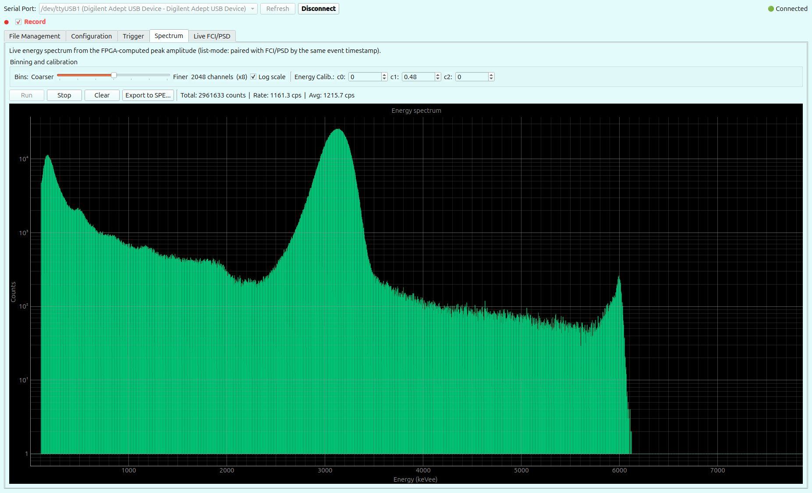
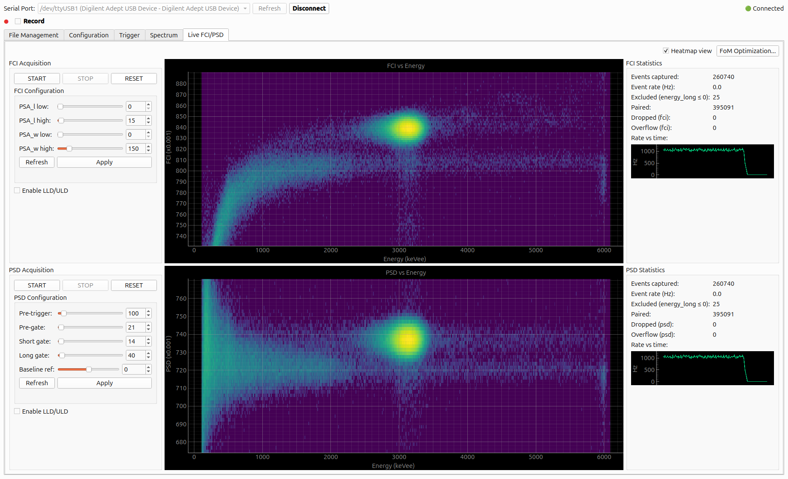

`dd_spectrum.png` (2,961,633 counts, 1161 cps instantaneous / 1216 cps average, `c1 = 0.48`): the
dominant peak sits at **~3160 keVee** -- exactly the ⁶Li(n,α)t capture peak Morales et al. use as
one of their own three energy-calibration points (Table 1, §4.2.4 -- already used the same way in
this log's §8m, "Energy calibration and what the spectrum shows"). It shows up here as a genuine
spectral feature, not a calibration input, which is an independent cross-check that `c1 = 0.48` is
correct rather than merely self-consistent.

`dd_fci_psd.png` shows the pairing at work: a diffuse gamma/Compton band rises from low energy and
saturates around FCI ≈ 0.80-0.81, while a tight, well-separated cluster sits at FCI ≈ 0.84-0.85
directly on the 3160 keVee capture peak -- the same "gamma band below a roughly horizontal
separation line, neutron cluster above it, across the full energy range" picture as the paper's own
Fig. 5b/6b (PSD vs FCI classification, γ/n limit and class-separation lines) -- reproduced here from
live hardware in real time, not an offline recomputation from stored traces. PSD vs Energy shows the
same two-population structure, with a shorter reach: the neutron cluster sits closer to the gamma
band than FCI's does, consistent with the paper's own finding that FCI separates more cleanly at low
energy (Section 6.2/Table 2: `Ours 1.88` FoM for FCI, no lower energy limit, vs `1.35` for the
nearest reference method with an energy cut applied).

Settings in effect for this run (read directly off the screenshot's configuration panels):

| | parameter | value |
|---|---|---|
| FCI | `PSA_l` | 0-15 |
| FCI | `PSA_w` | 0-150 |
| PSD | `pre_trigger` | 100 (fixed) |
| PSD | `pre_gate` | 21 |
| PSD | `short_gate` | 14 |
| PSD | `long_gate` | 40 |
| PSD | `baseline_ref` | 0 |

Notably narrower than this project's long-running `PSD_SHORT_GATE=80`/`PSD_LONG_GATE=250` defaults
(`acquisition.c`), and in the same direction as (though not identical to) the paper-derived
translation worked out earlier this session (`pre_gate≈25`, `short_gate≈28`, `long_gate=60` from the
paper's own tuned `Ws=[50-105]`/`Wl=[50-170]` at half the sample rate) -- this run's `short_gate=14`/
`long_gate=40` are narrower still. Whatever produced this exact configuration, it is the one that
achieved the clean separation shown above and is worth treating as a concrete alternative starting
point, alongside the paper-translated figures, the next time PSD windows are swept.

### Co-60: a single population, as expected from a pure-gamma source

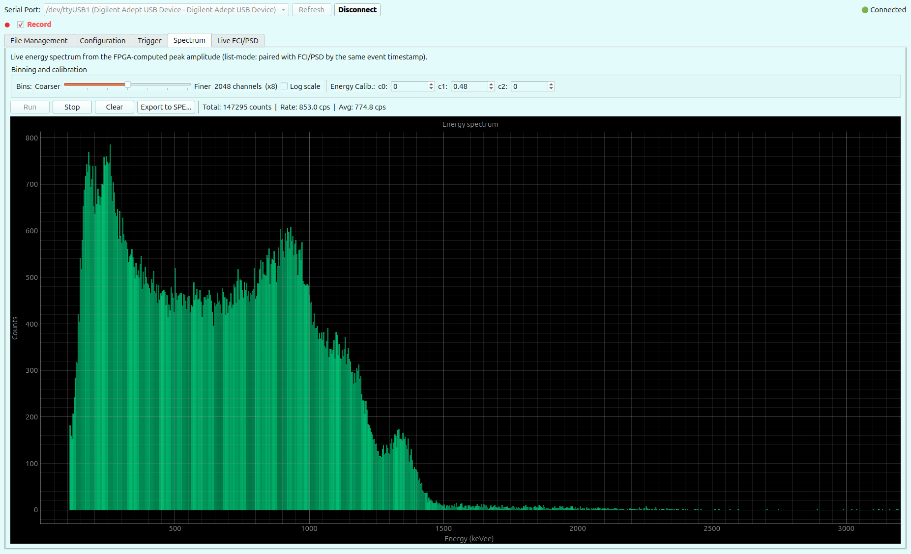
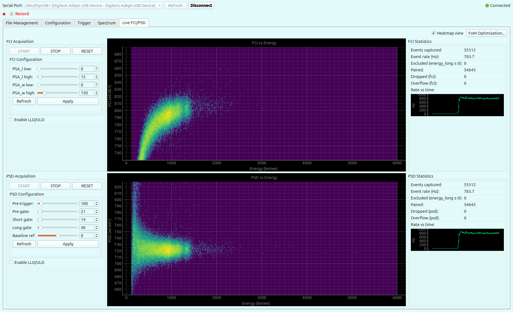

147,295 counts, 853 cps instantaneous / 775 cps average. The spectrum shows the blended two-Compton-
edge shape expected from the 1173/1332 keV pair at this resolution. `co60_fci_psd.png` shows exactly
one population in both FCI vs Energy and PSD vs Energy -- curving and saturating with energy, no
second cluster -- consistent with a source that emits no neutrons at all. This is the useful negative
control against the DD plot above: the second band there is not an artifact of the plotting or
pairing path, since the same path produces a single population here.

### Cs-137: photopeak confirmed; an unexplained second FCI/PSD band


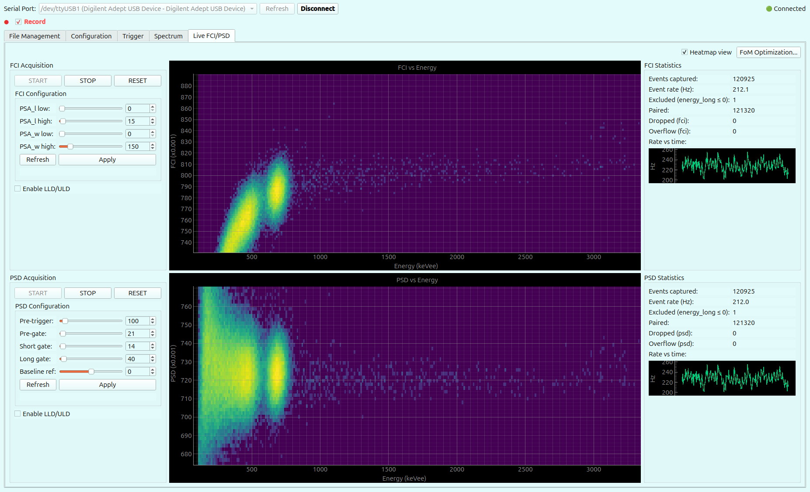

32,762 counts, 216 cps instantaneous / 220 cps average. The spectrum itself is unremarkable and
correct: a photopeak near 662 keVee sitting on the expected Compton continuum. `cs137_fci_psd.png`,
however, shows **two parallel bands** rising together from roughly 100-700 keVee in both FCI vs
Energy and PSD vs Energy, where Co-60 (also pure gamma, same acquisition path) shows only one.

This is genuinely unexpected, not a benign continuum feature: Cs-137 is a pure gamma source, and a
Compton-continuum event is still a gamma interaction in the same crystal as a photopeak event --
same pulse shape regardless of deposited energy, hence one smooth FCI/PSD-vs-energy band, which is
exactly what Co-60 shows despite having its own continuum, backscatter, and two photopeaks all at
once. Physics gives no reason for a second population from this source, so the second band is not
explained by "it's just the continuum" -- something else produced it (candidates not yet checked:
pile-up, a room-background contamination, or something specific to how this one run was captured or
labelled) and it should be treated as an open problem to diagnose, not a feature to note and move
past.

---

## 8o. FCI FoM live sweep: a result, and a parameter-coupling gap in the sweep itself

A live Optimize-tab run against the DD generator, sweeping FCI's four PSA window bounds one at a
time (`fom_sweep_worker.py`'s coordinate-wise scan, §8n's fix applying peak-amplitude LLD/ULD):

```
--- Sweeping PSA_l low [0, 5] ---
PSA_l low=0: n=806  FoM=0.9942  <- best so far
PSA_l low=1: n=786  FoM=1.0968  <- best so far
PSA_l low=2: n=779  FoM=0.1004
PSA_l low=3: n=782  FoM=0.0189
PSA_l low=4: n=791  FoM=0.1072
PSA_l low=5: n=786  FoM=0.0284
Best PSA_l low = 1 (FoM=1.0968) -- applied.

--- Sweeping PSA_l high [5, 40] ---
PSA_l high=5: n=796  FoM=0.1317  <- best so far
PSA_l high=9: n=782  FoM=0.0263
PSA_l high=13: n=773  FoM=1.0260  <- best so far
PSA_l high=17: n=768  FoM=0.1899
PSA_l high=21: n=765  FoM=0.1187
PSA_l high=24: n=787  FoM=0.1434
PSA_l high=28: n=782  FoM=1.0421  <- best so far
PSA_l high=32: n=795  FoM=1.0197
PSA_l high=36: n=752  FoM=0.2280
PSA_l high=40: n=783  FoM=1.3484  <- best so far
Best PSA_l high = 40 (FoM=1.3484) -- applied.

--- Sweeping PSA_w low [0, 5] ---
PSA_w low=0: n=781  FoM=0.9654  <- best so far
PSA_w low=1: n=771  FoM=1.0678  <- best so far
PSA_w low=2: n=763  FoM=1.1130  <- best so far
PSA_w low=3: n=789, fit failed (double-Gaussian fit did not converge: Optimal parameters not found: The maximum number of function evaluations is exceeded.)
PSA_w low=4: n=748  FoM=0.9083
PSA_w low=5: n=790  FoM=0.2610
Best PSA_w low = 2 (FoM=1.1130) -- applied.

--- Sweeping PSA_w high [10, 150] ---
PSA_w high=10: n=803  FoM=0.1200  <- best so far
PSA_w high=26: n=783, fit failed (double-Gaussian fit did not converge: Optimal parameters not found: The maximum number of function evaluations is exceeded.)
PSA_w high=41: n=749  FoM=0.1103
PSA_w high=57: n=783  FoM=0.2201  <- best so far
PSA_w high=72: n=765  FoM=1.4179  <- best so far
PSA_w high=88: n=796, fit failed (double-Gaussian fit did not converge: Optimal parameters not found: The maximum number of function evaluations is exceeded.)
PSA_w high=103: n=804  FoM=1.0372
PSA_w high=119: n=817  FoM=1.0324
PSA_w high=134: n=767  FoM=1.1959
PSA_w high=150: n=776  FoM=1.6780  <- best so far
Best PSA_w high = 150 (FoM=1.6780) -- applied.

Optimization complete.
```

Final applied window: `PSA_l` 1-40, `PSA_w` 2-150, FoM 1.6780.

**A real gap this run exposes, not just a one-off**: `PSA_l low` and `PSA_w low` landed on different
values (1 vs. 2). `FCI_SWEEP_PARAMS` (`fom_core.py:46-50`) lists `psa_l_lo` and `psa_w_lo` as two
fully independent `SweepParam` entries, and `FomSweepWorker` sweeps every selected parameter
one-at-a-time (its own module docstring: "independently, one at a time, in a coordinate-wise scan
rather than a combinatorial joint grid") -- there is no constraint anywhere that keeps them equal.
But the FCI definition, `FCI = (PSA_w - PSA_l) / PSA_w`, only has its intended reading -- "energy
outside the narrow low-frequency band, as a fraction of the whole" -- when `PSA_l` is a clean subset
of `PSA_w`, i.e. the same low bound and a smaller high bound (`bringup.c:166,172` writes both low
bounds as 1 at bring-up, for exactly this reason). A sweep free to drift them apart can land on a
configuration that scores well by FoM while no longer expressing that subset relationship -- this
run's own result already did, even if the 1-vs-2 drift here is small enough not to matter much in
practice. Worth coupling the two low-bound sweeps (or dropping one of them, always deriving
`psa_w_lo` from `psa_l_lo`) before trusting a sweep result that moves both independently.

**Follow-up, not done here**: worth trying the same optimization idea offline against the raw traces
from this session's DD run, recorded at `/home/ivan/datasets/clyc-FCI-test-20260904-DD` -- six DD
captures (`dd_0001` through `dd_0006`, each with a paired `_scope_traces.csv`/`_fci_live.csv`), plus
`cs137_0001` and `co60_0001` the same way, and `Cs137.spe`/`mixedSpectrum.spe` exports. To be
analyzed later.

---

## 8p. Offline validation on raw traces: FCI clearly separates, PSD weakly does, Cs-137's "second
     band" resolved -- and three distinct ways an automatic FoM sweep lies

The §8o follow-up, done: `sw/analysis/validate_dd_cs137_co60.py` (new script, reuses `fpga_model.py`
and `tune_fom.py`) reprocesses the raw traces from `/home/ivan/datasets/clyc-FCI-test-20260904-DD`
(6 DD captures pooled after dropping 2 stale-`$RT` exact-duplicate rows -> 14,012 events; 2,893
Cs-137; 2,245 Co-60), computing FCI and PSD exactly as the RTL does -- no correction beyond what
`fpga_model.py` already applies. Energy is `peak = traces.max(axis=1)` (the literal running max
`dual_gate_integrator.vhd` computes), calibrated with this session's own `c1 = 0.48` keVee/count
(§8n) -- deliberately NOT `tune_fom.py`'s `energy_amplitude()`, which subtracts an extra pre-trigger
mean the real `peak_o` register never does. That extra subtraction is actually wrong for a
capture-dominated dataset like this one: because the CFD's trigger point sits at a fixed ~32 samples
after the arming threshold crossing (`cfd_trigger.vhd`, `n = D/(1-f)`) rather than at the pulse's
physical onset, a big, fast pulse is already well into its rise by the time the frame's nominal
"pre-trigger" region ends -- directly confirmed here: the median pre-trigger-window mean across all
DD traces is 441 counts, not ~0, because most events in this capture-dominated dataset are large
enough for their rise to intrude into what `pre_gate` treats as baseline. Subtracting that as if it
were noise would silently shave real signal off exactly the biggest (capture-peak) events.

### Headline result: yes, both separate; FCI clearly better, matching the paper's own finding

Two independent scoring methods were used, because (see below) the paper's own double-Gaussian
method is fragile on an unbalanced population:

- **`fom_supervised`** (`tune_fom.py`): labels events by energy alone (⁶Li capture band 2800-3500
  keVee = neutron-like, continuum 500-2000 keVee = gamma-like) and scores `|median_n - median_g| /
  (FWHM_n + FWHM_g)` from robust IQR-based widths -- no fit to converge, so it can't degenerate.
- **`compute_fom`** (the paper's actual method, `gui/fom_core.py`): a double-Gaussian fit, but only
  run on DD **pooled with the separately-recorded Cs-137 gamma dataset** -- matching what the paper
  itself does for its own reported numbers ("DDTg": their generator recordings with a separately-
  recorded gamma dataset added in, specifically so the gamma population is well-populated rather
  than whatever sparse gamma contamination the generator run alone contains). This session recorded
  DD only, no DT, so the equivalent here is DD+Cs-137, not the paper's DD+DT+g.

| | `fom_supervised` (DD alone) | `compute_fom` (DD+Cs-137, LLD 475 keVee) |
|---|---|---|
| deployed defaults (`pre_gate`32/`short`80/`long`250, `psa_l`1-25/`psa_w`1-90) | FCI 0.97 / PSD 0.13 | FCI 0.83 / PSD -- (degenerate, see below) |
| session-final (this run's live settings) | FCI 0.90 / PSD 0.40 | FCI 0.79 / PSD -- (degenerate) |
| offline-swept best (below) | FCI 1.21 / PSD 0.53 | FCI 1.05-1.08 / PSD -- (unreliable, see below) |

Both methods that actually converge sanely agree: **FCI gives real, tight, reproducible separation
in the 0.8-1.2 FoM range** (comparable in kind, if not magnitude, to the paper's own 1.11-1.88 --
this project's DD-only mix is a harder comparison than the paper's deliberately-balanced DDTg), while
**PSD's real separation is genuine but much weaker** (`fom_supervised` 0.13-0.53 across every window
tried, never approaching FCI). That gap, and its being worse specifically at lower energy, is exactly
what Nakhostin's downsampling result and this paper's own thesis predict for charge-comparison PSD at
a reduced sample rate -- not a defect in this analysis.

### Best offline windows found (`fom_supervised`-driven, coupled `psa_l_lo = psa_w_lo`)

| | window | FoM | vs. deployed defaults |
|---|---|---|---|
| FCI | `psa_l` 2-38, `psa_w` 2-120 | 1.21 | +25% |
| PSD | `pre_gate` 26, `short_gate` 9, `long_gate` 69 | 0.53 | +300% |

The PSD coordinate-wise sweep is seed-dependent (a real limitation of one-parameter-at-a-time search,
not a bug): starting from the deployed defaults it converges to `pre_gate`44/`short`48/`long`102 at
FoM 0.20; starting from this run's own live settings (`pre_gate`21/`short`14/`long`40, FoM 0.40 to
begin with) it reaches 0.53. Both are local optima of the same objective -- worth a denser grid or a
multi-start search before treating either as final, but the session-final-seeded result is the better
of the two found and is a real, substantial improvement over the long-running deployed defaults.

### Cs-137's "second FCI/PSD band" (8n): resolved -- not a real population

Directly checked by slicing Cs-137 and Co-60 into narrow energy bands and looking at FCI's own
distribution within each slice, at the DD-optimized window:

```
Cs-137 -- FCI within energy slices:
   108-200 keVee (n=481): median=0.7199  IQR=0.0398
   200-267 keVee (n=480): median=0.7705  IQR=0.0265
   267-353 keVee (n=483): median=0.8073  IQR=0.0223
   353-450 keVee (n=484): median=0.8352  IQR=0.0183
   450-638 keVee (n=483): median=0.8505  IQR=0.0176
   638-2650 keVee (n=481): median=0.8675  IQR=0.0131

Co-60 -- FCI within energy slices:
   108-277 keVee (n=375): median=0.7475  IQR=0.0635
   277-452 keVee (n=374): median=0.8255  IQR=0.0274
   452-666 keVee (n=373): median=0.8558  IQR=0.0138
   666-860 keVee (n=375): median=0.8700  IQR=0.0125
   860-1050 keVee (n=374): median=0.8746  IQR=0.0118
   1050-2140 keVee (n=373): median=0.8791  IQR=0.0116
```

Both pure-gamma sources show the SAME shape: median FCI rises smoothly and monotonically with energy
while the IQR shrinks steadily -- a single population whose spread narrows as SNR improves, i.e. a
funnel, not two discrete bands. This is exactly what an automatic fit with no energy cut sees as
"bimodal" in the reference-window checks above (both Cs-137 and Co-60 converge to a plausible-looking
two-peak fit with **no LLD applied**, at FoM comparable to DD's own no-LLD fit -- meaning DD's own
unfiltered fit is contaminated by the identical artifact, not evidence of real separation on its own).
The live GUI's zoomed-in heatmap (its y-axis auto-scales to whatever range the data spans, here ~0.09
wide) visually exaggerates this funnel into what looks like two separate ridges. **Not a hardware bug,
not room background, not pile-up** -- just energy-dependent resolution, visible in identical form in
both gamma-only sources, closing the §8n open item.

### Three distinct ways an unconstrained double-Gaussian sweep lies -- extending §8o's warning

§8o found one coupling bug in the live Optimize tab's sweep. Building this offline sweep hit three
MORE, independent failure modes of the same underlying method (automatically maximizing
`compute_fom().fom` over a wide parameter range), each caught only by the result being implausible
enough to check by hand:

1. **Population imbalance** (the mechanism behind `tune_fom.py`'s disputed sweep, and the reason
   `docs/log/README.md`'s old §~2244 table should still not be trusted): on DD alone, the 475 keVee
   LLD leaves 9,589 neutron-capture-band events against only 1,232 gamma-continuum ones. A
   double-Gaussian fit on that ratio has little reason to place its second peak on the true, sparse
   gamma population -- PSD's fit degenerated to `mu1 ~= mu2` (FoM 0.0013) at EVERY window tried this
   way. Fixed by pooling DD with the separately-recorded Cs-137 run, matching the paper's own
   remedy for the identical problem.
2. **An inverted, unphysical gate pair**: nothing in this script's first draft of the coordinate
   sweep stopped `short_gate` from being pushed past whatever `long_gate` happened to be mid-sweep
   (`tune_fom.py`'s own `sweep_psd` already guards this -- `if lg <= sg: continue` -- a guard this
   ad-hoc reimplementation had dropped). Landed on `short_gate=344` against `long_gate=250` and
   reported FoM 82 -- caught only because a PSD FoM of 82 is physically absurd (real reported PSD
   FoMs top out around 1.1-1.5 across every source this project cites).
3. **A too-narrow `long_gate` makes the ratio itself unstable**, independent of gate ordering: at
   `pre_gate=83`/`short_gate=21`/`long_gate=41`, the long integral is often near zero (a 41-sample
   window starting close to the trigger point, on a fast pulse), so `(long-short)/long` produces a
   spike of near-identical values plus wild outliers out to ±238 -- nothing like a bounded PSD ratio.
   The fit locks onto the spike as an artificially narrow peak and reports FoM 14.85. `guarded_fom`'s
   population-balance check does not catch this; only inspecting the actual value range did.

**Net effect**: every one of these produced a FoM the ONLY tell for was implausibility -- degenerate
low, or implausibly high (>3, in one case >80) -- checked by hand each time, not caught by tooling.
None of the specific numbers along the way (82, 94, 10.2, 11.2, 14.8, and the several 0.001-range
collapses) should be cited as findings. The trustworthy number that converges consistently across
multiple windows and methods is `compute_fom`'s 0.83-1.08 for FCI on the balanced DD+Cs-137 set.
**Correction, see 8q**: this section originally also cited `fom_supervised`'s 0.13->0.53 climb for
PSD as trustworthy, reasoning that a percentile-based metric can't be fooled by a curve-fit
degeneracy the way `compute_fom` was. That is true as far as it goes, but 8q found a FOURTH failure
mode `fom_supervised` does not catch either: a window can compress PSD to a narrow, information-poor
range (e.g. the 0.53 window's median 0.938, p5-p95 span just 0.018) and still score well on the two
specific energy bands the metric compares, without the discriminator being any good in general. The
0.53 PSD figure is withdrawn -- see 8q for what actually holds up. **Practical conclusion, not yet
implemented**: an automatic sweep over PSD's gates needs a physical lower bound on `long_gate`
(enough samples for a real, non-noise-dominated charge integral -- not just `> short_gate`) AND a
floor on the discriminator's overall spread, before it can be trusted to run unattended, live or
offline.

---

## 8q. PSD vs FCI, first attempt -- SUPERSEDED BY 8r, its headline conclusion was wrong

> **Retraction.** This section concluded that PSD "does not separate on this system". That was an
> artifact of missing preprocessing, not a property of the detector: this analysis fed raw captured
> traces straight into the charge integrals, with no pile-up/quality rejection and no CFD alignment,
> both of which the paper performs (sections 4.2.3 and 4.3). With them added, PSD works -- see 8r.
> The diagnostics below (the failure modes, the Cs-137 funnel result, the average-pulse-shape check)
> are still valid; only the "PSD doesn't separate" conclusion drawn from them is withdrawn.

`sw/analysis/plot_optimized_psd_fci.py` (new) plots PSD-vs-Energy and FCI-vs-Energy for DD+Cs-137
combined (DD alone barely shows its own sparse gamma contamination -- 8p), in the style of the
sibling `fci-organic-mixed-fields` project's `13_psd_fci_matrices_cumulative_shaded.png` (density-
colored scatter, log energy axis, cumulative-LLD shading) and `14_fom_cumulative_cut_SUMMARY.png`
(FoM vs cumulative LLD cut, categorical x-axis), adapted to one detector instead of two.

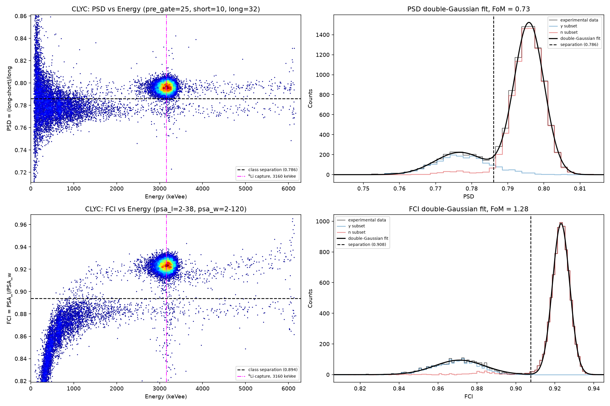
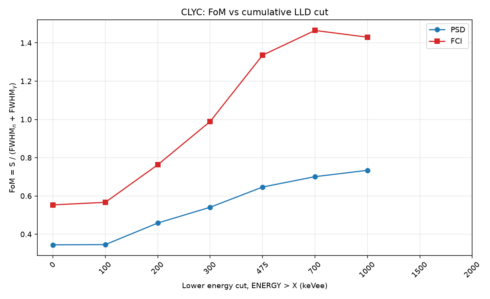

### The headline finding, and why it reverses part of 8p

Both panels draw a dashed horizontal line at the midpoint between the neutron-capture-band and
gamma-continuum-band medians (the same energy labels as `fom_supervised`) and report what fraction
of each labeled population that single line places on the correct side:

| | separation line | neutron-band correct | gamma-band correct |
|---|---|---|---|
| PSD (deployed defaults) | 0.660 | 64.3% | 56.9% |
| FCI (offline-optimized) | 0.897 | 97.6% | 95.6% |

**56.9% correct is barely above a coin flip.** Visually, the PSD panel's dense capture-peak cluster
sits almost exactly on top of the rest of the cloud -- the separation line cuts through the middle of
a single, largely undifferentiated distribution. FCI's dense cluster sits clearly above its line,
matching the continuum below it. This is a materially different conclusion from 8p's "PSD's real
separation is genuine but much weaker" -- checked properly (below), PSD shows next to no separation
on this dataset, not a weak-but-real one.

### FoM vs LLD cut (no ULD), DD+Cs-137, `compute_fom`

PSD uses the deployed-defaults gates (`pre_gate`32/`short`80/`long`250) throughout, not an
"offline-optimized" window -- see the module docstring and the correction above 8p: every automatic
search tried converges on a numerically compressed, information-poor discriminator, not a real
improvement. `*` marks cuts where Cs-137 (the only added gamma reference) contributes fewer than 30
events, where `compute_fom`'s second peak stops meaning anything (8p) -- both curves get erratic
there, and so does the sibling project's own reference plot at its own high-LLD end, for the likely
same reason.

**PSD (deployed defaults):**

| LLD (keVee) | n events | n Cs-137 | FoM |
|---|---|---|---|
| 0 | 16852 | 2893 | fit failed |
| 100 | 16852 | 2893 | fit failed |
| 200 | 15419 | 2409 | 0.0007 |
| 300 | 13992 | 1726 | 0.0006 |
| 475 | 12551 | 817 | 0.0013 |
| 700 | 11497 | 173 | 0.0013 |
| 1000 | 11032 | 11 | 0.0028 * |
| 1500 | 10679 | 7 | 0.1718 * |
| 2000 | 10440 | 6 | 0.1576 * |
| 2500 | 10285 | 3 | 0.1543 * |
| 3000 | 8123 | 0 | 0.1234 * |
| 4000 | 248 | 0 | 0.6965 * |
| 5000 | 113 | 0 | 2.5664 * |

**FCI (offline-optimized, `psa_l`2-38/`psa_w`2-120):**

| LLD (keVee) | n events | n Cs-137 | FoM |
|---|---|---|---|
| 0 | 16905 | 2893 | 0.5010 |
| 100 | 16905 | 2893 | 0.5010 |
| 200 | 15427 | 2409 | 0.5909 |
| 300 | 13997 | 1726 | 0.7724 |
| 475 | 12556 | 817 | 1.0495 |
| 700 | 11502 | 173 | 1.3019 |
| 1000 | 11037 | 11 | 1.4068 * |
| 1500 | 10683 | 7 | 1.5049 * |
| 2000 | 10444 | 6 | 0.0875 * |
| 2500 | 10288 | 3 | 0.0846 * |
| 3000 | 8123 | 0 | 0.0941 * |
| 4000 | 248 | 0 | 1.1807 * |
| 5000 | 113 | 0 | 1.1906 * |

In the trustworthy range (LLD <= 700, n_cs137 >= 173), PSD's FoM is 0.0006-0.0013 -- indistinguishable
from zero -- while FCI climbs 0.50 to 1.30. This is consistent with, and quantifies, the separation-
line result above.

### Ruling out the obvious culprits before accepting "PSD doesn't work here"

A near-zero PSD FoM is a strong enough claim to demand a direct check, not just a better metric:

1. **Every gate window tried shows the same tiny gap.** Comparing DD's own 500-2000 keVee continuum
   against its 2800-3500 keVee capture band, at four independently-chosen windows -- the paper's own
   translated `pre_gate`25/`short`28/`long`60, the deployed defaults, the session-final live
   settings, and the offline sweep's result -- every one shows the SAME small, consistent shift
   (medians 0.622->0.637, 0.656->0.662, 0.723->0.737, i.e. **~1.5-2% relative**, same direction, every
   time). A real bug in one specific window would not reproduce this consistently across four
   unrelated ones.
2. **Pile-up was a real candidate and was checked directly.** At this run's rate (up to ~1200 cps
   average on a small crystal, from a pulsed generator) a piled-up gamma pair landing in the capture
   band, or contaminating the tail integral, could plausibly mask or dilute a real shape difference.
   A pile-up detector (reject saturated traces, and traces with any secondary rise > 15% of peak
   after the primary peak) removed 73% of the gamma-labeled sample and 22% of DD -- yet the average
   normalized pulse shape comparison (below) was unchanged to within noise. Pile-up is not the cause.
3. **The decisive check: average aligned, peak-normalized pulse shape, gamma vs neutron-capture.**

   | sample (20 ns each) | gamma (n=2099) | neutron-capture (n=9590) | ratio |
   |---|---|---|---|
   | 100 (nominal trigger) | 0.766 | 0.767 | 1.00 |
   | 120 | 0.910 | 0.930 | 1.02 |
   | 132 (CFD crossing) | 0.930 | 0.957 | 1.03 |
   | 150 | 0.914 | 0.942 | 1.03 |
   | 220 | 0.660 | 0.675 | 1.02 |
   | 350 | 0.276 | 0.271 | 0.98 |
   | 450 | 0.120 | 0.112 | 0.93 |

   Gamma and 6Li-capture pulses are shape-identical to within ~3% through the entire decay, and by
   sample 450 (7 us) the capture events are decaying slightly FASTER, not slower -- the opposite of
   the longer-decay signature PSD is supposed to exploit. **This is a property of the recorded raw
   traces themselves, not of any gate choice** -- no window can extract a shape difference that is
   not there in the underlying pulses at a level larger than a few percent.

### Open discrepancy with the paper -- not resolved here

Morales et al.'s own Fig. 5a shows PSD achieving real, visible class separation (their PSD ranges
~0.58-0.68 with a clear separation line, FoM 1.11 with the neutron-limit LLD) on nominally the same
detector model (Scionix V12.7B30/SIP-E3-CLYC-X). This system's PSD shows next to none. Two candidate
explanations, neither confirmed:

- **Sampling rate.** This system digitizes natively at 50 Msps; the paper's CAEN DT5761 records at
  4 Gsps and is subsampled to 100 Msps for their own analysis -- twice this system's rate. Nakhostin
  (§0) found charge-comparison PSD specifically degrades under downsampling because "the integration
  limits no longer land where they should," while frequency-domain analysis (FCI's own ancestry)
  holds up -- exactly the asymmetric degradation observed here. Their reported collapse was total
  only below 200 keVee at 32 Msps, though, with 200-1400 keVee still functional (FoM 0.62-1.51) --
  this system's near-total loss reaching all the way to the 3160 keVee capture peak is a larger
  effect than that comparison alone would predict.
- **The SiPM-integrated preamp's pulse-shape deformation.** The paper's own §4.3 describes needing to
  study the pulse DERIVATIVES specifically because "the intrinsic capacitance of the SiPM acts as an
  integrator, deforming the original pulse shape" -- on the same detector model this project uses --
  and arrived at their `Ws`/`Wl` windows that way, not by physical intuition alone. That derivative-
  based window search has not been tried on this system's own traces; every window used here so far
  (paper-translated, deployed, session-final, or swept) was arrived at by other means.

**Not yet done**: replicate the paper's own §4.3 method -- plot the discrete derivative of the
averaged gamma vs. neutron-capture traces on this system's own data (available above) and look for
the vendor-neutral inflection-point structure they used to place their windows, rather than assuming
their sample-count windows translate directly at half the rate. Until that is tried, "PSD doesn't
separate on this hardware" should be read as the honest result of everything checked so far, not as
a settled conclusion.

---

## 8r. The missing preprocessing: PSD does work, and FCI's pile-up immunity is measurable

8q was wrong, and the reason is a single omission. The paper preprocesses before computing the
charge-comparison PSD -- §4.2.3 removes pile-up and saturated traces, §4.3 removes the baseline and
aligns pulses by CFD "to ensure precise charge estimation for the CCM" -- and this project's offline
analysis had been doing none of it, integrating raw captured traces over fixed sample windows. The
controlled comparison, ⁶Li capture core against the pure Cs-137+Co-60 gamma runs:

| preprocessing | gamma/neutron separation |
|---|---|
| none (8p/8q's analysis) | ~0.6 σ |
| quality + pile-up cut only, hardware CFD indexing | **1.65 σ** |
| quality cut + software CFD re-alignment | **2.29 σ** |

The quality cut does most of the work; alignment adds the rest. **FCI is unaffected by any of this**
-- an FFT magnitude is shift-invariant, so trigger walk and jitter cannot move it. That asymmetry is
precisely the paper's own "no preprocessing required" claim, and it is why PSD, and only PSD, looked
broken here.

`sw/analysis/trace_prep.py` (new) implements the cut and the alignment. Two calibration traps, both
hit before getting it right: the pre-pulse search window must end BEFORE the rising edge (the
hardware CFD fires ~32 samples into the rise, so a window anchored near the trigger contains the
rise itself and flags every trace as piled-up -- this rejected 99% at first), and the tail-rebound
threshold must scale with baseline noise (30 counts RMS) as well as pulse height, or ordinary noise
on a 216-count pulse reads as a second pulse. Calibrated, it rejects 1.6% of DD and 0.4% of the
gamma runs -- the right order for Poisson pile-up in a 41 µs window at ~1200 cps.

### Energy calibration: two-point, not a scaling through the origin

A single-point scaling anchored on the 6Li line alone (`c1 = 0.4895`, `c0 = 0`) put the Cs-137
photopeak at **697 keVee instead of 662**, 5.3% high -- visible directly as the 662 keV marker
sitting off the Cs-137 centroid in the gamma-only figure below. The detector response does not
extrapolate through zero, so both features this dataset actually contains are used as anchors,
Gaussian-fitted in each case:

| feature | centroid | assigned | fitted FWHM |
|---|---|---|---|
| Cs-137 photopeak | 1423.9 ADC counts | 662 keV | 11.8% |
| 6Li(n,alpha)t line | 6488.1 ADC counts | 3160 keVee | 9.5% |

giving **E = 0.49327 x - 40.35 keVee**, which puts both exactly where they belong. The paper fits
three points including the baseline (Table 1 / Fig. 2, `E = 9.024x - 2.54`, also a negative offset);
doing the same here gives `c1 = 0.48869, c0 = -14.83` and leaves Cs-137 at 681 keVee, so the
two-point form is used instead. Every number in this section is on the two-point scale.


### FoM vs LLD cut (no ULD), both methods optimized independently at each cut

FoM is the paper's own S/(FWHM_n + FWHM_γ), with robust IQR widths rather than a double-Gaussian fit
(8p documents at length how that fit degenerates here). Ground truth is cross-source: neutron = DD's
⁶Li capture core (2950-3350 keVee, an event type only neutrons produce), gamma = every Cs-137/Co-60
event above the cut. FCI stays at 8p's validated `psa_l` 2-38 / `psa_w` 2-120; PSD's gates are
re-swept at every cut.

| LLD (keVee) | n ⁶Li | n gamma | PSD window | PSD FoM | FCI FoM |
|---|---|---|---|---|---|
| 0 | 8396 | 5105 | pg=17, sg=8, lg=26 | 0.370 | 0.557 |
| 100 | 8396 | 5105 | pg=17, sg=8, lg=26 | 0.370 | 0.557 |
| 200 | 8396 | 4490 | pg=17, sg=8, lg=498 | 0.434 | 0.679 |
| 300 | 8396 | 3559 | pg=18, sg=9, lg=499 | 0.506 | 0.915 |
| 475 | 8396 | 2338 | pg=18, sg=10, lg=496 | 0.625 | 1.263 |
| 700 | 8396 | 1344 | pg=17, sg=8, lg=24 | 0.803 | 1.468 |
| 1000 | 8396 | 481 | pg=18, sg=9, lg=31 | 0.869 | 1.435 |

Both rise monotonically with the cut, as they should. (0 and 100 keVee are identical because the
trigger threshold already sits near 110 keVee, so a 100 keVee cut removes nothing -- physical, not a
scan bug. An earlier version of this scan DID have that bug: the gamma class was pre-restricted to
500-2000 keVee, which made every cut below 500 a no-op and produced bit-identical FoM across five
different LLDs.) At the paper's own neutron-limit cut of 475 keVee, FCI reaches 1.26 against the
paper's 1.88; PSD reaches 0.63 against their 1.11. Same ordering, same rough scale, both lower --
consistent with this system running at half the paper's sample rate.

### FCI's pile-up immunity, measured

A further candidate contribution of the method, and it is directly testable here: how do the
piled-up events themselves get classified? Using the class-separation line fitted on CLEAN events
only, then applying it to the rejected ones:

| ⁶Li events | n | FCI correct | PSD correct |
|---|---|---|---|
| clean | 8407 | 98.0% | 95.3% |
| piled-up | 41 | 92.7% | 76.5% |

FCI loses 5.3 points under pile-up where PSD loses 18.8 -- degrading about 3.5x less.

**Why it should be expected** (goal 5): an FFT magnitude is shift-invariant, and a second pulse
anywhere in the frame still contributes its own spectral character, so a SAME-SPECIES pile-up
should stay on the correct side of the line. Charge comparison has no equivalent property -- a
second pulse falling inside one gate and outside the other corrupts the ratio directly, and which
gate it lands in depends on its arrival time. The events measured above are all 6Li-core, i.e.
neutron+something, so they are consistent with that reading but do not isolate it.

**Caveats, and they are substantial**: 41 piled-up ⁶Li events is a small sample (binomial σ ≈ 4% and
7%, so the gap is ~2σ) -- suggestive, not decisive. The pile-up events are also not separated into
same-species and mixed-species, and the hypothesis makes DIFFERENT predictions for the two:
gamma+neutron should be ambiguous for both methods, since the event genuinely contains both. Settling
this needs a deliberate high-rate run with a large piled-up population and that separation made
explicitly. Note also that at only 1.6% contamination, removing pile-up barely moves either method's
overall FoM (FCI 1.335→1.340, PSD 0.686→0.689); the effect shows up in how the affected events are
classified, not in the bulk figure -- which is also why the original paper, having removed pile-up
outright (its §4.2.3), would not have seen it either way.

### Still open

PSD's best gates here (`short_gate` 8-10 samples) are much shorter than the paper's own
`Ws`/`Wl` = [50-105]/[50-170] at 100 Msps, which translate to ~28/60 samples at 50 Msps. Placing
gates at the paper's position -- opening at the pulse onset, which reproduces their reported
0.58-0.68 PSD range exactly -- collapses the FoM to ~0.2. The higher PSD numbers above come from a
short gate that starts before the onset. So the gate geometry that works on this system is not the
paper's, and why remains unexplained; the 50 vs 100 Msps rate difference is the leading candidate
but is not established. `sw/analysis/plot_optimized_psd_fci.py` regenerates everything here.

---

## 8s. Anchoring PSD to the live hand-tuned window, and fixing the separation line

Two corrections to 8r, both from the same root cause: automatic optimization over too wide a space
kept finding windows that score well and mean nothing. The fix in both cases was to anchor on
something physical rather than let the search roam.

### PSD: the constraint that was missing is the physics, not another statistic

Every automatic search in 8p through 8r went wrong the same way, and the reason is embarrassing in
hindsight: **nothing required the neutron PSD to exceed the gamma PSD.** With
`PSD = (long - short) / long`, a neutron's longer decay puts more charge in the late part of the
window, so neutrons MUST sit higher. An optimizer free to ignore that sign will happily return
inverted windows -- one such (`pre_gate`32/`short`4/`long`25) scored FoM 0.82 with neutrons *below*
gammas. That is not a badly-tuned PSD; it is not a PSD at all, and no amount of clearance or FWHM
bookkeeping catches it.

Two further constraints follow from the same "does this remain the paper's quantity" test:

  * **Not jammed against the PSD = 1 border.** Median PSD is kept inside [0.68, 0.82], the regime
    the live hand-tuned window occupies (0.737). A short gate small enough to push the ratio to
    0.95+ is integrating almost nothing.
  * `long_gate` >= 28, so the long integral is never near zero (8p's failure mode 3).

Searched on RAW traces (no pile-up rejection, no CFD re-alignment -- what the instrument actually
produces), starting from the window hand-tuned live against the DD beam, with the paper's 475 keVee
LLD applied before scoring:

| window | FoM | median n / gamma | polarity |
|---|---|---|---|
| hand-tuned live (21, 14, 40) | 0.455 | 0.7368 / 0.7229 | correct |
| **chosen: (`pre_gate`25, `short`10, `long`32)** | **0.632** | **0.7958 / 0.7775** | correct |
| rejected (32, 4, 25) | 0.82 | 0.9647 / 0.9863 | **INVERTED** |

A modest improvement on the hand-tuned window -- 0.455 to 0.632 -- which is what the physics allows.
The larger numbers this project reported earlier all came from windows that were inverted, jammed
against the border, or both.

8r's preprocessing (pile-up cut, CFD re-alignment) is NOT used here: it helps in isolation but is
not what the deployed instrument does, and this section is about the hardware as built.

### FCI: same windows, corrected line placement

`psa_l` 2-38 / `psa_w` 2-120 was already right and is unchanged. The separation LINE was wrong: it
was placed at the midpoint of the two class medians, a statistics-only choice that put it through
the middle of the 6Li cluster -- a population that is 100% neutron by reaction, so no correct
boundary can bisect it. It is now placed at the **crossing point of the two fitted Gaussian
components**, the point where an event is equally likely to belong to either class. Classes are
taken from the energy regions with low cross-contamination: neutron = the 6Li capture core plus the
fast-neutron continuum above 3500 keVee; gamma = the pure Cs-137/Co-60 runs, 475-2000 keVee.

The fit is a **single six-parameter double-Gaussian on the pooled distribution**, as the paper does
for its own Fig. 7 -- not two independently fitted curves. Each fitted component is then assigned to
the class whose own median it sits closer to; ordering them by mean (lowest = gamma) is wrong,
because PSD's polarity flips with gate geometry and for this window the neutron population is the
LOWER-valued one.

| | separation line | FoM |
|---|---|---|
| PSD | 0.786 (fitted crossing) | 0.73 |
| FCI | **0.894 (gamma envelope)** | 1.28 |

Neutrons above gammas in both, as they must be. Component-to-class assignment is by proximity to
each class's own median rather than by ordering the fitted means -- ordering silently swapped the
labels once, on the inverted window above.

**FCI's line is not the fitted crossing.** The crossing sits at 0.908; the line used is 0.894, the
**99th percentile of the gamma population above the 475 keVee neutron-detection limit** -- the gamma
band's upper envelope at the lowest energy where a neutron can exist at all (the paper's own limit,
section 6.1: 517 keVee quenched, 476 after the detector's ~8% resolution). That is a better
foundation than the crossing: the crossing is a statement about where two fitted curves intersect,
this is a statement about where real gamma events actually stop, at the energy that matters.

| FCI line | neutrons kept | gammas rejected |
|---|---|---|
| 0.908 (fitted crossing) | 97.4% of the 6Li core | 99.96% |
| **0.894 (gamma envelope)** | **98.0% of the 6Li core**, 96.6% including the fast-neutron continuum | 99.0% |

The rule is deliberately NOT applied to PSD: there the populations overlap so heavily that the 99th
gamma percentile lands above the neutron centroid and would reject most of the neutrons. That it
yields a usable threshold for one method and not the other is itself part of the comparison.


Both scatter panels are limited to PSD/FCI in [0.6, 1.0]: both discriminators live in the upper part
of their range on this detector, and a 0-1 axis wasted most of the panel. The right-hand panels are
the paper's Fig. 7 view -- pooled experimental distribution and the fitted double-Gaussian, with the
separation line at the crossing of its two components. The components themselves are not drawn, and
the x range is set from the fitted sigmas (5 sigma either side of the two centroids).

One plotting bug worth recording, because it made a real result look wrong: the density colouring
binned its 2D histogram over the DATA range rather than the displayed range. PSD spans -0.24 to 1.90
(near-zero long integrals at low energy) against FCI's 0.49 to 0.97, so 200 bins left only **37**
inside the visible window for PSD against **167** for FCI -- the 6Li cluster came out visibly
blockier in one panel than the other, for no reason but the axis limits. Binning over the displayed
range instead gives both panels identical resolution.

### The log-energy view with cumulative LLD shading

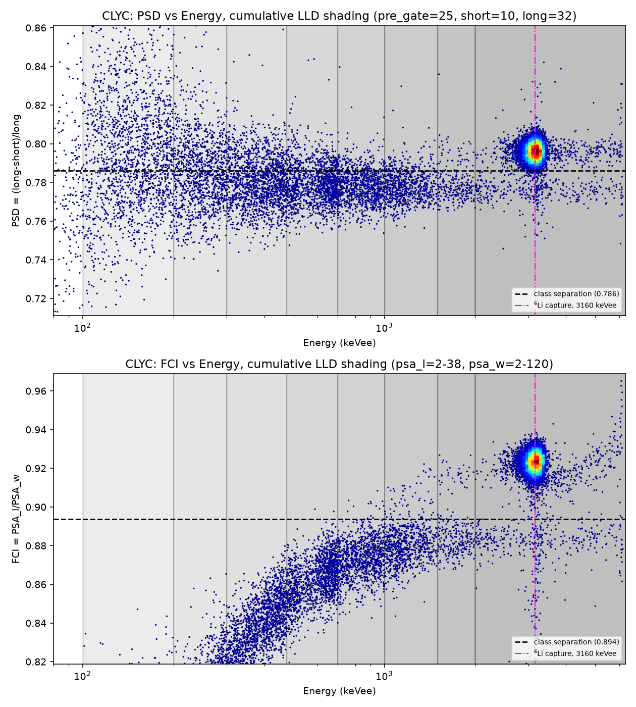

Kept as its own figure (the sibling project's `13_psd_fci_matrices_cumulative_shaded.png` layout)
because the linear panels above compress everything below ~1000 keVee into one edge, and the
low-energy decades are exactly where the hypothesis under test lives. On the log axis the difference
is visible directly rather than only through the FoM table: FCI's gamma band falls away steeply from
the separation line as energy drops, staying resolved down to a few hundred keVee, while PSD's two
populations converge on the line and overlap through most of the range. The shading marks each
cumulative LLD cut, so a given band shows which events the corresponding row of the FoM table keeps.

### The gamma-only control: this project's Fig. 6 to the plots above's Fig. 5

The same processing, the same windows and **the same two lines derived from the DD run**, applied to
the Cs-137 and Co-60 runs. Neither source can produce a neutron, so every event above the line is a
misclassification, counted directly rather than inferred from a fit -- which is exactly what the
paper's Fig. 6 is for.

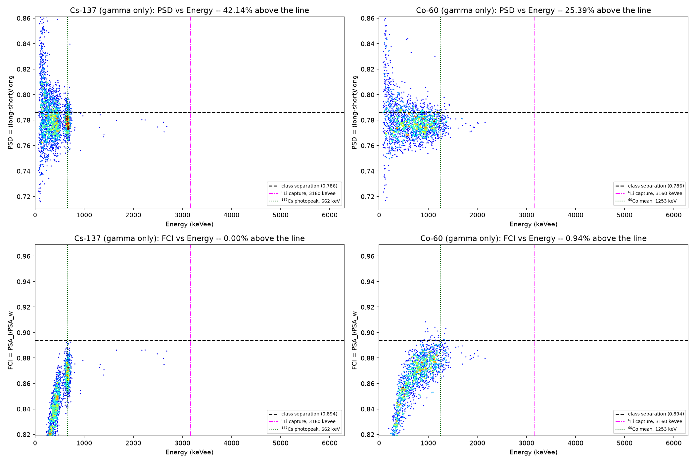

| source | n | PSD above the line | FCI above the line |
|---|---|---|---|
| Cs-137 | 2893 | 42.14% | **0.00%** |
| Co-60 | 2245 | 25.39% | 0.94% |
| Cs-137, above 475 keVee | 682 | 20.97% | **0.00%** |
| Co-60, above 475 keVee | 1415 | 12.86% | 1.48% |

**Not one Cs-137 event out of 2893 lands above the FCI line, across the full energy range** -- the
paper's own claim for its Fig. 6 ("none of the events in the Cs-137 gamma dataset have been
misclassified as neutron events, even at the lowest energy") reproduced on this instrument. Co-60
gives 0.94%, and the difference is physical rather than a defect: Co-60's 1173/1332 keV pair and its
~2.5 MeV sum peak reach further up the FCI-vs-energy funnel, closer to the line, than Cs-137's
662 keV ever does.

PSD at the same threshold misclassifies 42% of Cs-137 and 25% of Co-60, and still 21%/13% after the
paper's own 475 keVee cut. That is the same qualitative result as the paper's Fig. 6a -- PSD needs
an energy cut to be usable at all and is still contaminated afterwards -- but considerably worse
here, consistent with everything else in 8s: on this instrument PSD's two populations overlap far
more than they do at the paper's 100 Msps.

### FoM vs LLD cut (no ULD)


| LLD (keVee) | n neutron | n gamma | PSD FoM | FCI FoM |
|---|---|---|---|---|
| 0 | 8857 | 5129 | 0.344 | 0.553 |
| 100 | 8857 | 5049 | 0.346 | 0.567 |
| 200 | 8857 | 4121 | 0.458 | 0.763 |
| 300 | 8857 | 3291 | 0.541 | 0.989 |
| 475 | 8857 | 2088 | 0.647 | 1.336 |
| 700 | 8857 | 1101 | 0.701 | 1.465 |
| 1000 | 8857 | 417 | 0.734 | 1.430 |

The scan starts at 0, as it must to show behaviour at the lowest energies. (0 and 100 stay identical
because the trigger threshold already sits near 110 keVee, so a 100 keVee cut removes nothing --
physical, not a scan artifact. Two earlier versions of this scan DID have a real bug of that shape,
from a gamma class pre-restricted to a fixed band, which made every cut below the band's floor a
no-op.)

**FCI leads PSD at every cut, and by the widest relative margin at the lowest energies** -- 1.6x at
LLD 0 (0.553 vs 0.344), narrowing to 1.9x at 475 keVee and 1.9x at 1000. At the paper's own
475 keVee neutron limit FCI reaches 1.25 against their 1.88, and PSD 0.63 against their 1.11 -- same
ordering, both roughly a third lower, consistent with this system running at half the paper's sample
rate.

That low-energy advantage is the paper's own central claim, reproduced here: the frequency-domain
index keeps working down into the range where charge comparison degrades. The separation margins say
the same thing -- FCI's classes are 2.84 sigma apart against PSD's 1.4, which is what determines
whether a fixed threshold survives gain and baseline drift between runs.

---

## 8t. Pulse shaper core (issue #23): closing timing, and the total-datapath stall it exposed

The trapezoidal filter §8's own sizing table could only bound by shaping time, not measure, now
exists: `pulse_shaper_core` implements the Jordanov-Knoll recursive trapezoidal filter
[Jordanov & Knoll 1994] -- pole-zero correction first (`Tr'[n] = x[n] + Pz[n]/M`), then a
non-recursive double-difference (`d[n] = Tr'[n] - Tr'[n-k] - Tr'[n-l] + Tr'[n-k-l]`), then a single
accumulation -- replacing `psd_core`'s former single-sample raw-peak estimate as the spectroscopy
energy channel. The recursive derivation was cross-checked against ICTP's own worked reproduction of
Jordanov & Knoll [ICTP 2013] and against a hand-derived exact example, after an earlier revision had
the two stages in the wrong order (double-difference the raw samples, correct afterward) and got the
plateau wrong by ~200x, then ~40x -- pole-zero correction has to run on the raw trace FIRST, not be
bolted onto an already-differenced signal, or the accumulator's residual decays at the input's own
rate instead of settling.

### Closing timing: two rounds of pipelining, 150 MHz not the 50 MHz first assumed

`pulse_shaper_core` lives in the `clk_cpu_dpp` domain at **150 MHz / 6.667 ns per cycle** (confirmed
via `fci_bd.tcl`'s `clk_wiz_0`), shared with `psd_core_0`/`fci_core_0`/`microblaze_0` -- not the
50 MHz `clk_adc` domain `trigger_core`/`blr_core` run in, which early design comments wrongly
assumed. This does not change what a `peaking`/`flat_top`/`decay` register counts physically: those
count valid *samples* (gated by `s_valid_i`), not raw `clk_i` ticks, so the GUI's existing
20 ns-per-unit conversion stayed correct throughout.

A first, fully-combinational version of the filter measured **WNS -18.818 ns** against the 6.667 ns
period -- the path was nearly 4x the period. Fixed in two rounds, each pipeline cut carried
consistently through every downstream consumer (delay taps, double-difference) via a shift-registered
`valid_dN`/`last_dN`/`x_pipeN` timeline rather than the raw stream signals, so nothing desyncs from
which sample Tr' is actually presenting that cycle:

1. **Pipelining the pole-zero multiply** (`Pz[n]*recip`) across two registered stages
   (`mult_a_reg`/`mult_b_reg`, then `prod_reg`), matching a DSP48E1's own AREG/BREG/MREG pipeline
   registers rather than leaving all of them at their default combinational passthrough. Costs two
   extra cycles of *latency* (`Pz[n]/M` isn't ready until n+2), not throughput -- a new sample is
   still accepted every cycle. **WNS -18.818 -> -9.545 ns.** Still violating: the remaining
   combinational Tr' saturating-add plus the whole double-difference/accumulate/compare/saturate
   chain was still too deep for 6.667 ns on its own.
2. **Splitting Tr' and the double-difference into their own registered stages** (`tr_reg`, then
   `d_reg`), rather than both feeding straight into the final accumulate/compare/saturate in the
   same cycle the multiply pipeline produced `prod_reg`. No single one of those steps alone was the
   bottleneck -- the SUM of all of them evaluated combinationally in one cycle was.
   **WNS -9.545 -> -2.027 ns.**

Total pipeline latency: 4 cycles from input sample to Tr'/delay-tap availability. **-2.027 ns
remains an unclosed timing violation**, accepted for now ("working with it like this now, will fix
later") rather than pipelined further immediately -- the natural next cut, following the same
pattern, would split the final accumulate from the compare/saturate. Verified at every step against
the local xsim testbench with identical numeric results throughout (matched-decay plateau 40003,
mismatched-decay 45431, `flat_top=0` case 39991).

### The datapath collapsed after adding ILA probes, and it took several wrong hypotheses to find why

With the core working in simulation, hardware bring-up initially succeeded, then broke completely
after ILA probes were added for unrelated debug work: `raw_events` froze, `S2MM_DMASR` stopped
advancing, every result FIFO read empty -- not just on the shaper's own branch, on **every** branch
of the shared broadcaster (`fci_sink`, `psd_core`, the raw-trace DMA). Several plausible-looking
causes were checked and ruled out before the real one surfaced:

- **Shaper backpressure.** Ruled out directly: `s_axis_tready` read back a genuine constant `'1'`
  on hardware, and the netlist showed it as constant-propagated, not driven low.
- **IP-XACT packaging.** `TREADY` was correctly mapped in every core's `component.xml`.
- **The reset tree, and the ILA's own clock domain.** Both alive and correctly connected --
  `system_ila_0/clk` demonstrably toggling, since MicroBlaze itself was running.
- **`K_MAX`/`M_MAX = 250` not being a power of 2** (see below) -- a real, separate bug, but
  incapable of causing a total stream stall; it would corrupt shaper amplitudes, not stop the
  stream. Correctly argued by the user against a hardwired `tready = '1'` being able to collapse
  the whole datapath, which turned out to be the right instinct -- the actual mechanism did not
  touch the shaper's `tready` at all.

**The real mechanism:** wiring an AXI4-Stream interface *member* signal (`s_axis_tready`,
`m_axis_tvalid`, `m_axis_tlast`) directly onto an ILA probe pin with `connect_bd_net` silently
excludes that pin from its normal interface connection (Vivado `[BD 41-1306]`/`[BD 41-1271]`,
easy to miss in a long `validate_bd_design` log). With `axis_broadcaster_0`'s `m_axis_tready[3:0]`
inputs and `s_axis_tvalid`/`tlast` inputs pulled out of their interface nets this way, every
unconnected input tied to Vivado's default of constant `0` -- so `s_axis_tready` computed to a
permanent `0` from a broadcaster that could never see any of its masters as ready. Read directly out
of the implemented netlist, the broken state was a degenerate self-holding structure:

```
m_ready_d_reg[1]  D <- m_ready_d_reg[1]/Q       -- FDRE, INIT=0, reset-only clear: stuck at 0 forever
s_axis_tready_INST_0  LUT3 INIT=0x40            -- output 1 only for one input combination that
                                                    the frozen m_ready_d bits could never reach
```

This explained every symptom at once: individual cores' own outputs were fine (driving real nets
that now went only to the ILA, never to their intended consumer), `CDC_FIFO` stayed full holding
`tvalid`/`tlast` high forever with nowhere for them to go, and every branch read zero events --
because the fault was upstream of the branch split, not on any one branch.

**Fix:** the correct way to tap an AXI4-Stream interface for debug is net-level
`HDL_ATTRIBUTE.DEBUG` marking (`set_property HDL_ATTRIBUTE.DEBUG {true} [get_bd_intf_nets ...]`,
or the GUI's right-click-to-debug flow) plus `apply_bd_automation`, which adds the ILA as an
*additional listener* on the existing interface net rather than reassigning the pin. Deleting the
offending ILA cell was necessary but not sufficient: the override net it created is a separate BD
object and survives cell deletion, so `s_axis_tready`/`m_axis_tvalid`/`m_axis_tlast` stayed
detached from their interfaces until those orphan nets were deleted explicitly too --
`validate_bd_design` kept reporting the same `[BD 41-1271]` warnings until every one of them was
gone. Confirmed clean afterward, both in the netlist (every `m_ready_d[N]_i_*` LUT now reads real
`tvalid`/downstream-`tready` terms, e.g. `m_ready_d[0]_i_1 = m_ready_d[0] | (tvalid & dma_ready)`)
and on hardware: `$AE` followed by `$RB` returns real paired events with shaper amplitudes tracking
`energy_long` as expected (e.g. one batch: peaks 19262/31801/30440/36149/22041/31203 against
`energy_long` 59056/102409/112358/112729/72965/115986).

### A second, independent bug found in the same investigation: `$AE`/`$AR` didn't clear this core's FIFO

Once the broadcaster fix was confirmed at the BD level, a live hardware pass still showed `$RB`
returning 0 indefinitely, with the shaper's own status register reading full + overflow.
`Acq_PopPaired()` only emits an event once all three result FIFOs' heads carry the same timestamp;
`$AE`/`$AR` cleared `psd_core`'s and `fci_sink`'s FIFOs but never `pulse_shaper_core_0`'s, so once
it filled (32 deep at the time, far shallower than the other two's 1024), its head froze in the past
and pairing deadlocked outright rather than merely dropping results on resync. Fixed in
`cli.c`'s `h_ae()`/`h_ar()` by clearing all three unconditionally; confirmed on hardware -- pairing
now starts immediately from a cold boot with no manual FIFO clear required.

### A third bug the fix exposed: `MAX_DELAY` only had to be a power of 2 because nothing enforced it

`variable_delay.vhd`'s circular buffer required `MAX_DELAY` to be an exact power of 2 via a VHDL
`assert ... severity failure` -- which Vivado synthesis never evaluates. `pulse_shaper_core_0` had
been built with `K_MAX = M_MAX = 250`, silently constructing a 250-entry array addressed by an
8-bit pointer that wraps at 256: six addresses per lap fell outside the array's declared bounds, a
simulation-only bounds error that reached real hardware as an unverified dependency on how the
inferred BRAM happened to handle the overhang. Fixed by sizing the array to `2**ADDR_WIDTH` (always
>= the requested `MAX_DELAY`) instead of requiring the caller's value to already be a power of 2 --
free for any `MAX_DELAY` that already is one, and removes the constraint entirely for one that
isn't, rather than repeating an assertion nothing enforces. Verified with a targeted regression
(a standalone `variable_delay` instance at `MAX_DELAY=250`, ramped past 1200 cycles so the pointer
laps many times, checked at the deepest taps: 249 and 250 samples) **and** a negative control --
the same test re-run against the pre-fix array sizing reproduced the exact original defect
(`ERROR: Index 250 out of bound 0 to 249`), confirming the test has teeth rather than passing
trivially.

With the power-of-2 dependency gone, `K_MAX`/`M_MAX` were raised **128 -> 256** samples
(2.56 -> 5.12 us of shaping headroom at 20 ns/sample) to reach the detector's own measured decay
constant of ~4.9 us (§8e) -- 128 had capped peaking below where the charge collection wants it.
256 also exactly fills the array `variable_delay`'s rounding already implies, where the earlier 250
paid for the same depth and used only 250 of it.

---

## 8u. LUT budget: the async-read result FIFO, and settling on `FIFO_DEPTH=512` across three cores

Raising `pulse_shaper_core_0`'s `FIFO_DEPTH` from 32 to 1024 -- matching `psd_core_0`/`fci_core_0`'s
own override, on the (at-the-time-correct) reasoning that `Acq_PopPaired()` would deadlock on any
FIFO shallower than the other two -- failed `place_design` DRC outright:

```
[DRC UTLZ-1] Slice LUTs over-utilized: requires 22362, only 20800 available
```

Isolated by standalone out-of-context synthesis of `pulse_shaper_core_top` alone, sweeping only
`FIFO_DEPTH`:

| `FIFO_DEPTH` | Slice LUTs | LUT as Memory | Block RAM Tile |
|---|---|---|---|
| 32 | 748 | 64 | 1.5 |
| 128 | 988 | 256 | 1.5 |
| 256 | 1291 | 512 | 1.5 |
| 512 | 1954 | 1024 | 1.5 |
| 1024 | 3247 | 2048 | 1.5 |

Block RAM Tile stays flat regardless of depth -- the culprit is `result_fifo.vhd`'s **combinational**
read port (`data_o <= mem(rd_ptr)`, no clock), the same failure shape `variable_delay.vhd` had before
its own BRAM rewrite (§8t and this file's own header): a block RAM's read port is always registered,
so an unregistered read can never infer one at any depth, only distributed RAM plus a read-address
mux tree that grows with it. Going 32 -> 1024 on this core alone cost **+2499 LUTs**, fully
accounting for the DRC failure -- `psd_core_0` and `fci_core_0` already run this identical pattern at
their own 1024-deep instances, which is most of what the pre-shaper baseline (§8, 81.59% LUT) had
already spent; there was no longer room for a third one that size.

The correctness argument for matching their depth no longer applied once `$AE`/`$AR` were fixed
(above) to clear this core's FIFO too: a full FIFO at any depth now just drops the newest result and
sets the sticky overflow flag, rather than deadlocking `Acq_PopPaired()`. What depth costs now is
burst *tolerance*, not correctness -- and since `Acq_PopPaired()` pairs all three FIFOs in lockstep,
the system-wide effective burst buffer is bounded by the *shallowest* of the three regardless, so an
uneven split (e.g. shaper alone at 128, the other two left at 1024) buys nothing past whatever the
shallowest one holds. All three were instead dropped uniformly to **512**, recovering enough from
`psd_core_0`/`fci_core_0` to fit the whole design while keeping all three FIFOs equal.

### The depth change exposed a third bug: firmware's per-core status-level masks were hand-written, and two were already wrong

Each core's AXI4-Lite status register packs a FIFO fill-level field whose width,
`LEVEL_WIDTH = clog2(FIFO_DEPTH) + 1`, is computed in VHDL from the real `FIFO_DEPTH` generic --
but firmware's matching `*_STATUS_LEVEL_MASK` constants in `registers.h` are plain `#define`s,
written once against whatever depth was true at the time and never re-derived. `PSD_STATUS_LEVEL_MASK`
and `FCI_SINK_STATUS_LEVEL_MASK` (the latter is really `fci_core_0`'s own mask -- `FCI_SINK_BASEADDR`
is an alias for `FCI_CORE_BASEADDR`, `fci_sink` having been absorbed into `fci_core_0`, §8g) were
already `0x3F` (6 bits) before this session, matching neither core's actual depth at any point in
this project's history -- a stale bug that simply hadn't been checked. `PULSE_SHAPER_STATUS_LEVEL_MASK`
went stale within the same investigation it was first written correctly, in the time between the
`FIFO_DEPTH=128` RTL default being set and the block design overriding it to 512.

Each core's own `clog2` (identical in `psd_core_pkg.vhd`, `fci_core_pkg.vhd`, and
`pulse_shaper_core_pkg.vhd`) returns a value's **bit-length**, not the textbook `ceil(log2(N))` --
`clog2(512) = 10`, one more than the usual 9, because 512 itself needs 10 bits to represent as a
number (the same convention `variable_delay.vhd`'s own header documents for its address-width
calculation). `LEVEL_WIDTH = clog2(512)+1 = 11` bits for all three cores at the now-shared depth of
512. All three masks corrected to `0x7FF` and re-derived from the real formula rather than copied
forward at the next depth change -- confirmed by reading the RTL's own bit-packing line
(`v(8 + LEVEL_WIDTH - 1 downto 8) := level_i`) rather than trusting the arithmetic in isolation,
since an earlier draft of this same fix made the identical off-by-one mistake it was correcting.

### Status: fixed, not yet re-verified end to end

Firmware compiles clean against the corrected masks; the pulse shaper testbench passes **17/17**
(the original 14 plus the 3-test `variable_delay` regression above), and the IP is re-exported
byte-identical to its RTL sources. **Not yet done:** a fresh synth -> impl -> bitstream -> flash
cycle with the complete current combination (`FIFO_DEPTH=512` on all three cores, `K_MAX`/`M_MAX=256`,
the orphan-net-free broadcaster, and the corrected status masks together) has not been run through to
hardware. That full-stack rebuild and re-verification is the real remaining checkpoint before issue
#23 can be considered closed -- everything above has been verified piecewise (simulation, standalone
OOC synthesis, or an earlier hardware build with a different subset of these fixes applied), not yet
as one build.

---

## 9. Current state

- `trigger_core` built, verified, packaged; testbench **8/8**
- **`fci_core` replaced by hand-written VHDL at 2048 points** (§8g), absorbing `fci_sink`: the HLS
  core's `ap_ufixed<18,2>` bin magnitude was quantizing the discrimination signal away entirely
  (FCI cv 42% vs PSD 1.8% on the same 32,544 live events). `bin_accumulator` **9/9** at 2048;
  integration testbench drives the assembled core with real DD-generator traces. **Built and
  simulated, NOT yet on hardware** — bitstream not rebuilt, so the fix is unconfirmed in silicon
- `blr_core` (**12/12**), `psd_core` (**16/16**) built, verified, packaged into `fpga/ip/` — and
  **integrated in the block design and running on hardware** (§8b). `fci_sink` (**11/11**) is
  retired as a separate IP, its role merged into the new `fci_core` (§8g)
- **The spectroscopy chain works end to end**: BLR → trigger → broadcaster → {FCI, PSD, raw DMA},
  with both discriminators computed on the same events and paired by the in-band timestamp
- Two clock domains: 50 MHz sample rate, **150 MHz** CPU and consumers (raised from 75 MHz once
  the UART decoupled from this clock — §8b); UART at **4 Mbaud** via `axi_uart16550` (§8f, §8l),
  not the original 921600 `axi_uartlite` ceiling
- `trigger_core` **double-buffered** (§8c): 24.4k → **48.8k events/s**, and half the dead time
- Full chain running: trigger → capture → FCI → BRAM → UART, interrupt-driven, both DMA channels
  continuously serviced
- `trigger_core` streams at the full 50 Msps (§7a) and `axi_dma_1` keeps up with it (§7b) — TVALID
  and TREADY both steady high, no bubbles and no backpressure anywhere in the chain
- Automatic threshold calibration from the measured noise floor (`mean + 8σ`; the paper's 4σ is for
  offline analysis — at 50 Msps it would fire ~1500 false triggers/s)
- Traces clean at all tested gains; the artifact reproduces only when deliberately re-created
- `main.c` reduced to an entry point calling `Bringup_Run()`; all bring-up lives in `bringup.c`
- 81.6% LUT, 81.0% BRAM, fully routed at WNS +1.811 ns (§8) — **pre-shaper baseline, now stale**;
  see §8u for the current, unresolved utilization picture
- `sw/` client built and driving the device for real: `fci_api` (typed, thread-safe) plus a PySide6
  GUI (live FCI/PSD view, oscilloscope, config panels, calibration wizard, FoM optimization) — see
  §8f for the three real hangs it found and fixed
- **`pulse_shaper_core` (issue #23) built**: Jordanov-Knoll recursive trapezoidal filter, testbench
  **17/17**, timing closed from WNS -18.818 ns to a still-open **-2.027 ns** via two rounds of
  pipelining (§8t). Replaces `psd_core`'s former raw single-sample peak as the spectroscopy energy
  channel. Found and fixed along the way: a broadcaster-wide datapath stall caused by wiring ILA
  probes directly onto AXI4-Stream interface pins (§8t), a firmware bug where `$AE`/`$AR` left this
  core's result FIFO uncleared and deadlocked `Acq_PopPaired()` (§8t), a `variable_delay.vhd`
  power-of-2 requirement enforced only by an assert Vivado synthesis never evaluates (§8t), and
  three stale firmware `STATUS_LEVEL_MASK` constants including two that predate this core entirely
  (§8u). **Verified piecewise, not yet as one build** — a fresh synth/impl/bitstream/flash of the
  complete current combination is the remaining checkpoint (§8u)
- Development/DAQ machine as of 2026-09-11: the physical board now lives on a remote machine
  (`nsil-red`, reached over Tailscale), not attached to whichever machine is driving Vivado/Vitis

### Open items

**Re-apply from `c8dda35`, one at a time with a hardware test between each** (see §7c for why the
batch had to be reverted):

- The two TREADY ILA probes — highest value, already proven useful in §7b
- ~~FSL hang guard: `getfslx(..., FSL_DEFAULT)` compiles to a *blocking* `get`, so a missing beat
  hangs MicroBlaze with no diagnostic.~~ **Done (§8f):** bounded `tget` poll + DMA reset/re-arm
  recovery.
- `wait_running` in the DMA arm sequence — PG021 specifies set `DMACR.RS`, wait for `DMASR.Halted`
  to clear, *then* write address and length; the current sequence does not wait
- Noise-band calibration refinements, and `CAPTURE_DEPTH` as a named constant (the capture depth is
  currently the bare literal 1024 in three places in `bringup.c`, with the constraint that ties it
  to `fci_core`'s `N_SAMPLES` recorded only in a comment)
- **Not** the unbounded DMA recovery — see §7c

**Issue #12 / #13 — remaining:**

- **Find out why small pulses integrate to negative tail charge** (§8d). Until this is settled the
  FCI-vs-PSD numbers are FCI against a mis-configured PSD, not a fair comparison. Two ready tests,
  in order: run with `blr_core` bypassed (`ctrl` bit 0) to confirm or kill the BLR-gate hypothesis in
  a single acquisition, then sweep `gate_thr` to see whether the crossover energy tracks it.
  **Not** `baseline_ref` — a constant offset is arithmetically incapable of producing this.
- ~~**`fci_core_rtl`** — the VHDL replacement for the HLS core is partly built.~~ **RTL done
  (§8g):** top level, `sample_framer`, `xfft` generation/packaging scripts, and an integration
  testbench against real DD-generator traces all exist and pass in simulation. **Remaining, and
  it is the load-bearing part:** rebuild the block design against the new IP (remove `fci_core_0`
  + `fci_sink_0`, add `fci_core_rtl_0` at the freed `0x00030000`, rewire
  `axis_broadcaster_0/M02_AXIS`), regenerate the BSP so `XPAR_FCI_CORE_RTL_0_BASEADDR` exists,
  synthesize (**check utilization — already ~81.6% LUT / 81% BRAM and a 2048-point FFT costs more
  than a 1024-point one; this is a genuine fit risk**), then reflash and re-measure the §8g table.
- **`prepare_dataset.py`: apply the ÷5 to the ROOT path** so measured data lands at 100 Msps
  (§8e), averaging each group of 5 samples rather than subsampling. Until then, measured ROOT
  events are 5× too fast to compare against the reference set — and nothing about the output looks
  wrong.
- Firmware timing constants are still calibrated in loop iterations at 50 MHz; at the actual
  **150 MHz** (§8b) every dwell runs **3× shorter** than intended, not the 1.5× this item was
  originally written against back when the domain was 75 MHz. Deriving them from a single
  `CPU_CLK_HZ` is the fix, and matters more now than it did at 75 MHz.
- **BD tidy-ups:** `microblaze_0_axi_periph` still has `NUM_MI = 11` with `M10` unconnected, and
  `trigger_core`'s `MAX_DEPTH` is still 4096 where 2048 would make double-buffering BRAM-neutral
  (§8c) on a device at 81% BRAM.
- `acquisition.c` still carries `PSD_LONG_GATE 400`, superseded by the 250 found in §8d.

**Issue #23 — remaining:**

- **The real checkpoint: one clean synth → impl → bitstream → flash → hardware pass with the
  complete current combination** (§8u) — `FIFO_DEPTH=512` on `psd_core_0`/`fci_core_0`/
  `pulse_shaper_core_0` together, `K_MAX`/`M_MAX=256`, the orphan-net-free broadcaster, and the
  corrected `STATUS_LEVEL_MASK`s. Everything so far has been verified piecewise (simulation,
  standalone OOC synthesis, or an earlier hardware build with a different subset of these fixes),
  never all together as one build
- **-2.027 ns WNS still open** in `trapezoidal_filter.vhd`'s `u_filter` (§8t) — accepted for now,
  not fixed. The natural next cut, following the same pattern already used twice, is splitting the
  final accumulate from the compare/saturate
- Device-wide utilization and WNS need re-measuring from scratch once the above build exists —
  the §8 baseline (81.6% LUT, +1.811 ns) and the §8u OOC estimates are not the same thing as a
  routed, whole-device number
- Histogram builder (§8 for sizing) — not yet started; the trapezoidal filter half of that estimate
  is now built, the histogram half is not

**Later:**

- **`blr_core` hold-off vs the preamp undershoot** (§8d): the gate reopens ~60 samples before the
  undershoot starts, so the BLR tracks it. Harmless at 30 cps, a real bias at the 15 kcps target.
  Fix by extending `holdoff` past it or by gating on signed deviation
- Tune `psa_l_hi` / `psa_w_hi` to this detector's actual pulse (§7)
- CFD trigger, the original motivation for the BLR in issue #12 — cross-level triggering biases
  low-energy events, which is visible in the §8d energy dependence
- Size the planned shaper from the **Scionix data sheet's 5 µs** fall time (§8e), corroborated to 2%
  by the Zenodo recording of this detector. Worth a second look at why the oscilloscope reads ~20%
  high, but not a blocker
- ~~PC-side "oscilloscope" tool consuming the `RAW,<depth>` UART format~~ **Done (§8f):** the
  `sw/` GUI's oscilloscope view
- `axi_timer_0` for list-mode timestamps; `adc_of` (ADC overflow flag) currently unused
- The `threshold=0` interrupt livelock theory (§8f) — still unconfirmed at the firmware level
- ~~The transient two-leading-NUL-byte framing glitch on a fresh serial connection~~ **Fixed
  (§8f):** stray leading NULs are now stripped before parsing each reply

### Diagnostics retained

Both live in `bringup.c` behind compile-time flags, default **off**:

| flag | what it does |
|---|---|
| `VGA_BISECT_ENABLE` | sweeps the fine-gain DAC across {0, 205, 410, 819, 1638}, recalibrating at each, reporting baseline/σ/amplitude/plateau/undershoot |
| `ENCODING_FOLD_DEMO_ENABLE` | raises gain until a pulse crosses analog zero, prints the capture corrected and as-read-before-fix |

---

## Appendix: ILA note

Early in bring-up the ILA showed `trigger_core`'s `m_axis` TVALID toggling 1/0 on alternate cycles,
delivering an effective half data rate — repo issue #10, diagnosed and fixed in §7a:


---

## References

**[Morales et al. 2024]** I.R. Morales, M.L. Crespo, M. Bogovac, A. Cicuttin, K. Kanaki, S. Carrato,
"Gamma/neutron classification with SiPM CLYC detectors using frequency-domain analysis for embedded
real-time applications," *Nuclear Engineering and Technology* 56:2 (2024) 745–752.
[doi:10.1016/j.net.2023.11.013](https://doi.org/10.1016/j.net.2023.11.013). The anchor paper this
whole project reproduces and extends in hardware (§0): the Frequency-domain Comparison Index (FCI),
`FCI = (PSA_w - PSA_l) / PSA_w` over a 2048-point FFT's city-block spectral magnitude, on a
CLYC(Ce) + SiPM detector (Scionix V12.7B30/SIP-E3-CLYC-X, OnSemi ArrayC-60035-4P), CAEN DT5761 at
4 GS/s subsampled to 100 MS/s. Proposes FPGA/DSP deployment as future work; this project is that
deployment. Also the source of the reference PSA window shape (§0) and the ⁶Li(n,α)t capture-peak
energy used to validate the DD generator (§8n). (First author is this project's own developer.)

**[Nakhostin 2019]** M. Nakhostin, "Digital discrimination of neutrons and γ-rays in liquid
scintillation detectors by using low sampling frequency ADCs," *Nuclear Instruments and Methods in
Physics Research Section A* 916 (2019) 66–70.
[doi:10.1016/j.nima.2018.11.021](https://doi.org/10.1016/j.nima.2018.11.021). A BC501A liquid
organic scintillator on a PMT at 4 GHz; the finding used here (§0) is that the n/γ shape difference
lives below ~18 MHz even though the pulses carry components to ~110 MHz, putting the useful
sampling floor at ~32 MHz rather than the ≥250 MHz standing recommendation — the basis for treating
this project's own 50 Msps as adequate rather than marginal.

**[Jordanov & Knoll 1994]** V.T. Jordanov, G.F. Knoll, "Digital synthesis of pulse shapes in real
time for high resolution radiation spectroscopy," *Nuclear Instruments and Methods in Physics
Research A* 345 (1994) 337–345. The recursive trapezoidal (pole-zero + double-difference +
accumulation) pulse-shaping algorithm `pulse_shaper_core` implements (§8t, issue #23) — the same
filter, and the same `peaking`/`flat_top`/`decay` parameter names, CAEN's own DPP-PHA firmware
uses.

**[ICTP 2013]** "Digital Gamma-Ray Spectroscopy: Trapezoidal Filtering," *Advances in Digital
Signal Processing*, ICTP, May 2013. A worked reproduction of Jordanov & Knoll's own recursive
forms, used (§8t) to cross-check `trapezoidal_filter.vhd`'s derivation against a second,
independent source before implementing it, after an earlier revision had the pole-zero and
double-difference stages in the wrong order and got the plateau wrong by ~200x, then ~40x.

**Hardware documentation and data, not independently citable:**

- **Scionix V12.7B30/SIP-E3-CLYC-X data sheet** — manufacturer-supplied gamma decay time (**5 µs**,
  §8e), used to size `pulse_shaper_core`'s `K_MAX`/`M_MAX` (§8t) and cross-checked to 2% against the
  Zenodo recording below.
- **The paper's labelled Zenodo dataset** [Morales et al. 2024's supplementary data] — 100 gamma +
  neutron events at 100 Msps, used throughout §8j–§8s for offline validation against a reference
  implementation and (§8e) to independently measure the same detector's decay constant
  (**4.89 µs**, 2% from the data sheet's 5 µs). No formal DOI recorded in this project; cite via the
  paper above.
- **CAEN DPP-PHA documentation** — the source of the `peaking`/`flat_top`/`decay` naming convention
  this project's own trapezoidal filter register map follows (§8t, `docs/sw/CLI_documentation.md`
  §3.6), and of the `PSA_l`/`PSA_w` gate-naming convention `fci_core`'s registers already used
  before the shaper existed (§0, §1).
