# FCI-FPGA — Project Log

Real-time FPGA implementation of the **FCI (Frequency Classification Index)** algorithm
(Morales et al.) for gamma/neutron discrimination with a CLYC/NaI(Tl) + SiPM detector.

| | |
|---|---|
| **Target** | Digilent Cmod A7-35T (Artix-7 35T) on the IAEA DPP4SiPM AFE carrier |
| **ADC** | LTC2248, 14-bit, 50 Msps, `MODE` pin strapped to 2/3 VDD |
| **AFE** | AD8330 VGA + AD5697 dual 12-bit DAC (I²C 0x0D) |
| **Toolchain** | Vivado / Vitis / Vitis HLS 2022.2 |
| **Soft CPU** | MicroBlaze, standalone BSP |
| **Reference design** | `NSIL-MCA-DPP4SiPM` (same board, gamma spectroscopy) |

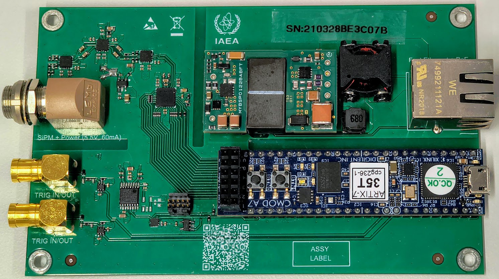

---

## 1. What was built

### `fci_core` — Vitis HLS

Computes the two partial-spectrum-area sums whose ratio is the FCI, over a 1024-sample frame.

- `N_SAMPLES = 1024`, FFT-based, `ap_ufixed<28,12>` (Q12.16) results
- Window bounds as genuine AXI4-Lite registers (`psa_l_lo/hi`, `psa_w_lo/hi`), `ap_ctrl_hs`
- Cosim verified: **Latency = Interval = 3249 cycles** → no back-to-back overlap, ceiling
  **≈ 15.4k events/s** at 50 MHz

An alternative free-running configuration (`ap_ctrl_none` + `ap_fifo` window ports) reached
1024-cycle intervals — 2–3× the throughput — but was rejected: the window bounds must remain real
AXI4-Lite registers. Accepted trade-off, recorded here so it is not rediscovered as a bug.

### `trigger_core` — hand-written VHDL

Cross-level trigger with pre-trigger lookback and triggered capture, streaming straight into
`fci_core`'s `s_axis_data` with no adapters.

```
adc_data ─┬──────────────────────────────► trigger.vhd ──► trigger pulse
          └──► delay_line.vhd ──► delayed ──► capture_engine.vhd (IDLE/CAPTURE/STREAM)
                                                  └──► circular_buffer.vhd ──► m_axis
```

Register map (AXI4-Lite):

| Offset | Register | Notes |
|---|---|---|
| 0x00 | `threshold` | 14-bit, offset-binary ADC code |
| 0x04 | `polarity`  | 1 = rising crossing, 0 = falling |
| 0x08 | `delay`     | pre-trigger samples, clamped 2..256 |
| 0x0C | `depth`     | capture length, clamped 1..4096 |

Verified by a self-checking testbench (`xvhdl`/`xelab`/`xsim`), currently **8/8 scenarios
passing**: six original functional and boundary cases, a reconfiguration-hazard case added after
§4.1, and a long-stall throughput case added for §7a.

### Block design and firmware

`clk_cpu` and `clk_adc`, both 50 MHz, from one MMCM (`NUM_OUT_CLKS = 2`; the third output,
`clk_dsp`, was dropped once nothing needed a separate DSP clock domain). `trigger_core` →
`axis_broadcaster_0` → {`fci_core` → `axi_dma_0`, `axi_dma_1` raw-trace tap}, with
`axi_dma_1` configured for 256-beat bursts (§7b). MicroBlaze firmware drives everything by
hand-poked AXI4-Lite plus two interrupt-driven DMA channels; BRAM readback goes through MM2S + FSL
because `axi_bram_ctrl_*` is mapped only into the DMA address spaces, not into `microblaze_0/Data`.

Firmware layout: `main.c` is a bare entry point; all bring-up and acquisition lives in
`bringup.c`/`bringup.h` behind `Bringup_Run()`.

---

## 2. The bring-up problem

Captured ADC traces showed a repeatable artifact on **large** pulses while **small** ones passed
through intact: a fast overshoot spike, a flat plateau lasting the pulse duration, an undershoot,
then a slow settle.

The two ILA captures below are from the same session at the same baseline (~10050 in the raw
reading). Small pulse, clean:

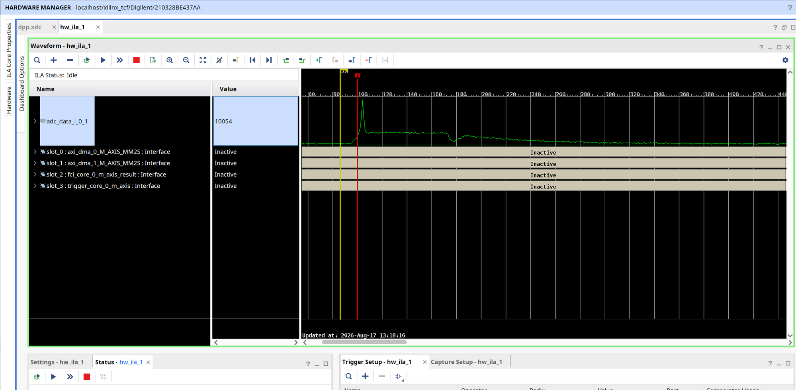

Large pulse, same setup — spike, flat plateau, then a cliff:

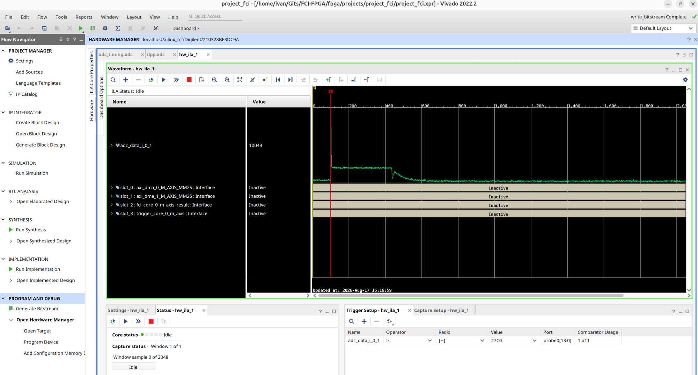

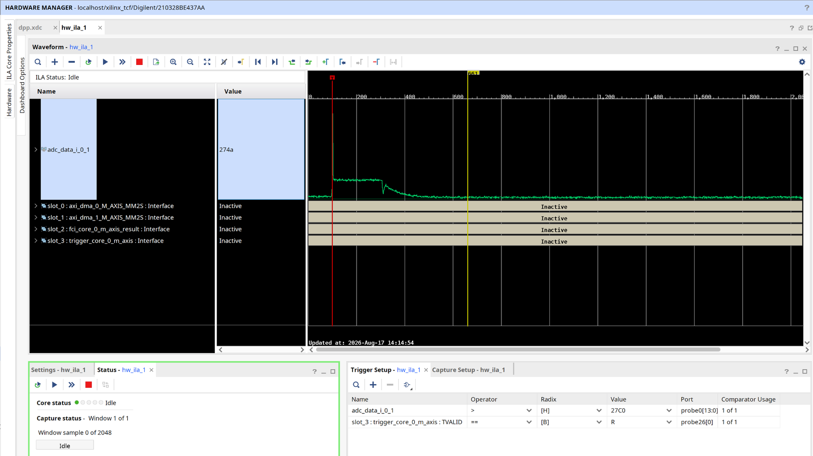

For reference, the analog pulse at the AFE output measured on a scope — negative-going, ~500 mV,
fast fall and a few-µs exponential recovery. This is the shape the digitized trace must reproduce
(possibly inverted), with **no discontinuity, delta or spike**:

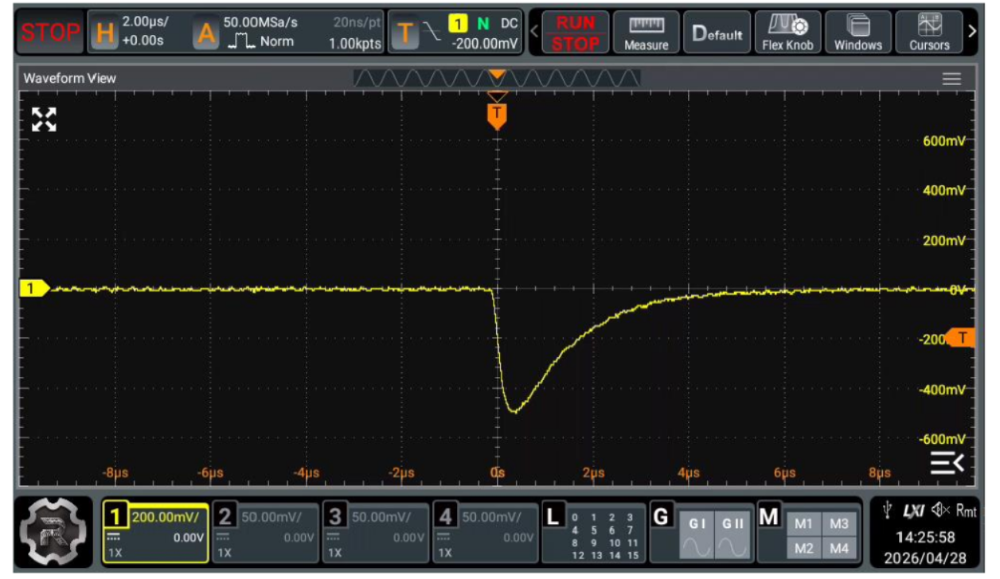

---

## 3. Root cause: the 2's-complement fold

**The LTC2248's `MODE` pin is strapped to 2/3 VDD, which selects 2's-complement output. The design
was consuming that word as offset binary.**

Reading 2's complement as unsigned maps analog value `V` to

```
U = V              for V >= 0
U = V + 16384      for V < 0
```

which is monotonic *everywhere except across analog zero*, where `U` folds from **16383 straight to
0**. The baseline sits ~6300 counts below analog zero — offset-binary ≈ 1861, which read raw is
`1861 XOR 8192 = 10053`, matching the "baseline close to 10000" seen in the earliest bring-up logs:

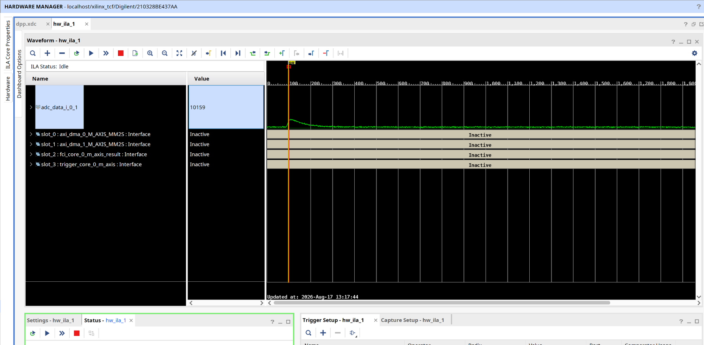

So:

- pulse amplitude **< ~6300** → never reaches the fold → **reads cleanly**
- pulse amplitude **> ~6300** → crosses it → **cliff**, and if it also over-ranges the ADC it
  **clips flat at the rail** on the far side before cliffing back on the way down

Rise → cliff → plateau → cliff back → exponential decay. That is the artifact, item for item, and
it is amplitude-dependent for a concrete reason.

**Fix:** a single MSB inversion in `trigger_core_top.vhd`, applied after the input capture register
so the rest of the core stays format-agnostic:

```vhdl
adc_data_ob <= (not adc_data_q(ADC_WIDTH - 1)) & adc_data_q(ADC_WIDTH - 2 downto 0);
```

### Reproduced on demand

`test_encoding_fold_demo()` (in `bringup.c`, behind `ENCODING_FOLD_DEMO_ENABLE`) raises both gain
channels until a pulse crosses analog zero, then prints the capture twice — corrected, and as the
pre-fix firmware would have read it:

```
idx  corrected  as_read_before_fix
 97      6335        14527
 98      8935          743   <- crosses analog zero, folds 16383 -> 0
 99     11126         2934
101     16383         8191   <- ADC clipped at the rail
...     16383         8191      (85 samples of flat plateau)
185     15907         7715
232      8225           33   <- decayed to near zero: the "undershoot"
233      8163        16355   <- folds back
234      7584        15776      then settles slowly to baseline
```

The corrected column over the same samples is a clean pulse. Question closed.

Current state, same ILA, radix signed — clean rise and exponential decay:

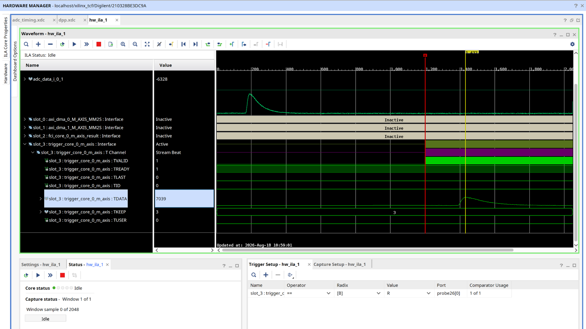

---

## 4. Other real bugs found along the way

Each of these was genuine and independently verified, even though none of them caused the artifact.

### 4.1 Reconfiguration hazard in `trigger.vhd`

The `above` comparator state was compared across threshold/polarity register writes, so *any*
config write could emit a false `trigger_o`. Fixed by suppressing the trigger on the cycle config
changes while still updating `above` to the new comparison:

```vhdl
cfg_changed := (threshold_i /= threshold_q) or (polarity_i /= polarity_q);
if armed_i = '1' and not cfg_changed and (...edge...) then
  trigger_o <= '1';
```

Verified by a new testbench scenario that fails when the fix is reverted.

### 4.2 VGA fine-gain DAC pinned at code 0

The driver applied the **coarse** channel's logarithmic formula to the **fine** channel. Since
`log10(1.0) = 0`, the default fine gain of 1.0 produced DAC code **0** instead of 819 — the AD8330
parked at the bottom of its control range for a long stretch of bring-up, making every threshold
constant tuned in that period meaningless.

The two channels use genuinely different control laws (confirmed in the sibling project's
host-side Python API, which is the real source of truth — its MicroBlaze only ever receives
finished integer codes):

```
fine   (VMAG, linear)      code = gain * 2^12 / (2 * 2.5)          gain 1.0 -> 819
coarse (VDBS, logarithmic) code = 0.6 * 2^12 * log10(gain) / 2.5   gain 6.0 -> 765
```

A later controlled bisect confirmed the fine channel is linear empirically: baseline σ tracked the
DAC code proportionally (410 → 29, 819 → 58, 1638 → 102), not exponentially.

### 4.3 `axi_dma_0` armed as a one-shot — the pipeline deadlock

`axi_dma_0` was armed for a single 8-byte transfer during the end-to-end test and not re-armed
until continuous capture started at the very end. In between, `fci_core`'s result stream had
nowhere to go, so it backpressured; once its output FIFO filled it stopped accepting input; and
because `axis_broadcaster_0` is **lockstep** (no beat advances unless *both* consumers take it), a
stalled `fci_core` froze the raw-trace tap on `axi_dma_1` too.

The `raw_events` counter traced it exactly:

| point in run | `raw_events` |
|---|---|
| first calibration fails | 5 (the FIFO's worth of events) |
| after the one-shot test | 6 (drained 2 beats = 1 event) |
| entire gain bisect | 8, frozen |
| continuous capture starts | flowing again |

This is what made *every* calibration result unreproducible for several sessions — success
depended purely on how much FIFO slack happened to be left. Fixed by servicing both broadcaster
consumers continuously from before the first trigger (`start_result_pipeline()` alongside
`start_raw_trace_pipeline()`).

### 4.4 Threshold calibration by descending sweep

The original auto-calibration swept the threshold down from full scale waiting for a real pulse.
Two problems:

1. **The trigger response is not monotonic in threshold.** With RISING polarity, a threshold below
   baseline never fires (`above` is permanently 1); inside the noise band it fires at kHz; above
   the noise but below the pulse peak it fires at the event rate; above the peaks it never fires.
2. It kept reporting "first capture at probe threshold 15488" on traces that never exceed 5959 —
   physically impossible. Those were **stale captures draining**, not triggers at that level.

Replaced with a **noise-band search**: sweep *up* from 0 in small steps with a few ms dwell, and
record the first and last threshold that fire. The noise band is always present, independent of
the detector, and fires at kHz, so milliseconds are decisive. Calibration then parks at the band
center, captures immediately, and measures mean/σ from the pre-trigger region.

Two follow-on fixes were needed: the step size had to drop from 64 to 8 (the band is only ~±4σ ≈ 56
counts wide on a quiet baseline — *narrower than the original step*), and the event-counter
snapshot had to move to **after** programming the threshold, or a capture already in flight under
the previous threshold scored as a hit at the new one.

### 4.5 Startup race

`test_trigger_core()` left a live threshold (0x1234 = 4660) that real pulses cross every time,
while neither broadcaster consumer was armed yet. A trigger in that window left `capture_engine`
stuck in STREAM holding beat 0. The threshold is now parked at full scale on the way out, so
nothing can fire until the whole pipeline is up.

---

## 5. Hypotheses that were wrong

Both were pursued hard, and both are disproven by measurement. **Do not revive them.**

### ADC bus capture skew

Real and measured: the 14 input flops were scattered across `SLICE_X39Y106..SLICE_X50Y116` with
port-to-flop delays spanning 3.272–5.736 ns — **2.464 ns of bit-to-bit skew** on a bus latched
every 20 ns. Adding `attribute IOB` packed all 14 into `ILOGICE2.IFF` at 1.448–1.480 ns
(**0.032 ns** skew), with hold slack going from +0.146 to +1.992 ns.

Compelling, and wrong. `system_ila_0` samples the *same pads* through its own fabric registers that
the attribute never touched:

| capture path | pad→flop delay | skew |
|---|---|---|
| `trigger_core` `adc_data_q` (IOB-packed) | 1.448 – 1.480 ns | 0.032 ns |
| `system_ila_0` probe0 (fabric SRL) | 3.548 – 7.099 ns | **3.551 ns** |

The ILA path carries *more* skew than `trigger_core` had before the fix, and it shows clean pulses.
If 3.551 ns does not corrupt the bus, 2.464 ns was not corrupting it either.

**The IOB attribute is kept** — it is the correct way to capture a source-synchronous parallel bus
and it costs nothing — but it is documented on those merits, not as the fix.

### VGA fine gain at code 0

Overload recovery is a plausible reading of spike/plateau/undershoot, and the misconfiguration was
real (§4.2). But the controlled bisect showed that at fine code 0 the pulse amplitude is **41
counts with σ = 5** — VMAG at 0 V means the AD8330 output is essentially *zero*. It produces **no
signal**, not distorted signal, so it cannot explain traces full of large distorted pulses.

### Why the ILA reinforced both errors

The ILA was treated as ground truth, and it is not:

- it probes the **raw external port**, upstream of the MSB flip, so it saw the un-corrected word
- the radix was set to **unsigned decimal**, which renders the fold exactly as the firmware did
- it samples with its own scattered fabric flops

The instrument had the same disease as the patient. It is still useful, but for bus-integrity
questions its probe should be moved to `adc_data_q` (post capture register).

---

## 6. Process mistakes worth recording

- **A stale ELF was debugged for two full sessions.** The Vitis app's `src/` had been overwritten
  with the sibling project's firmware, *with original timestamps preserved*, so `make` saw sources
  older than the objects and silently relinked a byte-identical binary. Builds "succeeded" and
  changed nothing. Now caught by checking the ELF's string table against expected new output.
- **`mb-gcc -fsyntax-only` does not run `-Wunused-function`.** That was the standard verification
  command for most of the project, and it hid dead code. Use `-c -o /dev/null`.
- **`INPUT_DELAY` is not a queryable port property in Vivado 2022.2.** `get_property INPUT_DELAY`
  returns empty whether or not a constraint is applied. Concluding "the constraint isn't applying"
  from that emptiness sent the investigation chasing file-scoping settings across several rebuilds.
- **Auto-inferred MMCM generated clocks don't resolve while the IP is an unlinked OOC black box.**
  `set_input_delay` against an empty clock collection silently no-ops. Fixed by constraining the
  physical port with `create_clock`.
- **An event-rate estimate was wrong by 10×** (a UART dump timed as ~5 s when it is ~0.53 s), which
  produced a confident but false explanation for why calibration was failing. Background here is
  ~30 cps, and the real cause was §4.3.
- **The encoding hypothesis was raised early and dismissed on bad reasoning.** The fold point was
  placed at offset-binary midscale 8192 instead of at analog zero, where the *misread* jumps
  16383→0; and the fingerprint was described as "a cliff" without recognizing that a cliff, a
  clipped far side and a cliff back *is* spike-plateau-undershoot. That misplacement is what led to
  the skew and VGA detours.

- **Automatic error recovery was added before the error was understood**, and it was unbounded. It
  reset and re-armed the DMA on every fault, converting one diagnosable failure into 378,713 resets
  and zero clean captures — it deleted the evidence needed to diagnose it. Recovery belongs *after*
  a fault is characterized, and always with a retry bound (§7c).
- **Several things were changed in one step** — DMA parameters, ILA topology and firmware together —
  which left nothing to bisect when the system stopped acquiring. The batch had to be reverted whole,
  and the actual fix was then found in one change from the restored baseline (§7b).
- **The rollback initially went too far**, reverting the §7a `capture_engine` fix along with the
  diagnostics even though it had been in the working system and was never suspect. Reverting to a
  known-good state means reverting the *suspect* changes, not every recent one.

The general lesson: every hypothesis here was eventually settled by a **measurement that could have
come out the other way** — the ILA skew numbers, the gain bisect, the fold demo. The ones that
dragged on were the ones argued from plausibility instead.

---

## 7. Measured characteristics

At the normal operating point (fine gain 1.0 → code 819, coarse 6.0 → code 765), background only
(NORM + cosmics, ~30 cps):

| quantity | value |
|---|---|
| baseline (offset binary) | ~1861 |
| baseline noise σ | ~7 quiet; ~55 at 30 cps (pile-up inflates the pre-trigger window) |
| pulse rise | ~21 samples / 420 ns |
| pulse decay τ | ~1.4 µs (~70 samples to 1/e) |
| pulse amplitude | ~840–4100 counts, background dependent |
| headroom to analog zero | ~6300 counts |
| polarity (digitized) | **rising** — pulses go UP from baseline |

### Constants and what fixes them

Most numbers in this design are forced by something measurable. A few are not, and the difference
matters — this project lost several sessions to constants that looked derived and were not
(thresholds 1900 and 2100, tuned against a mis-encoded signal; a 64-count scan step that turned out
wider than the noise band it was searching for). Each constant is therefore classified below.

| constant | value | what fixes it |
|---|---|---|
| capture depth | 1024 | **Hard interface constraint.** Must equal `fci_core`'s `N_SAMPLES`: `trigger_core` streams exactly this many beats and `axis_to_fft` reads exactly that many, so a mismatch either hangs the pipeline or desyncs every frame after it. Not tunable. Currently written as a bare literal in three places in `bringup.c` — promoting it to a named constant is an open item (§9). |
| output FIFO depth (`capture_engine`) | 2 | **Derived** from the buffer's 1-cycle read latency: one read already in flight when TREADY drops, plus the beat already being presented. Three would be dead area; one would drop data. |
| `axi_dma_1` burst size | 256 | **Bounded by the protocol.** 256 is the AXI4 maximum burst length for an INCR transaction, so this is the floor on per-beat address-phase overhead rather than a tuned value (§7b). |
| `axi_dma_1` `c_sg_length_width` | 18 | **Chosen, with headroom.** 12 bits would carry today's 2048-byte trace and 13 the 4096-byte maximum; 18 leaves room to grow the trace without another block-design change. |
| `BASELINE_SAMPLES` | 64 | **Derived.** Must lie entirely inside the `TRIGGER_DELAY` pre-trigger region, so anything below 100 works; 64 leaves margin while still averaging enough samples for a usable σ. |
| noise-scan `STEP` | 8 | **Derived.** Must be well under the noise band width. On a quiet baseline σ ≈ 7, so the band is only ~±4σ ≈ 56 counts — a step of 64 stepped straight over it (§4.4). |
| AD5697 fine / coarse codes | 819 / 765 | **Derived** from the two control-law formulas (§4.2), cross-checked against the sibling project's host-side API and confirmed on hardware by the gain bisect. |
| FFT bin spacing | 48.83 kHz | **Derived**: 50 Msps / 1024. |
| `TRIGGER_DELAY` | 100 | **Chosen.** Sets the pre/post-trigger split; any value above `BASELINE_SAMPLES` and within the delay line's 2..256 range is valid. Adjust to taste. |
| `THRESHOLD_SIGMA_MULT` | 8 | **Tuning knob — not derived.** The paper's 4σ is for offline analysis of recorded traces; on a live comparator at 50 Msps it would fire ~1500 false triggers/s against a ~30 cps real rate. 8 was picked to sit clear of the noise, and is the intended thing to adjust: raise it if noise triggers persist, lower it if genuine small events are missed. |
| `psa_l_hi` / `psa_w_hi` | 25 / 90 | **Inherited, not derived for this detector.** These came from `fci_core_tb.cpp` and were never re-derived against the measured pulse. They are mismatched — see below. |

### Known issue: FCI windows are mismatched to this pulse

τ ≈ 1.4 µs puts the spectral corner at 1/(2πτ) ≈ 114 kHz. With 1024 samples at 50 Msps the FFT bin
spacing is 48.83 kHz, so the corner sits at **bin ~2.3** and essentially all pulse energy lands in
the first few bins. The current windows are `psa_l` = bins 1–25 (to 1.22 MHz) and `psa_w` = bins
1–90 (to 4.39 MHz) — both capture nearly the same energy, pinning FCI near 1.

Measured: **0.84 ± 0.03** over 60 background events, unimodal. Little shape information survives
into the ratio. Narrowing `psa_l` toward the first 2–3 bins is the direction that restores
sensitivity to decay-constant differences, and it is an AXI4-Lite parameter change — no rebuild.

---

## 7a. Issue #10 — trigger_core output rate halved (fixed)

`trigger_core`'s AXI4-Stream output ran at 25 Msps against a 50 Msps capture: TVALID toggled
1/0/1/0 continuously instead of staying high.

The issue text suspected the lockstep `axis_broadcaster` or the DMAs, but the ILA capture rules
that out — **TREADY was steady high while TVALID toggled**. A consumer applying backpressure would
show the opposite. The stall was inside `capture_engine.vhd`.

`circular_buffer` has a 1-cycle registered read latency. The FSM used a *single* `addr` register as
both the buffer read address and the current-beat pointer, so after every accepted beat it had to
spend a dead cycle waiting for `buf_rd_data_i` to catch up to the new address:

```vhdl
elsif m_axis_tready_i = '1' then      -- beat accepted
  addr       <= addr + 1;
  data_valid <= '0';                  -- forced low for the next full cycle
```

A hard 50% duty cycle, independent of anything downstream.

**Fix:** stop serializing "advance address" and "present data"; pipeline them. `issue_addr` now runs
ahead, presenting a new address every cycle it is allowed to, and returning words land in a 2-entry
FIFO feeding the stream output. Two entries is exactly right: when TREADY deasserts, one read is
already in flight and must be absorbed, on top of the beat already being presented. Issue is gated
on the occupancy the FIFO will have *next* cycle (`count + push - pop`), which makes overflow
structurally impossible rather than merely unlikely.

**Verification.** The testbench now counts idle cycles between the first accepted beat and TLAST
whenever TREADY is held high, and fails on any. Reverting the RTL makes it fail with exactly
`depth - 1` bubbles per capture — 4095 for a 4096-beat trace — which is the 50% duty cycle
quantified:

```
with the fix:      PASS (beats=4096, mid-stream idle cycles=0)
fix reverted:      FAIL: 4095 idle cycle(s) mid-stream with tready held high
```

All 8 scenarios pass, and the IP was repackaged and byte-compared against the RTL.

## 7b. Raw-trace backpressure — the DMA burst size

Fixing §7a moved the bottleneck rather than removing it. With `capture_engine` finally offering one
beat per cycle, `trigger_core` presents a sustained 50 Msps stream, and the ILA then showed genuine
backpressure for the first time: TREADY *low* on the raw-trace tap, which is the opposite of the
§7a signature and therefore a different problem with the same symptom.

Two extra ILA probes — `fci_core_0/s_axis_data_TREADY` and `axi_dma_1/s_axis_s2mm_tready` —
identified the slow consumer directly, with no inference needed. (These were part of the diagnostic
build that had to be reverted for unrelated reasons, §7c, so they are not in the design today; the
capture below is from that build.)

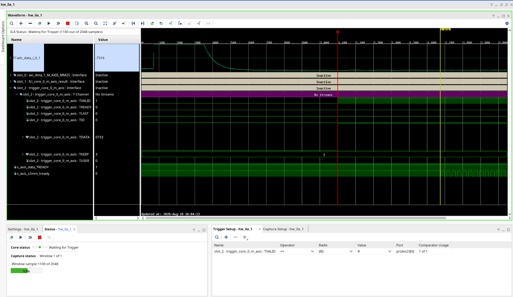

`s_axis_data_TREADY` (`fci_core`) is **steady high**. `s_axis_s2mm_tready` (`axi_dma_1`) is **low**,
pulsing only in short bursts. `trigger_core`'s `m_axis` therefore sits at TVALID = 1, TREADY = 0.

Because `axis_broadcaster_0` is lockstep, this is not a local problem. No beat advances unless
*both* masters accept it, so `axi_dma_1` alone was rate-limiting `fci_core` as well.

`axi_dma_1` was configured with `c_s2mm_burst_size = 2`. Every two beats of data
therefore paid for a full AXI address phase plus a SmartConnect arbitration round. At 50 Msps the
memory side could not retire transactions fast enough, S2MM's internal buffer filled, and TREADY
dropped — the stream was rate-limited by transaction overhead, not by bandwidth.

**Fix** (`59422f3`):

| parameter | was | now | what fixes it |
|---|---|---|---|
| `axi_dma_1` `c_mm2s_burst_size` / `c_s2mm_burst_size` | 2 | **256** | 256 is the AXI4 maximum burst length for an INCR transaction — the largest value the protocol allows, so this is the floor on address-phase overhead, not a tuned midpoint. It cuts transactions per trace by 128×. |
| `axi_dma_1` `c_sg_length_width` | unset (default 14) | **18** | Sizes the LENGTH register: 18 bits holds 262143 bytes against a present maximum of 4096 (`RAW_TRACE_MAX_SAMPLES` 2048 × 2 bytes). Headroom, chosen — 13 bits would carry the 4096-byte maximum. |
| `axi_dma_0` burst sizes | 2 | **8** | `axi_dma_0` carries one 8-byte FCI result per event at ~30 events/s, so it has no throughput problem to solve. Raised off the minimum for margin rather than for throughput; going to 256 would buy nothing here and would cost buffer BRAM. |
| `axi_dma_0` `c_sg_length_width` | 8 | **14** | 8 bits caps a transfer at 255 bytes. That was sufficient for the 8-byte result and is why it never failed, but it left no room for batching several results per transfer later. |

**Result.** The same ILA view after the change — `trigger_core`'s `m_axis` is `Active` with
TVALID = 1 and TREADY = 1 held continuously across the whole 2048-sample window, streaming beats
without a gap:

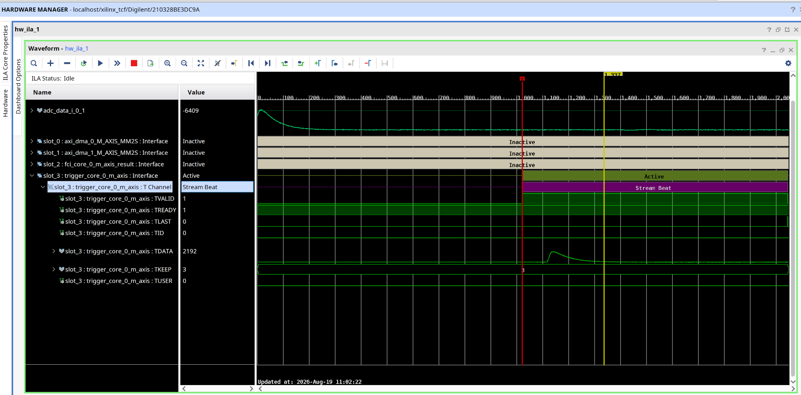

**The fix is not free, and the cost lands in the scarcest resource.** `axi_dma_1` now occupies
5 BRAM tiles (4 ×RAMB36 + 2 ×RAMB18) against 2 before the change, and the design total moved from
37.5 to 40.5 of 50 tiles — the +3 accounts for the whole difference. Deeper bursts need deeper
buffers. See §8 for why that matters for what comes next.

---

## 7c. A rollback, and why

Between §7a and §7b there is a detour worth recording, because the mistake in it is a process
mistake rather than a technical one.

After the backpressure appeared, several things were changed at once (`c8dda35`): DMA burst and
length-width parameters on both channels, the two TREADY probes from §7b plus two extra monitor
slots with the existing slots renumbered, and a batch of firmware diagnostics including automatic
DMA error recovery. The system then stopped acquiring entirely — `DMAIntErr`, one clean transfer after a
fresh bitstream and a permanent halt after it.

Two compounding errors followed:

1. **The recovery loop was unbounded.** It reset and re-armed the DMA on every error, which turned
   one diagnosable failure into 378,713 resets and zero clean captures. It destroyed the only
   evidence that could have identified the failure — the state of the core at the moment it first
   went wrong. Bounding it to 8 consecutive attempts restored observability immediately; the
   counter then read `recoveries=8 (consec=8, GAVE UP)` instead of a six-digit number. The frozen
   state it was masking looks like this — `trigger_core` stuck at TVALID = 1, TLAST = 1, TREADY = 0
   with `axi_dma_1`'s MM2S stream inactive and `s_axis_s2mm_tready` flat:

   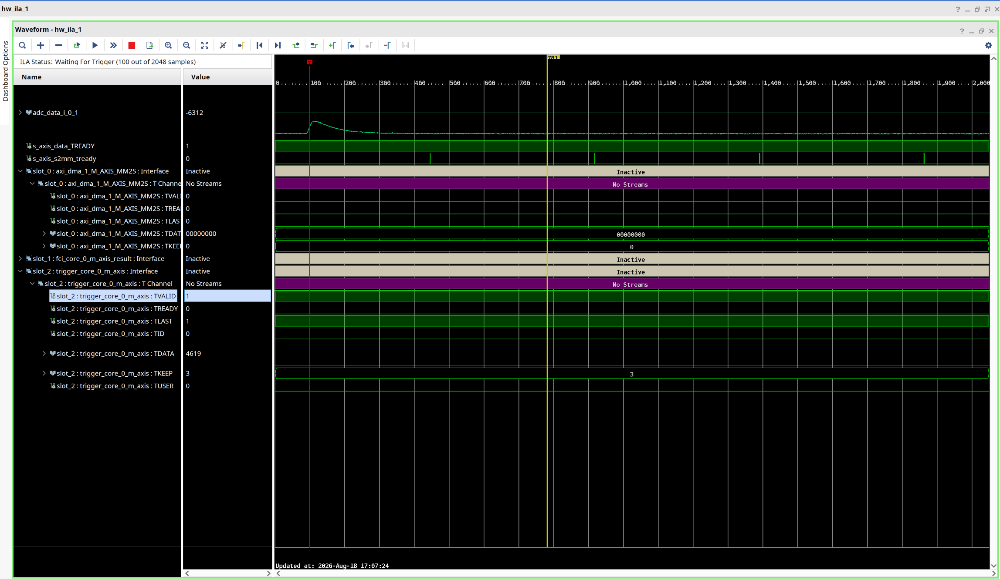

2. **Nothing could be bisected**, because BD parameters, ILA topology and firmware had all moved
   together. There was no single-variable experiment available.

The resolution was to revert the whole batch (`de5b230`) back to the last configuration known to
acquire, keeping only the §7a `capture_engine` fix, which had been in the working system and was
never in question. From that restored baseline the burst size was the single next change, and it
worked (§7b).

The `DMAIntErr` sequence itself was never isolated to a specific change and is not claimed to be
explained here. What is established is that it did not survive the revert, and that neither
`c_sg_length_width` value was capable of causing it: `axi_dma_0` at 8 bits caps at 255 bytes
against an 8-byte payload, and `axi_dma_1`'s default 14 bits caps at 16383 against 2048.

One part of the batch did earn its keep and should be re-applied first: the two TREADY probes.
They are what turned "there is backpressure somewhere" into "`axi_dma_1` is the slow consumer and
`fci_core` is not," which is the measurement §7b rests on. The rest of the diagnostics are preserved
in `c8dda35` and are worth re-applying **one at a time, with a hardware test between each** — see
the open items in §9.

---

## 8. Resource budget and headroom

Measured from the routed checkpoint of the current build (`report_utilization -hierarchical`),
not estimated:

| resource | used | available | % |
|---|---|---|---|
| Slice LUTs | 16970 | 20800 | **81.59** |
| Slice registers | 24110 | 41600 | 57.96 |
| Slices | 6870 | 8150 | 84.29 |
| BRAM tiles | 40.5 | 50 | **81.00** |
| DSP48E1 | 16 | 90 | 17.78 |

Fully routed, no routing errors, WNS **+1.811 ns**, WHS **+0.019 ns**.

Per block, largest first:

| block | LUTs | FFs | BRAM tiles | DSP |
|---|---|---|---|---|
| `fci_core_0` | 3919 | 5767 | 2 (4 ×RAMB18) | 13 |
| `axi_smc` | 3496 | 3996 | 0 | 0 |
| **`system_ila_0`** | **2054** | 2995 | **9.5** | 0 |
| `microblaze_0` | 1570 | 1304 | 0 | 3 |
| `axi_dma_1` | 1309 | 1926 | 5 | 0 |
| `axi_dma_0` | 1209 | 1809 | 2 | 0 |
| `trigger_core_0` | 1166 | 3846 | 2 | 0 |
| **`dbg_hub`** | **450** | 741 | 0 | 0 |
| `axis_broadcaster_0` | 4 | 2 | 0 | 0 |

### What removing the debug logic frees

`system_ila_0` + `dbg_hub` together are **2504 LUTs (12.0% of the device)** and **9.5 of 50 BRAM
tiles (19%)**. Removing both:

| | now | debug removed | free afterward |
|---|---|---|---|
| LUTs | 81.6% | **69.5%** | 6334 |
| BRAM tiles | 81.0% | **62.0%** | 19 |
| FFs | 58.0% | 49.0% | 21226 |
| DSP | 17.8% | 17.8% | 74 |

Partial reduction is also available: ILA storage scales with total probe width × depth, so dropping
from 4 monitor slots to 1–2 recovers most of the BRAM, and halving `C_DATA_DEPTH` from 2048 to 1024
halves it again. `C_SLOT_n_AXI_DATA_SEL = 0` captures control signals only (~4 bits instead of ~26
per AXIS slot). The 2048 depth is itself derived, and should not be cut without
re-deriving it: `trigger_core` captures a full 1024-sample trace before it streams any of it, so
the raw ADC bus and the triggered output are offset by 1024 cycles and a window has to hold both
to be readable.

### What the planned blocks need

Two observations shape the plan. **LUTs and BRAM are the binding constraints; flip-flops and DSPs
are abundant** (58% and 18%). And **the histogram dominates BRAM while everything else is logic.**

On Artix-7 a RAMB36E1 in 1K×36 mode is 1024 deep at up to 36 bits, so a histogram's tile count is
set by channel count alone — counter width up to 36 bits is free:

| histogram | RAMB36 tiles |
|---|---|
| 4K channels × 32-bit | 4 |
| 8K × 32-bit | 8 |
| 16K × 32-bit | 16 |

The 19 tiles freed by removing debug cover **16K channels with 3 to spare**, or 8K comfortably.

#### Sizing the trapezoidal filter

The trapezoidal filter is the one block whose cost swings hard on a design choice: its two delay
lines are *k* and *k+m* samples deep, so at 50 Msps the storage is set entirely by the peaking and
flat-top times, and a long shaping time gets expensive fast.

| peaking + flat top | *k*+*m* at 50 Msps | delay-line storage (14-bit) | as SRL32 |
|---|---|---|---|
| 2 µs + 1 µs | 150 | ~250 samples | ~120 LUTs |
| 5 µs + 1 µs | 300 | ~550 samples | ~250 LUTs |
| 10 µs + 2 µs | 600 | ~1100 samples | ~500 LUTs, or 1 ×RAMB18 |

**The shaping times for this detector have not been fixed yet, so this block cannot be costed
further than the table above.** Anything up to a few µs of peaking time stays comfortably in SRL
territory and needs no BRAM; past roughly 10 µs the BRAM-versus-logic trade becomes live. Settle
the shaping time against the measured pulse (τ ≈ 1.4 µs, §7) before treating any row here as the
budget.

Logic estimates for the four blocks — estimates, not measurements, and to be replaced with
synthesis numbers as each block is built:

| block | LUTs | BRAM | DSP |
|---|---|---|---|
| baseline restorer (gated moving average or IIR) | ~300 | 0 | 0–1 |
| trapezoidal filter (few-µs shaping) | ~350–500 | 0 | 1–2 |
| histogram read-modify-write control | ~200 | (see table above) | 0 |
| PSD: `ENERGY` / `ENERGY_SHORT` | ~300 | 0 | 0 |
| **total** | **~1150–1500** | **0 beyond the histogram** | **~2–3** |

Against 6334 free LUTs and 74 free DSPs after the ILA is removed, the logic is not the constraint.
The histogram's channel count is.

The CAEN-style PSD block is the cheapest of the four by a wide margin: two gated accumulators over
two integration windows on the baseline-restored stream, plus window counters and comparators. It
needs no memory of its own, since the pre-gate history it integrates over is already held by
`trigger_core`'s pre-trigger delay line.

`axi_smc` at 3496 LUTs is the largest block never examined for reduction. Its cost scales with
slave-port count, and it currently carries four (MM2S and S2MM for both DMA channels).

---

## 8a. Spectroscopy chain: blr_core and psd_core

Two new hand-written VHDL cores, built to the requirement in issue #12 (configurable BLR feeding a
configurable CAEN-style PSD).

### Revised datapath

The BLR runs **continuously on the raw ADC stream, ahead of the trigger**, rather than as another
broadcaster consumer. That places baseline restoration before the threshold comparison, so the
trigger works against a restored baseline — which also sets up the planned CFD trigger — and it
means every downstream consumer sees restored data:

```
adc pins -> blr_core -> trigger_core -> axis_broadcaster -> M00 fci_core -> fci_sink
              (continuous) (+timestamp)                     M01 psd_core
                                                            M02 axi_dma_1 (raw restored trace)
```

As built, the broadcaster has three masters; the planned shaper becomes a fourth. §8b has the
as-built version of this diagram with the clock-domain boundary marked.

Every link is AXI4-Stream, so the block design connects these as interfaces rather than as
hand-wired net bundles. On the two links carrying the continuous converter stream —
`blr_core -> trigger_core` — **TREADY is deliberately ignored**: `blr_core`'s master never examines
it and `trigger_core`'s slave ties it high. There is no buffer between those blocks and the ADC
pins, so a beat not taken is a sample destroyed; honoring backpressure there would corrupt the
time base rather than politely delay it. The interface is AXI4-Stream for connectivity, not for
flow control. `blr_core`'s testbench holds TREADY low for its entire run to prove the core does
not depend on it.

Three things moved out of `trigger_core_top` into `blr_core_top`, because that core is now the
first to touch the pins: the external ADC port itself, the IOB-packed capture register, and the
ADC word-format handling. `trigger_core`'s input is now an AXI4-Stream slave (16-bit TDATA, sample
in the low bits) rather than a plain vector wired to pads.

**The datapath is signed and zero-centered end to end, and offset binary is gone from it entirely.**
The LTC2248 is strapped for 2's complement, and 2's complement *is* signed — so in a signed
datapath there is no conversion to perform at all, only sign extension. That is worth stating as a
design property rather than a detail: the double-conversion hazard that would have re-created the
bring-up fold of section 3 is now **designed out rather than guarded against**, because there is no
MSB flip anywhere in the normal chain to apply twice. Both cores keep an `ADC_IS_2C` generic
(default **false** in `trigger_core`, since `blr_core` upstream already emits signed) purely to
cover a board strapped the other way.

### blr_core

Gated exponential moving average. `acc <- acc + sample - baseline` while the gate is open, with
`baseline = acc >> k`, so the time constant is exactly `2^k` samples — at 50 Msps, k=12 is 82 µs,
comfortably slower than the ~1.4 µs pulse decay it must not track.

| offset | register | what fixes it |
|---|---|---|
| 0x00 | `shift` (k) | **Tuning knob.** Must be slow against the pulse decay and fast against real DC drift. Default 12 = 82 µs. |
| 0x04 | `gate_thr` | **Set from the measured noise.** A few σ above baseline noise (σ ≈ 7 quiet, ≈ 55 at 30 cps, §7). Default 256. |
| 0x08 | `ctrl` | bit0 bypass (for A/B against unrestored data), bit1 hold |
| 0x0C | `baseline`/status | RO, live estimate + gate state |
| 0x10 | `holdoff` | **Derived from the pulse duration** — see below. Default 384 samples = 7.7 µs, past 5 decay constants. |

Output is **signed, restored to zero** — not offset binary re-centered on mid-scale, which is what
the first version emitted. Zero is the natural origin for a bipolar pulse: `psd_core` integrates a
zero-mean input with no pedestal to subtract, and `trigger_core` compares against a signed
threshold. Nothing downstream carries a mid-scale constant, so nothing downstream can disagree
about what the constant was.

Three failure modes are handled in the RTL rather than left to firmware, and each was caught by the
testbench rather than reasoned about in advance:

- **Cold start.** `acc = 0` means the first real sample is thousands of counts from the estimate,
  so a naive gated EMA shuts its gate on sample one and never reopens. Fixed by seeding `acc` from
  the first sample. The first implementation seeded one cycle too early, from the capture register's
  reset value, and recorded 8192 (all-zero pins, MSB-inverted) as the baseline — every other check
  in the testbench failed downstream of that single wrong value.
- **Pulse tails reopening the gate.** A threshold-only gate shuts on the peak but reopens part-way
  down the decay while the signal is still tens of counts high, so every event drags the estimate
  upward. Measured before the fix: **718 counts of drift across six 3000-count pulses.** Fixed with
  a hold-off that keeps the gate shut for `holdoff` further samples after the signal returns in
  range. After the fix: **0 counts of drift.**
- **Genuine DC drift locking the gate out.** If the baseline walks further than `gate_thr`, the gate
  shuts around a stale estimate forever. A watchdog forces one update after `2^(k+3)` closed cycles,
  floored at 4× the hold-off so ordinary pulses can never trip it.

**Overflow is structurally impossible, so there is no saturation logic.** The concern was real — a
wrap at the top of range would fold a large pulse straight back to zero, the exact
spike-plateau-undershoot signature of section 3 from a new cause. But `sample - baseline` on two
14-bit signed quantities spans ±16383 and needs 15 bits; the output is 16-bit signed, so the result
cannot overflow it. Widening the port was cheaper and stronger than the two comparators it
replaced: it removes the failure mode instead of clamping it.

**12/12 testbench scenarios pass.**

### psd_core

Dual-gate charge integrator producing the CAEN pair. Both gates open at
`pre_trigger - pre_gate`; the short gate captures the prompt component, the long gate prompt plus
delayed, and their ratio is the discrimination parameter — computed on MicroBlaze, the same
division-on-the-host split `fci_core` already uses.

| offset | register |
|---|---|
| 0x00–0x0C | `pre_trigger`, `pre_gate`, `short_gate`, `long_gate` |
| 0x10 | `baseline_ref` — **signed** residual-pedestal trim, default **0** (`blr_core` already restores to zero) |
| 0x14 | `ctrl` — bit0 pop, bit1 clear; self-clearing strobes |
| 0x18 | `status` — empty, full, sticky overflow, FIFO level |
| 0x1C–0x28 | `energy_short`, `energy_long`, `timestamp_lo/hi` |
| 0x2C | `event_count` |
| 0x30 | `watermark` — IRQ threshold, 0 disables |

**`s_axis_tready` is tied high permanently.** `axis_broadcaster_0` is lockstep, so a core that
stalled would take `fci_core` and the raw-trace DMA down with it — which is exactly how the
pipeline deadlock of section 4.3 happened. The only place a result can be lost is a full FIFO, and
that is counted and flagged rather than absorbed silently. The testbench asserts on TREADY for the
whole run.

**16/16 testbench scenarios pass**, including 36 undrained events to prove the overflow path.

### fci_sink — a buffered AXI4-Lite result window for fci_core

`fci_core`'s results used to reach MicroBlaze through `axi_dma_0`, which spends ~1200 LUTs and
2 BRAM tiles to move 8 bytes per event. `fci_sink` replaces that path: it pairs `fci_core`'s
two-beat AXI4-Stream result with its timestamp into the same 32-deep FIFO `psd_core` uses, and
presents the head over AXI4-Lite. The design then keeps exactly one DMA channel — the raw restored
trace.

| offset | register |
|---|---|
| 0x00 | `ctrl` — bit0 pop, bit1 clear |
| 0x04 | `status` — empty, full, sticky overflow, sticky framing error, level |
| 0x08–0x14 | `psa_l`, `psa_w`, `timestamp_lo/hi` |
| 0x18 | `event_count` |
| 0x1C | `watermark` |

**The buffering has to be RTL.** Vitis HLS can expose scalar outputs on an `s_axilite` bundle, but
those are single registers valid at `ap_done` with no queue behind them — at 15 kcps that is a hard
66.7 µs deadline per event, and one late interrupt loses a result silently. So `fci_core` keeps its
stream output internally and this block is what makes it present as a buffered register interface.
It is a separate IP only so that `fci_core`'s HLS output does not have to be unpacked and
re-instantiated; the pair can be packaged as a single block-design cell later without changing any
RTL.

Framing is anchored on TLAST rather than a beat counter. `fci_core` emits PSA_l with TLAST low then
PSA_w with TLAST high; a counter that ever slipped by one would swap the two for every subsequent
event and invert the FCI ratio with nothing to indicate it. Anchoring on TLAST re-synchronizes at
every event boundary, so a disturbance can corrupt at most one result — and a beat arriving where
the other kind was expected sets a sticky framing-error bit instead of passing quietly.

**11/11 testbench scenarios pass.** One real bug surfaced there: `clear` reached the FIFO and the
event counter but not the pairing logic, so the framing-error flag latched for the lifetime of the
bitstream and the status register would have gone on accusing after the fault was long gone.

### Why a result FIFO instead of a DMA channel

The design target is 15 kcps, not the 30 cps seen today. At 15 kcps the budget is 66.7 µs per event
(3333 cycles at 50 MHz); a six-word read plus MicroBlaze ISR entry and exit is roughly 400 cycles,
so the CPU keeps up **on average** — what it cannot guarantee is servicing every event before the
next one lands. A bare register pair loses an event on any late interrupt, with nothing to show.

| | LUTs | BRAM | slack at 15 kcps |
|---|---|---|---|
| bare result registers | ~100 | 0 | 66 µs (one event) |
| **32-deep result FIFO** | **~250** | **0–0.5 tile** | **2.1 ms** |
| AXI DMA channel | ~1200 | 2 tiles | buffer-sized |

The FIFO buys DMA-class jitter tolerance for a fifth of the fabric, on a device already at 81.6%
LUT (§8), and lets firmware drain in batches on the watermark instead of taking 15,000 interrupts
a second. Two limits worth recording alongside it: `fci_core`'s own ceiling is **15.4 kevents/s**
(Latency = Interval = 3249 cycles), so 15 kcps lands on the FCI core's maximum rather than the
result path's; and list-mode output at that rate is ~360 kB/s against UART's ~11.5 kB/s, so
sustained high rates require on-chip histogramming rather than streaming events off-board.

### Event timestamp on TUSER

`trigger_core` now carries a free-running 64-bit cycle counter, latched the moment the trigger
fires and held on **TUSER** for every beat of the resulting frame. `psd_core`, `fci_core` and the
future shaper each tag their own result with it, so results from the same pulse can be paired on
MicroBlaze.

This has to be in-band rather than a counter register the CPU reads. With a lockstep broadcaster
and no buffering, position in the output sequence would itself imply a common event — but once each
consumer has its own result FIFO they drain independently, and only a tag carried with the data
still pairs them. The counter is never gated: it is the time reference, so a stall would distort
every interval derived from it. At 50 MHz, 64 bits wraps in ~11,700 years, so firmware carries no
wrap handling.

`trigger_core`'s TUSER widened from 1 bit to 64; its testbench still passes **8/8**.

---

## 8b. The chain on hardware: two clock domains and the CDC

The spectroscopy chain of §8a is now wired in the block design, synthesized, and running on the
board. The stream path is:

```
       |------------- 50 MHz (converter rate) -------------|  |------- 75 MHz (CPU) -------|
adc -> blr_core -------------> trigger_core -> CDC_FIFO ------> axis_broadcaster -> M00 fci_core -> fci_sink
       (continuous)            (+timestamp)    (depth 32)                           M01 psd_core
                                                                                    M02 axi_dma_1 (raw trace)
```

The design now runs **two clock domains**: 50 MHz for the sample-rate front end and **75 MHz** for
MicroBlaze and every event-rate consumer. The AXI4-Lite side follows the CPU at 75 MHz;
`microblaze_0_axi_periph` inserts an `axi_clock_converter` automatically for any MI port on a
different clock (`auto_cc` in `axi_resolve.tcl`), so the 50 MHz slaves needed no manual bridge.

### Why 75 MHz, and why the UART chose it

The CPU clock was not picked for throughput — it was picked by the UART. `axi_uartlite` enumerates
baud rates up to **921600 and no further**, and the IP enforces **|error| ≤ 3%**, filtering the
dropdown to the rates a given `C_S_AXI_ACLK_FREQ_HZ` can actually hit. This is a documented Xilinx
constraint on the core, not the general ~2–3% tolerance of an asynchronous UART receiver; the IP
will simply refuse the combination.

An exact 921600 needs a clock that is an integer multiple of 14.7456 MHz. 75 MHz is not, but lands
at **−1.73%**, inside the ±3% window — so 75 MHz is the lowest convenient clock that both keeps the
error legal and leaves headroom on a device already at 81.6% LUT. Raising the CPU clock was
worthwhile independently: at 921600 baud the list-mode output is no longer the thing limiting how
fast events can be reported.

### Where the CDC goes, and why it is after the trigger

The crossing is an `axis_data_fifo` (depth 32) on **`trigger_core`'s output**, so `blr_core` and
`trigger_core` both stay at 50 MHz and the broadcaster and its consumers all run at 75 MHz.

The tempting placement is earlier — right after `blr_core`, so the trigger benefits from the faster
clock too. That does not work, for two reasons:

- **`trigger_core` is a sample-rate block, not an event-rate one.** Its pre-trigger delay line and
  its capture counter advance every cycle and are **not TVALID-gated**. Feeding it from a FIFO in a
  faster domain would advance those counters on cycles where no new sample arrived, stretching the
  pre-trigger window and the capture length by whatever the clock ratio happened to be.
- **Capture is bound by the sample rate anyway.** Writing `depth` samples takes `depth` sample
  periods no matter how fast the fabric runs, so a faster clock buys the capture engine nothing.
  What the 75 MHz domain does buy is faster *consumers* — and those are all downstream of the
  crossing.

So the boundary belongs exactly where the work stops being per-sample and starts being per-event,
which is the trigger's output. The depth of 32 absorbs bursts across the crossing rather than
buffering the stream: a 50 Msps feed into a faster domain drains faster than it fills and never
approaches full in steady state.

**A note that costs an afternoon if you don't know it:** `axis_data_fifo_v2_0` declares only
`s_axis_aresetn`. There is no `m_axis_aresetn` port to connect, on either side of the crossing —
the core derives the master-side reset internally. Looking for that port and concluding the BD is
incomplete is a dead end.

### Bugs found bringing this up

- **`package_ip.tcl` associated only `s_axi` with the clock**, so `blr_core_0/m_axis` came into the
  BD with no clock association and Vivado raised `[BD 41-967]`. The fix was in the packaging
  script, not the RTL: `foreach axi_if {s_axi m_axis}` (and `{s_axi s_axis m_axis}` where a slave
  stream exists). Worth recording because the RTL was correct throughout and the error message
  points at the block design.
- **A 14-bit truncation between `blr_core` and `trigger_core`.** `blr_core`'s restored output spans
  ±16383 and needs 15 bits (§8a); `trigger_core` was still taking 14. Widening the datapath to
  16-bit signed fixed it.
- **`ADC_WIDTH = 15` in the exported XSA.** With an odd width, `trigger_core`'s zero-padding
  generate would have driven `m_axis_tdata_o(15) <= '0'` — destroying the sign bit of every
  negative sample, i.e. of every pulse. Caught before it reached hardware; the generic is 16.
- **`[BD 41-237]` FREQ_HZ mismatch**, from AXI4-Lite interfaces that must follow the 75 MHz CPU
  while the stream interfaces follow the 50 MHz ADC clock.

---

## 8c. Double-buffered capture (issue #13)

`trigger_core` was deliberately **single**-buffered, and §"Architecture" of the original plan
argued that at some length: `fci_core`'s interval equals its latency (3249 cycles, no overlap), so
its ceiling is ~15.4k events/s, while a single-buffered `trigger_core` sustains
`50e6/(2*depth)` = **24.4k events/s** at depth 1024. Capturing faster than the consumer could drain
would have bought nothing, and the reasoning was correct *for that configuration*.

It stopped being correct. With `fci_core` moving to a pipelined VHDL implementation and the fabric
clock raised, `trigger_core` became the binding constraint instead. Overlapping capture with
streaming removes the factor of two — the core is busy for `depth` cycles rather than for
`capture + stream` — giving `50e6/depth` = **48.8k events/s**.

**Dead time is what this actually buys**, and that is the better way to state it than a rate
ceiling. Single-buffered, *every* event arriving during the stream phase was lost: half the live
time at full rate. Two buffers mean an event is lost only if both are occupied — a third event
arriving before the first has drained.

Two independent state machines share one dual-port RAM, with the top address bit as buffer select,
so no second memory instance is needed:

```
capture FSM:  wait for trigger while buf_free  ->  write depth samples  ->  set full(wr_sel)
stream  FSM:  wait for full(rd_sel)            ->  stream it out        ->  clear full(rd_sel)
```

**Each buffer latches its own depth.** `depth_i` is a live register that firmware may change
between two captures in flight at once; latching per buffer rather than once globally is what keeps
a depth change from corrupting a trace already being streamed.

The claim was verified by a **negative control**, not just by a passing test: with double-buffering
disabled the same stimulus reports `expected 2 traces, got 1`. A test that passes both before and
after a change proves nothing about the change.

**BRAM cost is the one open detail.** The address space doubles: at `MAX_DEPTH = 4096` and 16-bit
samples that is 4 RAMB36 rather than 2. Setting `MAX_DEPTH` to **2048** — still twice the 1024
actually used — makes double-buffering BRAM-neutral. The block design still instantiates the core
at 4096, so this saving has not been taken yet (§9).

---

## 8d. First on-hardware comparison: FCI vs PSD

Both discriminators now run on the same events, paired by the in-band timestamp of §8a, with
firmware printing `El,FCI,PSD` as CSV so a run drops straight into a spreadsheet.

### Configuring the long gate against the AFE, not against theory

The first runs showed **14% of events with `El < Es`** — an impossible result, since the long gate
contains the short one. The cause was the long gate extending into the AFE's undershoot: the tail
goes *negative*, so integrating further subtracts charge. A `[SCAN]` diagnostic that integrates a
captured trace at increasing gate lengths made this visible directly, and the long gate came down
from **400 to 250 samples**. The gate is now sized from the measured pulse rather than from the
nominal decay constant.

### Results, with the caveat that matters more than the numbers

With a low-level discriminator at `El >= 18000`:

| | FWHM of the separation | as % of usable span | residual energy dependence above the cut |
|---|---|---|---|
| **FCI** | **0.0814** | **11.3%** | **2%** of variance |
| PSD | 0.2627 | 26.3% | 22% of variance |

**This is FCI against a mis-configured PSD, and should not be read as FCI beating PSD.** What is
wrong with the PSD is now better understood than when those numbers were taken — and it is not what
was recorded here previously.

### The low-energy PSD pathology is not a baseline offset

An earlier revision of this section attributed it to a residual pedestal of about **−12 counts** and
named `psd_core`'s `baseline_ref` as the fix, calling that the highest-value outstanding experiment.
**That was wrong, and the arithmetic refutes it without needing any new data.**

With a constant pedestal `p`, a long gate `L_l` and short gate `L_s`, and a true ratio `c`:

```
PSD_meas = (c*El_true + (L_l - L_s)*p) / (El_true + L_l*p)
```

As `El_true -> 0` this tends to `(L_l - L_s)/L_l` = 170/250 = **+0.68**, *for any value of p at all*,
sign included. A constant offset simply cannot drive PSD negative at low energy. The measured
low-energy median is **−1.28**.

Checked against 1111 events of real hardware output (`Energy,FCI,PSD`), the charge collected in the
gate region between samples 80 and 250 behaves like this:

| `El` bin | fraction with `Es > El` | tail charge per sample |
|---|---|---|
| 243 – 6,013 | 100.0% | **−27.0** |
| 6,013 – 8,971 | 99.1% | −14.0 |
| 8,971 – 12,187 | 94.6% | −6.7 |
| 12,187 – 20,224 | 28.8% | +12.1 |
| 20,224 – 28,090 | 0.0% | +48.0 |
| 200,953 – 3,161,186 | 0.0% | **+1354.1** |

A fixed offset would put the *same* number in every row of that last column. It swings by two orders
of magnitude and changes sign. Whatever is happening scales with pulse amplitude.

### The leading hypothesis: the BLR gate never closes for small pulses

`blr_core` shuts its gate when the input deviates from the estimate by more than `gate_thr`, which
firmware sets to **4σ** (`Blr_GateThresholdForSigma`, floored at 32, capped at 1024) — roughly
**168–256 counts** on this detector. A pulse whose peak never reaches that threshold never closes the
gate, so the BLR treats it as baseline drift and subtracts it: the pulse is partially cancelled and
its tail is driven **negative**. That produces exactly the observed signature — negative tail charge
for small pulses, clean integration for large ones.

The crossover supports it numerically. Median PSD changes sign at `El` ≈ 12,000–14,000; the captured
raw trace gives `El`/peak ≈ 137, so that crossover is a peak amplitude of **~95 counts**, the same
order as `gate_thr`. Same order, not the same number — so this is a hypothesis with quantitative
support, not a settled cause.

**Two tests, both already built in and neither needing new RTL:**

1. **`blr_core` bypass** (`ctrl` bit 0, §8a — it exists for exactly this A/B). If the low-energy
   pathology survives with the BLR bypassed, the BLR is not the cause and the hypothesis dies in one
   run.
2. **Sweep `gate_thr`.** If the crossover energy moves with it, the mechanism is confirmed and the
   threshold can be set from the pulse population rather than from noise alone.

### The undershoot is the detector's, and it does not reach the PSD gates

The undershoot is **intrinsic to the detector's built-in preamplifier** — observed directly on an
oscilloscope with the detector plugged straight in, no AFE, no FPGA, nothing of ours in the loop.
That is worth recording as a property of the signal rather than a suspicion about our own chain.

Measured on the captured trace (peak 710 counts at sample 133):

| | |
|---|---|
| zero crossing after the peak | sample 857 — **14.5 µs** after the peak |
| undershoot minimum | sample 1004, −90 counts = **−12.7% of peak** |
| still negative at | the end of the 1024-sample record |

**It cannot be the cause of the low-energy PSD pathology.** The long gate closes ~3.7 µs after the
peak; the undershoot begins ~14.5 µs after it, four times later. A linear preamplifier scales its
shape with amplitude, so that separation holds for small pulses as much as large ones — the gate
never sees the undershoot at any energy. The amplitude-dependent *sign reversal* of §8d therefore
still requires a non-linear element, and the gated BLR remains the only one in the chain. The
bypass test is unaffected and still discriminates.

The earlier 400 → 250 gate reduction did its job and should stay.

### But it does reach the BLR gate — a rate-dependent risk

```
signal falls back inside +/- gate_thr   sample 411
hold-off 384 samples -> gate reopens    sample 795
undershoot spans                        sample 857 onward
```

The gate reopens **before** the undershoot arrives, so `blr_core` tracks a genuinely negative
excursion and pulls its estimate down — which biases every subsequent restored sample *up*.

Whether that matters is purely a question of event rate, against the BLR's `2^12` = 4096-sample
(82 µs) time constant:

- **~30 cps today:** 33 ms between events, 1.65 M samples. Fully recovered, no effect. This is why
  it has never shown up.
- **15 kcps design target:** 66.7 µs between events, 3333 samples — *shorter* than the time
  constant. Each event would begin on a baseline still biased by its predecessor.

So this is an error that no bench measurement at present rates can reveal, and that appears only as
the rate rises. Two candidate fixes, neither tested: extend `holdoff` past the undershoot (~1200
samples rather than 384), or gate on signed deviation so the undershoot closes the gate the same way
the pulse does. The second is the more principled — the undershoot is signal, and the gate exists to
keep signal out of the estimate.

### A pairing bug, and why it was invisible

Firmware drained one PSD result per printed FCI result, but advanced its FCI position by
`count - last_printed_count`, which can jump by more than one when the drain loop falls behind. The
two streams then slid apart permanently. The symptom was not corrupted data — it was
**missing event numbers** in the log (4700, 4827, 4845, 4912), which is easy to read as dropped
events rather than as misalignment. Fixed by advancing the PSD side by the same `advanced` count.

A second, cosmetic-looking bug in the same output was worse than it appeared: fixed-point printing
computed `scaled/10000` and `scaled%10000` separately, and C truncation toward zero means
`-5000/10000` is `0` — so **−0.5 printed as `0.5000`**, silently flipping the sign of every
fractional-only PSD value. Now handled by taking the magnitude and emitting the sign separately.

---

## 8e. The reference dataset, and what the digitizer was actually sampling at

`data/prepare_dataset.py` builds the committable verification set for the HLS testbench. It now
handles **two sources in one identical schema**: the labeled Zenodo set published with the paper
(the verification reference, carrying the paper's own FCI), and **CoMPASS ROOT files** measured on
this setup (unlabeled, for characterizing the real detector through the same datapath). ROOT is
read with `uproot` — pure Python, no ROOT installation, and the TTree is self-describing, unlike
the `.BIN` format where the byte layout has to be assumed.

The CLI **refuses to overwrite the tagged reference set**, because measured data carries no
reference FCI: writing it to `fci_verification_set.csv` would not fail, it would quietly disable
the testbench's figure of merit.

### Every sample was duplicated — in every format and on both operating systems

Across four acquisitions and all three CoMPASS formats, every sample appeared exactly twice:

| check | result |
|---|---|
| aligned grid `s[2k] == s[2k+1]` | **100.00%**, every event, every file |
| offset grid `s[2k+1] == s[2k+2]` | 20–43%, **no** event at 100% |
| run lengths of identical consecutive samples | **all even** — 0 odd out of 1,573,672 |

The run-length test is the sharpest of the three: a genuinely slow or oversampled signal produces
odd run lengths constantly, so a strictly even distribution is very hard to get any other way.
Worth stating as evidence rather than proof, though — it constrains the *pattern*, not the
mechanism, and says nothing about whether the doubling originates in the firmware, in CoMPASS, or
in the acquisition settings requested. Decimating by 2 is provably lossless either way. Recording the same setup **on a Windows machine
changed nothing**, which — together with its appearance in CSV, BIN and ROOT — rules out the host,
the OS and CoMPASS's file writers.

### Confirmed on a second family — each board at exactly half its nominal rate

The same tests were run on the earlier organic-scintillator campaign (`FFT-organic`, archived on
the external drive), recorded with a **DT5725SB s/n 30364** — a different family, 250 Msps, 14-bit,
ROC 4.31 / AMC 136.140, also DPP-PSD. It behaves identically: **100.00% aligned identity in all
2400 events tested across four runs and both channels, and 0 odd runs out of 600,298.**

| board | declared `sampleTime` | samples/record | distinct | `RECLEN` | implied interval | true rate |
|---|---|---|---|---|---|---|
| DT5751 | 1000 ps | 39,996 | 19,998 | 39,996 ns | **2.0 ns** | 500 Msps |
| DT5725SB | 4000 ps | 560 | 280 | 2,240 ns | **8.0 ns** | 125 Msps |

Two different families, each storing waveforms at **exactly half** the nominal ADC rate, both
running DPP-PSD firmware — and with **different detectors** on each (CLYC + SiPM on the DT5751,
organic scintillators on the DT5725SB), so the effect is not a property of the signal either. That points at the DPP firmware rather than at one product — which is
what makes it worth asking CAEN about rather than working around silently.

Worth keeping the epistemics straight: the duplication is *measured* on both boards; the 2.0 ns
figure for the DT5751 is *independently confirmed* by the pulser; the 8.0 ns figure for the
DT5725SB is *inferred* from the same record-length arithmetic the pulser validated, since no
pulser run exists for that unit.

### A 100 kHz pulser settled it: the ADC runs at 500 MS/s

A waveform generator at 100 kHz, 80% duty cycle, gives an absolute time reference. Three
independent measurements agree:

| measurement | result | implies |
|---|---|---|
| Pulse period, 50% crossings, 2000 records | 5000.249 ± 0.004 distinct samples per 10.000 µs (sd 0.18) | **1.99990 ns** per distinct sample |
| Duty cycle: HIGH 1003 + LOW 3997 samples | 2.006 µs / 7.994 µs = 20.1% / **79.9%** | **2.000 ns** per distinct sample |
| Board `Timestamp` (an independent clock) | dominant inter-event multiple 5×, implied period 10.0015 µs | pulser is **99.985 kHz** — genuinely 100 kHz |

The duty cycle lands on 79.9% against the generator's 80%, measured purely in sample counts, so the
2 ns figure does not rest on a single estimator. And it closes exactly against the settings file:
`SRV_PARAM_RECLEN = 39996.0` ns, with 19,998 distinct samples in the record — 19,998 × 2.000 ns =
**39,996 ns**. CoMPASS states record length in nanoseconds, and it only reconciles at 2 ns per
distinct sample.

**So the duplication was never a defect: it is CoMPASS upsampling ×2 to present the advertised
1 GS/s.** The digitizer records 500 MS/s. That explains every observation at once — two digitizers,
three formats, two operating systems, strictly even run lengths, and decimation by 2 being exactly
lossless. There was never any information to recover.

### The detector's own pulse confirms it, independently of the pulser

The decay-time puzzle is now closed, and it closed by measuring rather than by assuming. The Zenodo
dataset published with the paper was recorded with **the same CLYC + SiPM detector**, at a *known*
100 Msps — so it is an absolute time reference that needs no pulser at all.

Fitting its scintillation decay gives **τ = 462 samples = 4.62 µs for gamma events** by log fit
(5.01 µs neutron), or **4.89 µs** taking the 1/e crossing directly — the definition matters at the
5% level here, and is worth stating whenever this number is quoted. Matching the averaged DT5751 pulse against that reference with the
time scale as the only free parameter gives:

```
best match = 4.84 DT5751 distinct samples per reference sample
             10 ns / 4.84 = 2.07 ns per distinct sample
```

That agrees with the pulser's 2.000 ns to **3%**, and it excludes the declared 1 ns outright — 1 ns
would require a factor of 10, not 4.84.

**Two methods, two precisions — worth keeping distinct.** Matching the whole pulse *shape* is the
more precise of the two (2.07 ns) because it compares like with like: both averages are processed
identically, so the window sensitivity cancels. Comparing a single fitted **τ** instead — fitting
the DT5751 decay independently and asking what interval reproduces 4.62 µs — gives τ = 1900–2160
distinct samples and a looser **2.1–2.4 ns**, because a single-exponential fit to a low-amplitude,
multi-component decay moves with the fit window. Both exclude 1 ns by more than a factor of two.
The CAEN support email uses only the τ comparison, since that needs nothing from the reference
dataset but a single scalar. The factor is stable across gamma-only, neutron-only and
combined averages and across every fit window tried. The recent DT5751 runs were **background
measurements**, so they are gamma-dominated and the gamma subset is the right reference; it happens
not to matter, since all three subsets give the same factor.

**The detector's decay constant, from three references.** The detector is a Scionix
**V12.7B30/SIP-E3-CLYC-X** (CLYC:Ce, SiPM readout, built-in preamplifier). Its data sheet specifies,
for gammas, **rise time 1.5 µs and fall time 5 µs** — and gammas is the right column, since the
recent runs are background.

| source | fall time (max → 1/e) |
|---|---|
| Scionix data sheet, gammas | **5 µs** |
| Zenodo recording, same detector, known 100 Msps | **4.89 µs** |
| Direct oscilloscope measurement | **~6 µs** |
| DT5751 read at the pulser-verified 2.000 ns | **4.13 µs** (2064 distinct samples) |

The data sheet and the Zenodo recording agree to **2%**, which settles the reference: ~5 µs. The
oscilloscope's ~6 µs is the outlier, about 20% high, and the DT5751's 4.13 µs is about 17% low.
The latter is expected from the data itself — these background pulses are only **6–16 ADC codes**
tall on a 10-bit board, so the baseline estimate, not the sampling, limits where the 1/e point
lands.

An earlier revision of this section claimed the ~6 µs figure was simply wrong, then later gave it
equal weight to Zenodo. Neither was right: with the data sheet in hand the correct reading is that
~5 µs is the reference value, the oscilloscope sits ~20% above it, and the discrepancy is worth
a second look but changes nothing here.

**The rise time does not corroborate, and is not used.** The same data sheet specifies 1.5 µs, but
the Zenodo recording of this detector gives a 10–90% rise of **0.13 µs** — a factor of ten away,
at a known sample rate, so the disagreement is real and not a sampling artifact. Separately, the
rise measured on the DT5751 average is dominated by alignment jitter: aligning 6-count pulses on
their minimum smears a sub-µs edge far more than it smears a 4 µs tail. Two independent reasons to
leave the rise-time check out rather than let it muddy the fall-time one.

The sampling conclusion is insensitive to all of this: at 2 ns the DT5751 gives 4.13 µs, within 20%
of every reference; at the declared 1 ns it gives 2.06 µs, less than half of all of them.

(This is unrelated to the ~1.4 µs figure in §8a: that is the AFE-shaped pulse on the Cmod board,
a different signal chain from the CAEN measurement of the raw SiPM + preamp output.)

### The consequence: the ROOT path is currently 5× too fast

`prepare_dataset.py` decimates ROOT data by the duplication factor only, so it emits **500 Msps**
traces. The Zenodo reference is **100 Msps**. The same 2048-sample window therefore spans 4.10 µs
for measured data and 20.48 µs for the reference — the two sources land in entirely different FFT
bins, and an FCI comparison between them would be meaningless **while looking perfectly
well-formed**. This is exactly the class of error the shared schema was supposed to prevent and
does not.

The fix is a further ÷5 on the ROOT path (÷10 from raw), landing measured data at 100 Msps so the
testbench's existing ÷2 takes both to the board's 50 Msps. One judgment call goes with it:
**10.6% of trace power sits above 50 MHz and is flat with frequency** — broadband noise, not
signal. Plain subsampling folds all of it into the FCI band, biasing precisely the band-energy
ratio the FCI is built from, so each group of 5 samples should be averaged rather than picked.
**Not yet applied** (§9).

---

## 8f. The `sw/` client, and three real hangs found by driving the device for real

Everything before this section was driven by one-off diagnostic scripts. `sw/` adds the real
client: `fci_api` (pure Python, no Qt — a synchronous, thread-safe `transact()` primitive plus a
typed method per command) and a PySide6 GUI on top (live FCI/PSD view, raw-trace oscilloscope,
per-subsystem config panels, a threshold calibration wizard, FoM grid-search optimization). Driving
the device continuously, from a GUI, the way an actual user would — rather than a script that runs
once and exits — surfaced three genuine firmware hangs that no amount of scripted one-shot testing
had hit.

### The FSL hang guard, finally applied

`getfslx(..., FSL_DEFAULT)` in `read_raw_trace()`'s retrieval loop (MM2S → FSL stream 1 → CPU) is a
single blocking MicroBlaze instruction: a missing beat hangs the whole CPU with no diagnostic, no
timeout, and no recovery — exactly the item left open since §9's original list. Fixed with a bounded
`tget`/carry-flag poll (`RAW_TRACE_FSL_TIMEOUT_ITERS = 2,000,000`, `tget` and the carry-flag read
combined into **one** `asm volatile` block — two separate statements have no compiler-enforced
adjacency and let other code land between them, corrupting the carry read) and a recovery path,
`recover_raw_trace_pipeline()`, that resets and re-arms `axi_dma_1` under
`microblaze_disable_interrupts()` if the poll times out. Verified by disassembly (`tget`/`addic`
directly adjacent) and by 100+ consecutive continuous captures with no stall.

### A wrong hypothesis: torn reads of `g_raw_ready_buf`/`g_raw_ready_depth`

Before the real cause below was found, the oscilloscope (continuous `$RT` at `depth=1024`) hung
completely. `g_raw_ready_buf`/`g_raw_ready_depth` are two separate `volatile u32`s, written together
by `service_dma1_event()` (the ISR) but read as two separate statements by `Bringup_CaptureTrace()`
— a textbook torn read. Guarding the read with `microblaze_disable_interrupts()`/`enable()` was
tried. It did **not** fix the hang it was aimed at, and it introduced a **new** regression: the same
oscilloscope scenario that used to run cleanly started hanging with the guard in place. Reverted.
Kept as a precedent, the same spirit as §5: a plausible, real-looking race that measurably was not
the bug.

### The real cause: `axi_dma_1`'s S2MM channel armed at a depth that no longer matches `capture_engine`

`capture_engine.vhd` (§8c) is already correct here: since double-buffering, each half latches its
*own* `depth_i` snapshot (`depth_latch`) at the instant its trigger fires, specifically so a live
depth change can never corrupt a capture already in flight. The bug was entirely on the software
side of that boundary. `service_dma1_event()` re-arms `axi_dma_1`'s S2MM channel for the *next*
capture by reading `TRIGGER_CORE_DEPTH_OFFSET` fresh, at ISR time — correct for deciding what the
next arm should use, but the same read was also used to *label* the transfer that had just
completed, which may have been armed under a different, now-superseded depth value. Worse: if
`depth` is written again (any `$ST` index 3, e.g. the calibration wizard's widen-then-restore, or
the oscilloscope's own depth field) after that arm but before the next real trigger fires,
`capture_engine` latches the *new*, larger depth for that capture and streams more samples than
`axi_dma_1` was armed to accept. The DMA completes at its own, shorter, stale length and stops
asserting `tready`; `capture_engine`'s stream FSM is left waiting for a `tready` that never returns
— permanently wedged, with no bound on this side of the pipe (unlike the FSL side above).

Two escalating hardware repros nailed it down: an isolated widen→(20×`$RT`)→restore sequence with
no threshold touched at all reproduced a total, unrecoverable hang (every command, not just `$RT`)
on the very next capture after the restore; the full calibration wizard flow (real ~4 s collection
loop, real `apply_to_device()`) reproduced it identically. Neither an isolated `$ST`
threshold+polarity write nor sustained polling at a *fixed* depth (the FSL fix's own 100+-call
verification, above) reproduced anything — it is specifically depth changing underneath an armed
transfer.

Fixed by tracking what depth is actually armed (`g_raw_armed_depth`, updated at every arm site —
`start_raw_trace_pipeline()`, `service_dma1_event()`, `recover_raw_trace_pipeline()` — instead of
re-derived from a live register read) and by a new `Bringup_ReconfigureRawTraceDepth()`, called from
the CLI's `$ST` depth handler immediately after the register write, that resets and re-arms
`axi_dma_1` to the new depth right away rather than leaving the old arm in place for the next ISR to
opportunistically catch up on. Both repro scripts, re-run against the fix, completed 41/41 calls
each with no hang and byte-for-byte config restoration.

### Calibration wizard: same lesson as §4.4, on the client side

The wizard's own threshold math went through the same kind of wrong turn firmware's original
`calibrate_threshold()` did (§4.4). First it parked the trigger at `blr_core`'s live baseline —
found to be an entirely different numeric domain from what `trigger_core`'s comparator actually
compares against, so it never fired at all. Then it parked at `threshold=0` directly, in the right
domain, confirmed to fire at kHz — and hung the entire device, reproduced repeatedly, independent of
the two firmware fixes above. The working theory is an interrupt livelock (the capture-complete ISR
firing faster than the main loop can ever be scheduled), matching §4.4's own "inside the noise band
it fires at kHz" observation, but this was never proven at the firmware level — the client sidesteps
it instead. The wizard now never touches the threshold register at all: it collects the pre-trigger
region of real, sparse, background-radiation-triggered captures at whatever threshold is *already*
configured, pools several for statistics (widening `delay`/`depth` for a bigger pre-trigger window,
always restored afterward), and proposes `mean + Nσ` — the same formula as §4.4's firmware
calibration, just computed over the CLI instead of raw MMIO.

### Left open

- **The `threshold=0` interrupt livelock is still unconfirmed at the firmware level** — nothing here
  proves or fixes it, the client just never creates the condition. If any future feature is tempted
  to force a high trigger rate, this needs solving first, not rediscovering.
- A transient framing glitch — two leading NUL bytes on the first transaction right after a fresh
  serial connection — recurs occasionally and always self-resolves on retry. Not investigated.
- The oscilloscope's "Calibrate Threshold…" button is now disabled while continuous (`Start`) mode
  is running, purely to avoid the calibration wizard's own `$ST` delay/depth writes contending with
  the oscilloscope's concurrent `$RT` polling. This is a UI-level precaution, not a confirmed
  firmware bug in its own right — unlike the depth-arm race above, this specific interaction was
  never isolated as a reproducible hang on its own.

---

## 9. Current state

- `fci_core` and `trigger_core` built, verified, packaged; `trigger_core` testbench **8/8**
- `blr_core` (**12/12**), `psd_core` (**16/16**) and `fci_sink` (**11/11**) built, verified,
  packaged into `fpga/ip/` — and **integrated in the block design and running on hardware** (§8b)
- **The spectroscopy chain works end to end**: BLR → trigger → broadcaster → {FCI, PSD, raw DMA},
  with both discriminators computed on the same events and paired by the in-band timestamp
- Two clock domains: 50 MHz sample rate, 75 MHz CPU and consumers; UART at **921600 baud** (§8b)
- `trigger_core` **double-buffered** (§8c): 24.4k → **48.8k events/s**, and half the dead time
- Full chain running: trigger → capture → FCI → BRAM → UART, interrupt-driven, both DMA channels
  continuously serviced
- `trigger_core` streams at the full 50 Msps (§7a) and `axi_dma_1` keeps up with it (§7b) — TVALID
  and TREADY both steady high, no bubbles and no backpressure anywhere in the chain
- Automatic threshold calibration from the measured noise floor (`mean + 8σ`; the paper's 4σ is for
  offline analysis — at 50 Msps it would fire ~1500 false triggers/s)
- Traces clean at all tested gains; the artifact reproduces only when deliberately re-created
- `main.c` reduced to an entry point calling `Bringup_Run()`; all bring-up lives in `bringup.c`
- 81.6% LUT, 81.0% BRAM, fully routed at WNS +1.811 ns (§8)
- `sw/` client built and driving the device for real: `fci_api` (typed, thread-safe) plus a PySide6
  GUI (live FCI/PSD view, oscilloscope, config panels, calibration wizard, FoM optimization) — see
  §8f for the three real hangs it found and fixed

### Open items

**Re-apply from `c8dda35`, one at a time with a hardware test between each** (see §7c for why the
batch had to be reverted):

- The two TREADY ILA probes — highest value, already proven useful in §7b
- ~~FSL hang guard: `getfslx(..., FSL_DEFAULT)` compiles to a *blocking* `get`, so a missing beat
  hangs MicroBlaze with no diagnostic.~~ **Done (§8f):** bounded `tget` poll + DMA reset/re-arm
  recovery.
- `wait_running` in the DMA arm sequence — PG021 specifies set `DMACR.RS`, wait for `DMASR.Halted`
  to clear, *then* write address and length; the current sequence does not wait
- Noise-band calibration refinements, and `CAPTURE_DEPTH` as a named constant (the capture depth is
  currently the bare literal 1024 in three places in `bringup.c`, with the constraint that ties it
  to `fci_core`'s `N_SAMPLES` recorded only in a comment)
- **Not** the unbounded DMA recovery — see §7c

**Issue #12 / #13 — remaining:**

- **Find out why small pulses integrate to negative tail charge** (§8d). Until this is settled the
  FCI-vs-PSD numbers are FCI against a mis-configured PSD, not a fair comparison. Two ready tests,
  in order: run with `blr_core` bypassed (`ctrl` bit 0) to confirm or kill the BLR-gate hypothesis in
  a single acquisition, then sweep `gate_thr` to see whether the crossover energy tracks it.
  **Not** `baseline_ref` — a constant offset is arithmetically incapable of producing this.
- **`fci_core_rtl`** — the VHDL replacement for the HLS core is partly built: `fci_core_pkg.vhd`
  and `bin_accumulator.vhd` (**9/9**, `FFT_LENGTH` generic, default 1024, bit-reversed indexing)
  and `fci_axi4lite_regs.vhd` (configurable windows at 0x00–0x0C) exist. **Still to do:** the top
  level instantiating `xfft`, the IP-generation script, and a testbench against
  `data/fci_verification_set.csv`.
- **`prepare_dataset.py`: apply the ÷5 to the ROOT path** so measured data lands at 100 Msps
  (§8e), averaging each group of 5 samples rather than subsampling. Until then, measured ROOT
  events are 5× too fast to compare against the reference set — and nothing about the output looks
  wrong.
- Firmware timing constants are still calibrated in loop iterations at 50 MHz; at 75 MHz every
  dwell is 1.5× shorter than intended. Deriving them from a single `CPU_CLK_HZ` is the fix.
- **BD tidy-ups:** `microblaze_0_axi_periph` still has `NUM_MI = 11` with `M10` unconnected, and
  `trigger_core`'s `MAX_DEPTH` is still 4096 where 2048 would make double-buffering BRAM-neutral
  (§8c) on a device at 81% BRAM.
- `acquisition.c` still carries `PSD_LONG_GATE 400`, superseded by the 250 found in §8d.

**Later:**

- **`blr_core` hold-off vs the preamp undershoot** (§8d): the gate reopens ~60 samples before the
  undershoot starts, so the BLR tracks it. Harmless at 30 cps, a real bias at the 15 kcps target.
  Fix by extending `holdoff` past it or by gating on signed deviation
- Trapezoidal filter and histogram builder (§8 for sizing)
- Tune `psa_l_hi` / `psa_w_hi` to this detector's actual pulse (§7)
- CFD trigger, the original motivation for the BLR in issue #12 — cross-level triggering biases
  low-energy events, which is visible in the §8d energy dependence
- Size the planned shaper from the **Scionix data sheet's 5 µs** fall time (§8e), corroborated to 2%
  by the Zenodo recording of this detector. Worth a second look at why the oscilloscope reads ~20%
  high, but not a blocker
- ~~PC-side "oscilloscope" tool consuming the `RAW,<depth>` UART format~~ **Done (§8f):** the
  `sw/` GUI's oscilloscope view
- `axi_timer_0` for list-mode timestamps; `adc_of` (ADC overflow flag) currently unused
- The `threshold=0` interrupt livelock theory (§8f) — still unconfirmed at the firmware level
- The transient two-leading-NUL-byte framing glitch on a fresh serial connection (§8f) — not
  investigated, always self-resolves on retry

### Diagnostics retained

Both live in `bringup.c` behind compile-time flags, default **off**:

| flag | what it does |
|---|---|
| `VGA_BISECT_ENABLE` | sweeps the fine-gain DAC across {0, 205, 410, 819, 1638}, recalibrating at each, reporting baseline/σ/amplitude/plateau/undershoot |
| `ENCODING_FOLD_DEMO_ENABLE` | raises gain until a pulse crosses analog zero, prints the capture corrected and as-read-before-fix |

---

## Appendix: ILA note

Early in bring-up the ILA showed `trigger_core`'s `m_axis` TVALID toggling 1/0 on alternate cycles,
delivering an effective half data rate — repo issue #10, diagnosed and fixed in §7a:

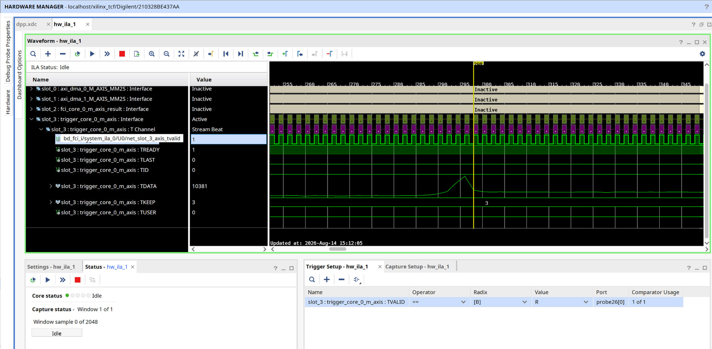

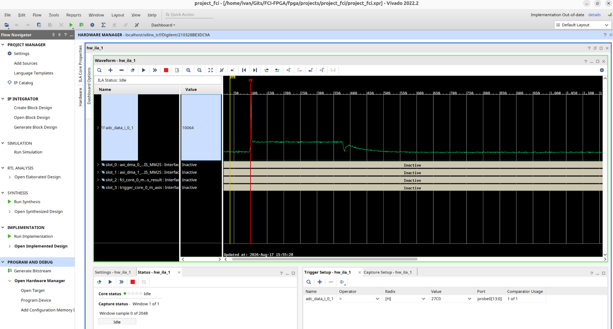
