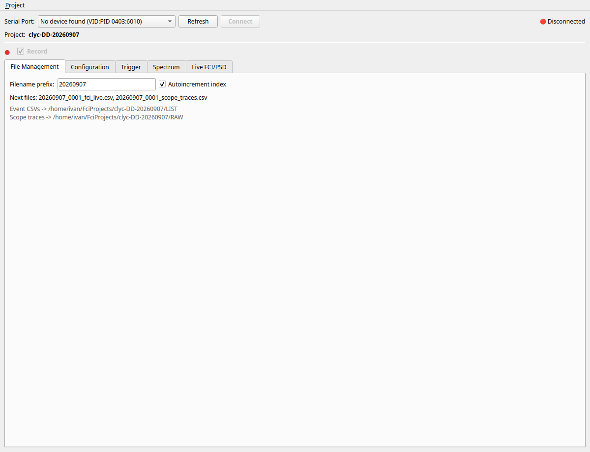
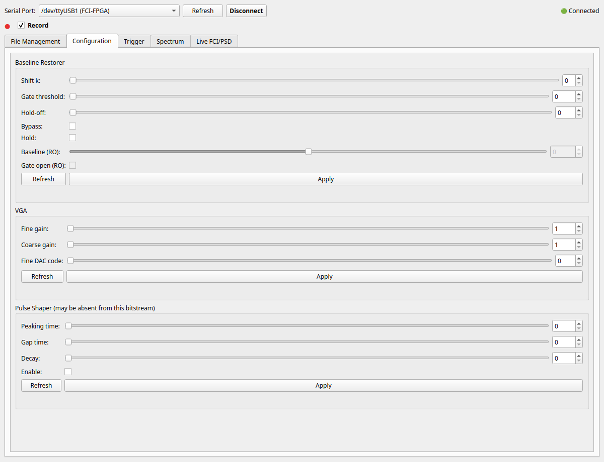
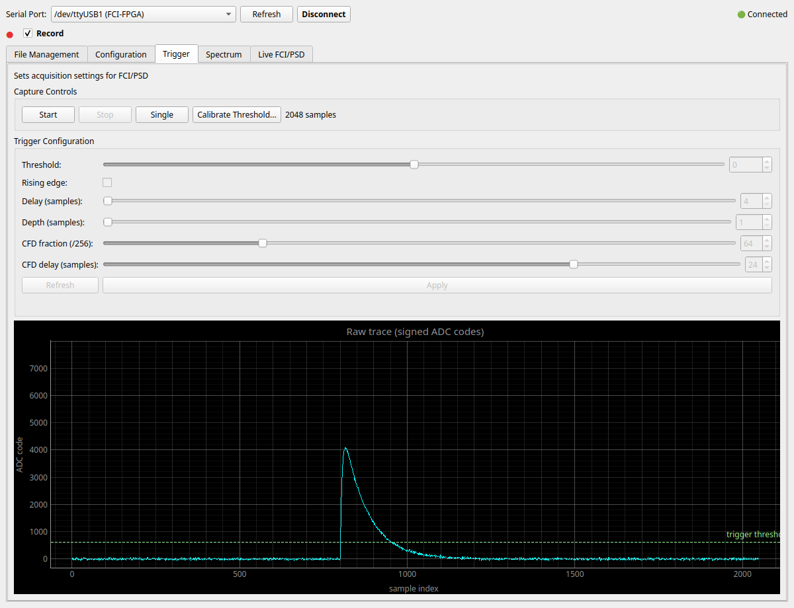
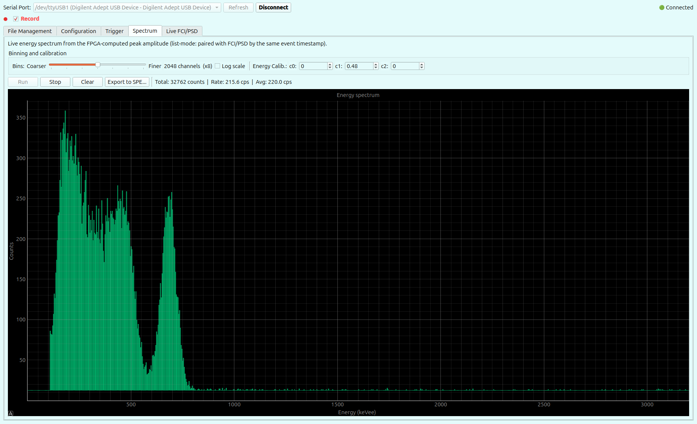
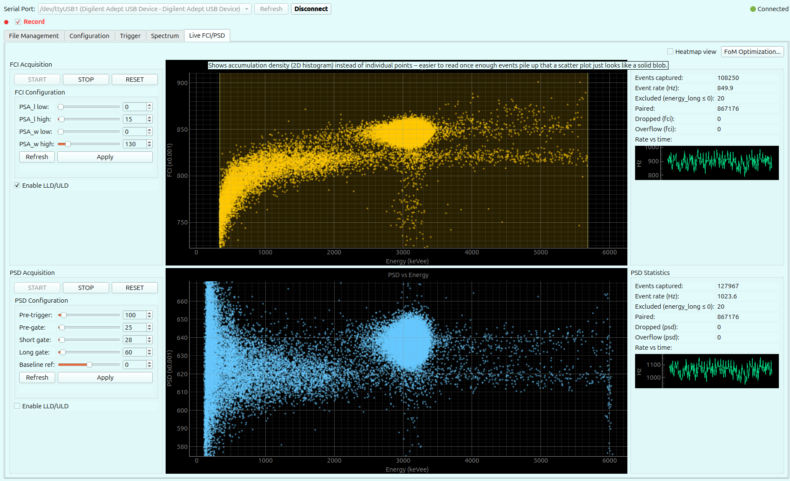
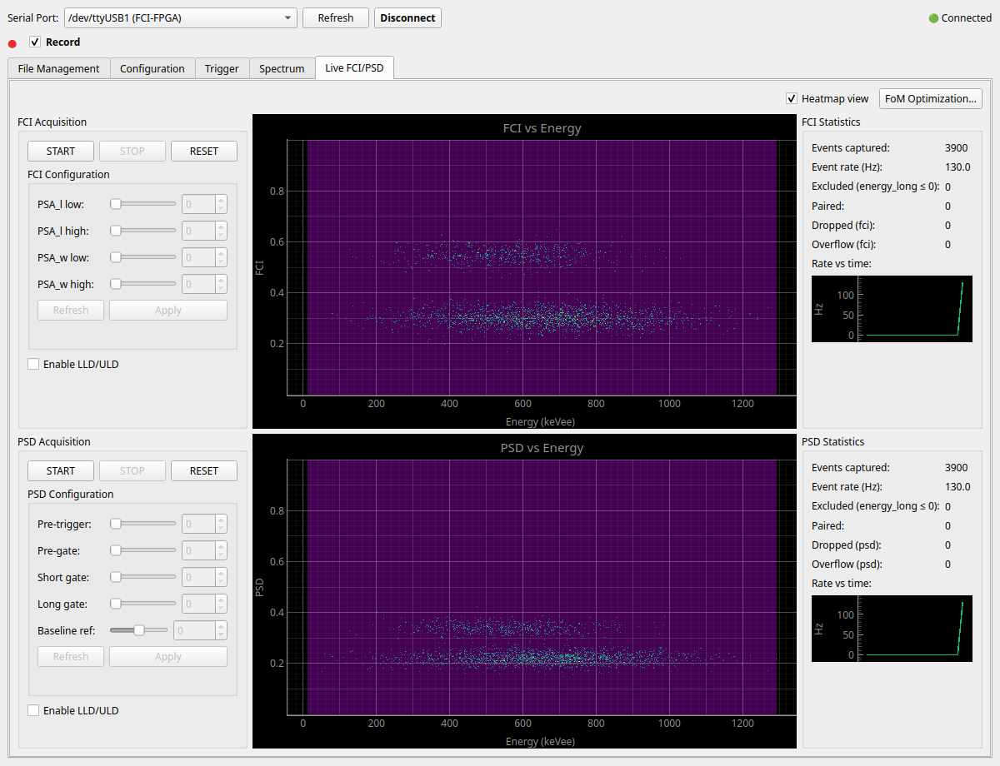

# FCI-FPGA Client Software

A Python client for the MicroBlaze CLI (see [`CLI_documentation.md`](CLI_documentation.md) for the
full wire protocol) and a PySide6 GUI built on top of it. This document is the user-facing tour of
the GUI; for the code layout and developer quick-start, see [`sw/README.md`](../../sw/README.md).

## Architecture

- **`fci_api/`** — the protocol client library. Pure Python, no Qt dependency: usable from a plain
  script (`sw/examples/read_batch_demo.py`) or from any other tool, not just the GUI. Owns framing,
  retries/resync, and one typed method per CLI command.
- **`gui/`** — the PySide6 application described below, built entirely on `fci_api`. Device I/O runs
  in its own OS process (`fci_api/reader_process.py`), not the GUI thread, so a redraw can never
  stall a serial read badly enough to overrun the UART's receive buffer.

Both `AcqEvent` (a paired FCI+PSD result) and `AmpEvent` (amplitude + timestamp only, no FCI
pairing) are the two per-event record shapes the GUI consumes; see `CLI_documentation.md` §2 for
where each comes from on the wire.

## Running

```
uv run examples/read_batch_demo.py          # auto-detects the board by USB VID:PID
uv run gui/main.py
```

## The GUI: tab by tab

The window has one always-visible connection bar and Record control at the top, and five tabs
below. Order matches the tab bar left to right.

### File Management



Where recorded CSVs go and how they're named: an output directory, a filename prefix, and an
autoincrementing index so repeated recording sessions don't collide. The Record checkbox (top of
the window, visible from every tab) is what actually starts a session -- this tab only sets *where*
it goes and *what it's called*.

### Configuration



Per-subsystem configuration forms (Trigger, PSD, FCI, BLR, VGA gain, and any not-yet-implemented
subsystems the CLI reserves fields for) with Refresh/Apply pairs -- Refresh reads the device's
current values back, Apply writes what's in the form. Nothing here is a live plot; it's where an
acquisition's parameters get set before Start.

### Trigger



The oscilloscope view: captures and plots one raw trace at a time (or continuously, at a slow
polling rate meant for eyeballing pulse shape, not for high-rate viewing) directly from the ADC
sample stream. This is also where the Trigger subsystem's own configuration lives (threshold,
polarity, delay, depth, CFD fraction/delay) and where the threshold calibration wizard is launched
-- what's set here is what every FCI/PSD event downstream is actually computed from, not a separate
view of the same data.

### Spectrum



A live energy histogram (spectrum) built from each event's FPGA-computed peak amplitude
(`AcqEvent.peak`/`AmpEvent.peak` -- the max baseline-subtracted sample over the whole triggered
frame, independent of the PSD gates). Controls, left to right:

- **Bins** -- a slider choosing the display resolution, 256 to 16384 channels in six steps (up to
  64x decimation). The full 16384-channel accumulation is always kept internally regardless of this
  setting (16384 = 2^14, this ADC's native resolution) -- decimating for display or export never
  discards the underlying data, only Clear does.
- **Log scale** -- a proper log-scale y-axis (real antilog tick labels and log-spaced minor ticks,
  not a linear axis showing raw log10 values).
- **Energy Calib.** -- up to three coefficients, `E = c0 + c1*channel + c2*channel^2`, applied
  against the raw (undecimated) channel axis. Accepts scientific notation (e.g. `1.5e-05`) for `c2`.
  These coefficients are the single source of truth for calibration in this session: the Live
  FCI/PSD tab's FCI-vs-Energy and PSD-vs-Energy plots compute their own x-axis from the same
  coefficients applied to each event's peak, live, so calibrating here also recalibrates those
  plots retroactively.
- **Run / Stop** -- independent of Live FCI/PSD's own acquisition state. When Live FCI/PSD is
  running, the Spectrum tab reads `peak` out of the same `$RQ` batches Live FCI/PSD already
  receives; when it is not, Run switches the device-I/O process to `$RA`, a lighter read that
  returns only timestamp + peak (see `CLI_documentation.md` §2.5c) so the spectrum can keep
  updating without needing full FCI/PSD acquisition active.
- **Clear** -- resets the accumulated histogram and both count-rate figures.
- **Export to SPE...** -- writes an ORTEC/Maestro-style ASCII `.spe` file (extension enforced even
  if omitted from the typed filename) at the currently selected binning, with calibration
  coefficients re-expressed against that binning's own channel numbering (see `_rebin_calibration()`
  in `gui/ui/histogram_view.py` if the exact algebra matters) so the exported `$MCA_CAL` section is
  correct for the file's own `$DATA` regardless of decimation.
- **Total / Rate / Avg** -- see "Count-rate labels" below.

### Live FCI/PSD



The two discrimination plots this project exists to produce: FCI vs Energy and PSD vs Energy, each
with its own Start/Stop/Reset (mirrored between the two -- there is only one underlying acquisition
state, `$AE`/`$AD`), configuration form, and live statistics panel including a small rate-vs-time
strip. Energy on both plots is keVee, computed from each event's peak amplitude through the
Spectrum tab's calibration coefficients (see above) -- not `energy_long`, which is a PSD charge
integral and was never a calibrated energy proxy. Each plot has its own optional LLD/ULD cut (drag
the shaded region), which also gates that plot's statistics and CSV recording.

Toggling "Heatmap view" switches both plots from a scatter to a 2D density histogram, useful once
enough events accumulate that a scatter plot is just a solid cloud:



The discriminant (FCI or PSD) axis is fixed to `[0, 1]` on both representations -- both are
normalized ratios with that theoretical range, and a heatmap auto-ranged to whatever is in the
retained window turned out to be fragile: a single pathological point (e.g. PSD briefly negative
from a noisy pulse) could stretch the axis far past where the real population sits.

"FoM Optimization..." opens a separate wizard for sweeping discrimination parameters against a
figure of merit, either live against the device or against an already-recorded CSV -- out of scope
for this tour; see the wizard's own tooltips.

## Spectrum tab: count-rate labels

The Spectrum tab shows two count-rate figures next to the total, both in counts per second (cps):

- **Rate** -- instantaneous. A sliding window over the last `RATE_WINDOW_S` seconds (3 s),
  recomputed once a second by a dedicated timer independent of event arrival, so it decays to 0
  shortly after events stop (Stop pressed, or the device paused) rather than freezing at its last
  nonzero value. Below `RATE_MIN_DT_S` (0.25 s) of actual history in the window it reads 0 rather
  than dividing by a near-zero span, which would otherwise show a spurious spike on the very first
  batch after a gap. Same windowing scheme, same constants' reasoning, as the Live FCI/PSD tab's own
  per-discriminator rate readout (`gui/ui/live_view.py`'s `RATE_WINDOW_S`/`_rate_hz_for()`).
- **Avg** -- cumulative. Total counts divided by the elapsed time since the first event after the
  tab was last cleared (`Clear`, or construction). A lifetime average, not windowed: it answers
  "what has the average rate been this run," not "what is happening right now" -- that is Rate's
  job.

Both read 0 until the corresponding condition is met (no events yet, or not enough elapsed time),
never a divide-by-zero.

## Building a standalone executable

```
uv run pyinstaller --onefile --noconsole --name="FCI_Client" gui/main.py
```

Produces a standalone single-executable with embedded libraries under `dist/`. Startup takes a
couple of seconds, but it is the most reliable way to redistribute the application without asking a
lab machine to set up its own Python environment.
